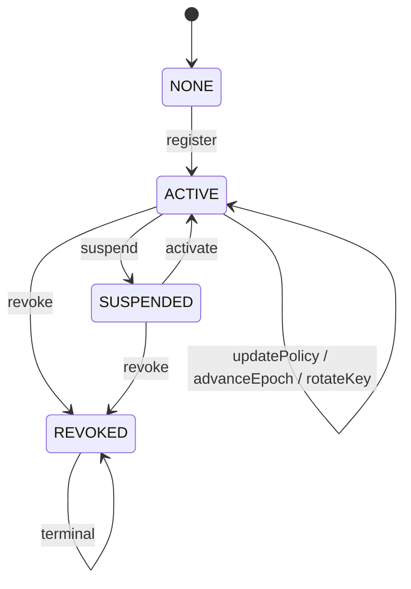
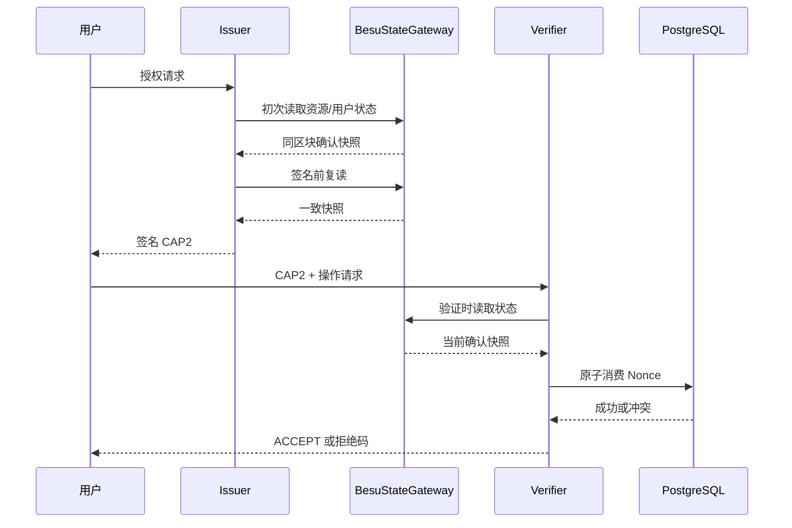

# 《面向非连续时间约束的区块链数据共享关键技术研究及实现》

## 集成母本候选稿 V1（I14）

> 本稿由真实冻结章节材料集成，来源映射见 `INTEGRATED-THESIS-SOURCE-MAP.json`。

## 中文摘要

随着数据共享场景对时间约束和事后追溯要求的提高，授权策略往往由多个不连续、非对齐的时间窗口组成，
并需要在授权状态变化后仍保证链下密文对象的安全释放。针对这些问题，本文面向非连续时间约束的区块链数据共享场景，
研究了策略表示、可信授权执行与密文对象生命周期管理的三项递进关键技术并完成系统实现。

研究内容一提出非连续时间策略的确定性规范化编译方法：以半开区间序列表征唯一语义表示，并据此确定性计算策略摘要，
层次覆盖结构仅作为可再生成的派生执行表示。实验表明，规范化区间列表在本文覆盖的配置范围内是更稳健的默认表示，
层次覆盖未表现出普遍存储优势，其价值限于提供稳定的层次节点接口。

研究内容二在真实五节点许可联盟链上实现了由链上授权状态锚定的可信授权执行机制，设计了与链标识、合约实例、
策略摘要、资源状态与用户密钥版本完整绑定的能力结构，并以共享原子 Nonce 协调多验证实例。
正式实验表明，逐请求链读取主导端到端时延，缓存与层次覆盖未产生稳定工程收益，系统的核心价值在于状态锚定、
重放控制与依赖故障下的 Fail-Closed 行为。

研究内容三实现了版本化密文头部与前瞻性撤销闭环机制，将链上授权状态、数据库任务状态与链下不可变对象组织为
可验证的闭合关系。受控正式实验完成 145 个有效运行：状态一致性与幂等性检查全部通过，未观察到错误材料释放，
撤销窗口内材料释放保持 Fail-Closed；恢复机制在对象损坏场景下提供可验证的恢复来源，并如实报告未观察到清晰
性能效应的副本结果。

本文的贡献集中在面向非连续时间约束的确定性策略表示、基于许可联盟链的可信授权执行，以及版本化密文对象的前瞻性
撤销与恢复闭环，并以预注册的正式实验给出可复现的证据边界。

## 关键词

非连续时间约束；区块链数据共享；可信授权执行；版本化密文；前瞻性撤销；故障恢复

## Abstract

Data sharing scenarios often impose non-continuous, misaligned time constraints on authorization
policies, and the shared material must remain securely governed after authorization state changes. This thesis
studies three progressive key technologies for blockchain-based data sharing under non-continuous time
constraints, and implements the corresponding system.

The first research content proposes a deterministic normalization and compilation method for non-continuous
time policies: a canonical half-open interval sequence represents the unique semantics, from which a policy
digest is deterministically derived, while a hierarchical cover is kept only as a regenerable derived execution
representation. Experiments show that the canonical interval list is the more robust default representation
within the tested scope, and the hierarchical cover exhibits no general storage advantage.

The second research content implements trusted authorization execution anchored by on-chain authorization
state on a real five-node permissioned consortium chain. A capability structure fully bound to chain identity,
contract instance, policy digest, resource state and user key version is designed, and a shared atomic nonce
coordinates multiple verifiers. Formal experiments show that per-request chain reads dominate end-to-end
latency; caching and the hierarchical cover yield no stable engineering benefit. The contribution lies in state
anchoring, replay control and fail-closed behavior under dependency failures.

The third research content implements versioned ciphertext headers with a forward-looking revocation and
recovery closure, binding on-chain authorization state, database task state and immutable off-chain objects into
a verifiable whole. A controlled formal experiment completes 145 valid runs: state-consistency and idempotency
checks all pass, no erroneous material release is observed, material release remains fail-closed during the
revocation window, and the recovery mechanism provides a verifiable recovery source under object corruption,
with no clear performance effect of the replica mechanism honestly reported.

The contributions of this thesis are the deterministic policy representation for non-continuous time
constraints, trusted authorization execution on a permissioned consortium chain, and the versioned-ciphertext
forward-looking revocation and recovery closure, together with reproducible pre-registered experimental
evidence and its boundaries.

## Keywords

non-continuous time constraint; blockchain data sharing; trusted authorization; versioned ciphertext; forward-looking revocation; recovery

## 目录

第一章 绪论；第二章 相关工作与技术基础；第三章 总体技术路线；第四章 非连续时间策略规范化编译方法；第五章 链上状态驱动的可信授权执行机制；第六章 版本化密文头部与前瞻性撤销闭环机制；第七章 总结与展望；参考文献；附录A 复现说明

## 第一章 绪论

### 1.1 研究背景与意义

区块链数据共享中的授权问题同时包含时间维度与状态维度：策略允许访问的时间往往不是单一连续区间，而是由多个
窗口、例外与周期片段组合而成；授权状态还会因暂停、撤销与密钥轮换而变化。系统既需要确定、唯一、可复现的策略
语义，也需要在授权状态变化后仍能控制链下密文对象的释放。本文围绕“非连续时间约束—可信授权执行—密文对象生命周期
管理”这一主线，按三个递进研究内容组织并实现。

### 1.2 研究内容与递进关系

研究内容一解决策略表示问题：将非连续时间约束规范化为唯一语义表示，并确定性计算策略摘要，为后续授权执行提供
稳定输入。研究内容二解决可信执行问题：将策略摘要与授权状态锚定到许可联盟链，通过能力结构与共享 Nonce 保证
授权判定的可审计性与重放控制。研究内容三解决状态变化后的对象治理问题：以版本化密文头部与前瞻性撤销闭环，
在授权状态变化后保持链下密文对象、密钥材料与撤销恢复状态的一致。

三者的关系是：策略表示提供语义与摘要输入，可信授权执行消费该输入并产出可验证的授权状态，密文对象生命周期
管理以该授权状态为材料释放与 Header 更新的可信依据。接口逻辑详见第三章。

### 1.3 主要贡献

1. 提出非连续时间策略的确定性规范化编译方法：唯一语义表示与确定性策略摘要，层次覆盖定位为可选派生执行结构，
   并通过边界实验明确其适用边界（研究内容一）。
2. 在真实五节点许可联盟链上实现并验证链上状态锚定的可信授权执行机制：完整绑定的能力结构、共享原子 Nonce
   与多验证实例一致性、依赖故障下的 Fail-Closed 行为（研究内容二）。
3. 实现版本化密文头部与前瞻性撤销闭环：链上状态、数据库任务与链下不可变对象的可验证闭合，以及受控正式实验
   验证的正确性、安全行为与工程开销边界（研究内容三）。

### 1.4 章节安排

第二章介绍相关工作与技术基础；第三章给出总体技术路线与三项研究内容的接口；第四章至第六章分别对应研究内容一、
二、三；第七章总结全文并讨论未来工作。

## 第二章 相关工作与技术基础

本章概述与三项研究内容相关的已有工作与基础技术。已有研究使用角色与时间约束描述授权策略[1]，使用区间与层次
结构组织时间语义[2]，以规范序列化保证跨组件一致性[3]，并以性质测试验证实现[4]。本文方法延续这些基础，但将
层次结构定位为派生执行表示而非主语义表示（第四章）。

能力与最小权限原则[5]与能力机制[6]、令牌授权框架[7]及其时间相关声明[8]、许可链共识[9]与数据库原子语义[10]
为研究内容二提供基础；Ed25519[11]与 Bootstrap 方法[12]分别用于签名与统计推断；许可链上的分布式属性访问控制[13]
提供授权状态管理对比背景。研究内容三使用标准密码原语 AES-256-GCM、HPKE[14]与 Ed25519[11]，其贡献属于
系统组合与状态协议，而非新的密码原语；内容寻址与版本化存储[15]为密文对象版本化提供背景，密文策略访问控制[16]
仅作为对比背景。

[文献覆盖说明：I15 已完成 16 篇文献核验，覆盖判定 MINIMALLY_SUFFICIENT。定稿阶段如需扩充近五年许可链
授权状态管理、跨链令牌绑定、版本化密文/前瞻撤销与事务恢复等主题，见
docs/final-literature-verification/07-RELATED-WORK-COVERAGE-AUDIT.md]

## 第三章 总体技术路线与三项研究内容接口

### 3.1 策略表示到授权执行的接口

研究内容一输出的唯一语义表示与确定性策略摘要（policyDigest）构成研究内容二的策略输入。能力签发与验证以
policyDigest 为绑定字段，链上资源状态记录 policyDigest，验证流程重新执行时间策略检查，从而将策略语义、
策略摘要与链上状态绑定。

### 3.2 授权状态到密文对象治理的接口

研究内容二输出的可验证授权状态（资源状态、epoch、stateVersion、userVersion）成为研究内容三判断材料释放、
Header 更新与撤销闭环的可信输入。材料释放由 AccessMaterialReleaseGuard 依据链上复合状态判定；撤销事件驱动
Header 更新意图，链下对象版本与恢复动作与链上状态保持一致。

### 3.3 统一状态模型

三个研究内容共享半开区间时间语义（第四章定义）、策略摘要绑定（第四章到第五章）与版本化状态闭合适配（第五章到
第六章），形成“策略表示—可信授权执行—密文对象更新与撤销恢复”的统一主线。
# 第四章 非连续时间策略规范化编译方法

> 正式修订稿V1.2。相对V1.1加入核验文献、图4-1和独立二次幂全域补充实验，并保持原E1与补充实验的数据版本隔离。

## 4.1 问题定义与设计目标

面向数据共享的时间约束通常不是单一连续区间。例如，某项授权可能仅在工作日的若干时段有效，也可能由临时开放窗口、例外日期和周期性片段共同组成。TRBAC等时态访问控制研究已经说明角色启停、周期时间和时态依赖是授权模型中的实际需求[1]。进入系统的原始策略因此可能包含乱序、重复、相交、相邻、嵌套及等价拆分等情况。不同输入序列虽然表达相同的允许时间集合，但若直接参与摘要计算或授权判断，会产生不同字节表示和不同策略标识，进而破坏跨组件校验的一致性。

时间槽枚举能够直接表示任意离散策略，但其空间随允许槽数量线性增长。普通规范区间列表利用连续性，已经构成一维存储和成员判断的强基线。二进制层次覆盖则提供带有层次标识的执行节点，但不能预设其比普通区间列表更紧凑或查询更快。因此，本章不把经典区间合并或二进制区间分解包装为新的基础算法。已有研究关注分布式环境下 XML 等半结构化数据的分区与索引处理[2]；本章研究的是如何将成熟操作组织为一条可验证、可摘要、边界明确的确定性策略编译流程。


图4-1突出 \(I^*\) 的分叉地位：NTP1和普通匹配直接消费语义IR，层次覆盖则生成独立执行IR。因此不存在 \(I^*\rightarrow C(P)\rightarrow pd\) 的摘要链路。

本章设置三个设计目标。

1. **语义确定性。** 等义输入在相同时间解释环境下生成唯一规范区间、唯一规范字节串和一致策略摘要。
2. **可验证的层次执行表示。** 在保持允许槽集合不变的前提下，将规范区间分解为确定的最大二进制对齐节点，为后续节点级授权提供结构接口。
3. **诚实的复杂度和适用边界。** 使用实际输出节点数描述编译成本，并同时报告连续策略的收益与高碎片策略的退化。

基于上述目标，本章构建语义中间表示（semantic IR）与执行中间表示（execution IR）相分离的编译方法：规范区间序列 \(I^*\) 负责表达策略语义、生成摘要和支持普通匹配；层次覆盖 \(C(P)\) 负责提供可被后续授权机制消费的节点标识。主要工作包括：定义时间离散化和策略语义；实现确定性规范化、最大层次覆盖和 NTP1 规范编码；分析语义保持性、规范性及输出敏感复杂度；通过 E2 正确性验证和 E1 正式实验量化三种表示的适用范围。该贡献属于面向特定系统问题的方法与工程验证，不构成新的密码原语或通用区间压缩算法。

## 4.2 时间策略形式化模型

### 4.2.1 时间域与策略语义

设系统研究的真实时间域为

\[
\mathcal{D}=[t_0,t_0+U\Delta),
\]

其中 \(t_0\) 为可转换为 UTC 的时区感知起点，\(\Delta>0\) 为时间槽粒度，\(U\in\mathbb{N}^{+}\) 为槽总数。离散时间域定义为

\[
T=\{0,1,\ldots,U-1\}.
\]

对 \(t\in\mathcal{D}\)，基本 Epoch 映射为

\[
\phi(t)=\left\lfloor\frac{t-t_0}{\Delta}\right\rfloor.
\]

为覆盖真实区间触及的全部槽，原型对开始时间向下取整、对结束时间向上取整。真实半开区间 \([a,b)\) 被转换为

\[
\left[
\left\lfloor\frac{a-t_0}{\Delta}\right\rfloor,
\left\lceil\frac{b-t_0}{\Delta}\right\rceil
\right).
\]

输入必须满足 \(a<b\)，离散结果必须满足 \(0\le l<r\le U\)。区间右端点可以等于 \(U\)，但查询槽只能属于 \([0,U)\)。

原始策略是允许重复的区间序列

\[
P=\langle[l_1,r_1),\ldots,[l_n,r_n)\rangle,
\quad 0\le l_i<r_i\le U.
\]

其语义不是序列形式，而是允许槽集合

\[
S(P)=\bigcup_{i=1}^{n}\{x\in T\mid l_i\le x<r_i\}.
\]

成员函数记为

\[
\chi_P(x)=
\begin{cases}
1,&x\in S(P),\\
0,&x\notin S(P).
\end{cases}
\]

空策略的语义为空集。

### 4.2.2 语义IR、执行IR与摘要

规范化函数输出有序区间序列

\[
I^*=\operatorname{Normalize}(P)
=\langle[a_1,b_1),\ldots,[a_k,b_k)\rangle,
\]

其中 \(b_i<a_{i+1}\)。因此，各区间合法、有序、互不重叠、互不相邻，并对应 \(S(P)\) 的极大连续分量。

令

\[
L=2^{\lceil\log_2 U\rceil}.
\]

概念上可在根区间 \([0,L)\) 上定义完全二叉层次。二进制对齐节点为

\[
D(j,s)=[j2^s,(j+1)2^s),
\]

但实际有效节点必须完全位于 \([0,U)\)。对于规范区间 \(I\)，其覆盖 \(C(I)\) 由所有“包含于 \(I\) 且其父节点不再完全包含于 \(I\)”的最大节点组成。全策略覆盖为

\[
C(P)=\bigcup_{I\in I^*}C(I),\qquad c=|C(P)|.
\]

当 \(U\) 不是 2 的幂时，原型不对 \([U,L)\) 进行填充授权；覆盖算法始终检查节点右端点不超过 \(U\)。例如 \(U=100000\) 的全域策略由 6 个层次节点覆盖，而规范区间仍为单个 \([0,100000)\)。

规范字节串定义为

\[
B(P)=\operatorname{CanonicalSerialize}(t_0,\Delta,U,I^*),
\]

策略摘要为

\[
pd=\operatorname{SHA256}(B(P)).
\]

摘要绑定 \(I^*\) 及其时间解释环境，而不绑定 \(C(P)\)。这是因为 \(I^*\) 直接表达策略语义；只要策略语义、起点、粒度和时间域不变，执行层以后更换索引或覆盖实现不应改变链上或协议中的策略标识。SHA-256在此仅作为标准固定长度摘要函数使用，其碰撞安全性不是本章提出或证明的性质。RFC 8785对规范JSON的讨论表明，哈希或签名要获得可重复结果，需要先形成不变的规范表示[3]；NTP1借鉴的是这一设计原则，但不是JCS实现。

### 4.2.3 符号说明

**表4-1 符号及含义**

| 符号 | 含义 |
|---|---|
| \(\mathcal D\) | 真实时间域 \([t_0,t_0+U\Delta)\) |
| \(t_0\) | 可转换为UTC的时间域起点 |
| \(\Delta\) | 正整数秒粒度 |
| \(U\) | 时间槽总数，同时为实验变量 `U` |
| \(T\) | 离散槽集合 \(\{0,\ldots,U-1\}\) |
| \(L\) | 不小于 \(U\) 的最小2次幂容量 |
| \(P,n\) | 原始策略及原始区间数 |
| \(S(P)\) | 策略允许槽集合 |
| \(I^*,k\) | 规范区间序列及其区间数 |
| \(D(j,s)\) | 起点为 \(j2^s\)、长度为 \(2^s\) 的对齐节点 |
| \(C(P),c\) | 层次覆盖及其节点数 |
| \(B(P)\) | NTP1规范字节串 |
| \(pd\) | SHA-256策略摘要 |
| \(A\) | 允许槽数量 |
| \(\rho\) | 实际覆盖率 |
| \(F\) | 实际碎片率 |
| \(R\) | 原始输入冗余度 |

## 4.3 确定性规范化编译方法

### 4.3.1 时间解析与离散化

原型要求 `datetime` 输入和时间域起点均携带时区信息，并在运算前统一转换为 UTC。缺少时区、非正粒度、非正 \(U\)、空或逆序区间以及越界结果均被拒绝。`time_to_slot` 使用整数微秒计算取整，避免浮点误差；`interval_to_slots` 对左端点执行 floor、对右端点执行 ceil，并允许右端点映射为排他边界 \(U\)。这种保守离散化确保声明区间触及的槽不会遗漏，但也意味着不足一个槽的边界部分会扩展到完整槽，系统必须在策略配置时固定该语义。

需要区分时间适配层与核心编译入口：冻结实现中的 `compile_policy` 接收已经离散化的 `Interval`，真实时间到槽坐标的转换由 `epoch.py` 在入口之前完成。该拆分使 Algorithm 1 的核心输入与实验使用的整数策略一致。

### 4.3.2 语义中间表示构造

`Normalize` 首先按 `(left,right)` 排序，再进行一次线性扫描。若新区间左端点不大于当前区间右端点，则二者重叠或相邻，扫描器将右端点更新为二者最大值；否则输出当前区间并开始新的连续分量。重复和嵌套区间由同一条件自然消除，输入对象不被修改。

规范结果对应有限整数线上允许集合的唯一极大连续分量。因此，输入顺序、重复区间和等价拆分不会改变 \(I^*\)。区间合并本身是经典操作，本章的方法贡献在于将其作为语义IR，进一步连接规范编码、摘要、执行IR和可复现实验。

### 4.3.3 层次执行表示构造

对每个规范区间 \([l,r)\)，算法从左至右输出最大对齐二进制块。当 \(l=0\) 时，选择不超过剩余长度的最大2次幂；否则通过 `l & -l` 得到从 \(l\) 开始的最大对齐块。若该块超过剩余长度，则持续右移缩小，直至完全位于 \([l,r)\)。随后令 \(l\leftarrow l+\text{size}\)，重复至右边界。

每个节点长度为2的幂，起点可被长度整除，节点不越界且按起点自然有序。由于每一步选取当前位置可用的最大块，所得节点的父节点均不能完整落在源区间内。`cover_policy` 只接受有序、互斥且不相邻的规范区间，因而不同规范区间生成的节点也互斥。

这里的 \(C(P)\) 是执行IR，不替代 \(I^*\)。普通成员判断可直接使用区间列表二分查找；层次节点则为第五章可能使用的节点标识、节点级授权和聚合接口提供输入。该系统价值仍需后续授权实验验证，本章只建立结构与语义基础。

### 4.3.4 规范序列化与策略摘要

NTP1使用固定宽度大端编码：

| 字段 | 编码 |
|---|---|
| `magic` | 4字节ASCII `"NTP1"` |
| `schema` | `uint16` |
| `time_origin` | UTC Unix秒，`int64` |
| `granularity` | 正整数秒，`uint64` |
| `domain_size` | `uint64` |
| `interval_count` | `uint32` |
| `intervals` | 重复的 `(uint64 left,uint64 right)` |

序列化器拒绝微秒未对齐的起点、非整秒粒度、非法字段范围、越界或非规范区间。JSON没有被用作摘要输入，以避免键顺序、数字表示和空白等外部差异。编码长度为固定头部加 \(16k\) 字节。`canonical_deserialize` 解码后重新调用编码器验证规范性，降低编码与校验规则分叉的风险。

### 4.3.5 Algorithm 1

**算法4-1 POLICY-COMPILE**

```text
Input : 已离散化区间序列 P，时区感知起点 t0，粒度 Δ，槽总数 U
Output: 规范区间 I*，层次覆盖 C，规范字节 B，摘要 pd

1: REQUIRE t0具有时区，Δ>0，U>0
2: originUTC ← UTC(t0)
3: I* ← NORMALIZE(P, U)
4: C ← COVER-POLICY(I*, U)
5: B ← NTP1-SERIALIZE(originUTC, Δ, U, I*)
6: pd ← SHA256(B)
7: RETURN (I*, C, B, pd)
```

**算法4-2 DYADIC-COVER**

```text
Input : 规范半开区间 [l,r)，槽总数 U
Output: 有序最大层次覆盖 CI

1: REQUIRE 0 ≤ l < r ≤ U
2: CI ← empty
3: WHILE l < r DO
4:     remaining ← r-l
5:     IF l=0 THEN
6:         size ← highestPowerOfTwoAtMost(remaining)
7:     ELSE
8:         size ← l AND (-l)
9:         WHILE size > remaining DO
10:            size ← size >> 1
11:        END WHILE
12:    END IF
13:    APPEND (l,size) TO CI
14:    l ← l+size
15: END WHILE
16: RETURN CI
```

算法4-1逐项对应 `compiler.py` 的 UTC 归一化、`normalize`、`cover_policy`、`canonical_serialize` 和 `digest_bytes`。算法4-2对应 `cover.py` 的整数位运算。真实时间离散化是算法4-1之前的适配步骤，不在核心入口中重复执行。

## 4.4 正确性与规范性分析

**引理1（区间规范化的语义保持性）。** 对任意合法策略 \(P\)，有
\[
S(\operatorname{Normalize}(P))=S(P),
\]
且输出有序、互不重叠、互不相邻。

**证明。** 排序不改变区间并集。扫描前 \(j\) 个有序区间时，设当前输出表示这 \(j\) 个区间的并集且已规范化。若下一区间与当前分量分离，追加后仍有序且分离；若二者相交或相邻，以左右端点的凸并替换二者不会改变整数槽并集。由归纳法，处理全部输入后语义不变，且不存在可继续合并的相邻分量。证毕。□

**引理2（层次覆盖的完整性与互斥性）。** 对任意规范区间 \(I=[a,b)\)，`DYADIC-COVER` 输出节点均位于 \(I\) 内、两两互斥，且节点并集等于 \(I\)。

**证明。** 每次迭代选择起点为当前 \(l\)、长度不超过 \(r-l\) 的正整数块，故节点不会越过右边界。更新 \(l\leftarrow l+\text{size}\) 后，后继节点起点等于前一节点终点，因此节点互斥并首尾相接。每次 `size` 至少为1，循环有限终止于 \(l=r\)，从而完整覆盖初始 \([a,b)\)。证毕。□

**引理3（规范序列的唯一性）。** 固定 \(t_0,\Delta,U\) 与 NTP1 schema。若 \(S(P_1)=S(P_2)\)，则 \(I_1^*=I_2^*\) 且 \(B(P_1)=B(P_2)\)。

**证明。** 有限整数集合的极大连续分量分解唯一。由引理1，两个规范化结果均为同一集合的极大连续分量，故 \(I_1^*=I_2^*\)。NTP1对相同字段采用固定顺序、宽度和字节序，因而产生相同字节串。证毕。□

**引理4（最大层次覆盖的规范性）。** 固定二进制层次后，任意规范区间 \(I\) 的最大层次节点集合唯一，算法4-2输出该集合。

**证明。** 对 \(I\) 中任一槽，沿叶到根路径存在唯一最高节点仍完全包含于 \(I\)。所有这样的最高节点互不包含；结合引理2，它们构成完整互斥覆盖。算法4-2在每个未覆盖左端点选择最大可用对齐块，若存在更大合法父节点，则当前块不是最大，和选择规则矛盾。使用更小子节点又不满足最大性，故输出集合唯一。证毕。□

**定理1（PolicyCompile正确性）。** 对任意合法输入，算法4-1终止，并满足：

\[
S(P)=S(I^*)=S(C(P));
\]

相同时间环境中的等义输入产生相同 \(I^*,C(P),B(P)\) 和 \(pd\)。

**证明。** 规范化扫描有限；覆盖循环中左端点严格增加；序列化与摘要处理有限长度输入，因此算法终止。第一项由引理1和引理2得到。\(I^*\) 与 \(B(P)\) 的唯一性由引理3得到，\(C(P)\) 的唯一性由引理4得到；确定性哈希函数对相同字节输入输出相同摘要。证毕。□

定理中的“相同输入得到相同摘要”不等价于证明SHA-256无碰撞。摘要抗碰撞依赖标准哈希函数的安全假设；本章的数学分析证明的是编码前语义规范性和编译过程正确性。Python测试则用于验证具体实现与上述抽象定义一致，不能替代数学证明。

## 4.5 复杂度分析

设 \(n\) 为原始区间数，\(k=|I^*|\)，\(c=|C(P)|\)。各阶段复杂度如表4-2前的分阶段分析所示。

| 阶段 | 时间复杂度 | 空间复杂度 |
|---|---:|---:|
| 时间离散化 | \(O(n)\) | \(O(n)\) |
| 排序 | \(O(n\log n)\) | 实现相关 |
| 合并 | \(O(n)\) | \(O(k)\) |
| 层次覆盖 | \(O(c)\) | \(O(c)\) |
| 序列化与摘要 | \(O(k)\) | \(O(k)\) |
| 总体 | \(O(n\log n+c)\) | \(O(n+c)\) |

覆盖阶段每输出一个节点执行常数次位运算，因此为 \(O(c)\)。单个区间最多产生 \(O(\log U)\) 个节点，故有宽松上界 \(c=O(k\log U)\)。总体复杂度采用实际输出大小表达，为

\[
T(n,c)=O(n\log n+c).
\]

该式是输出敏感复杂度，不意味着任意非连续策略具有 \(O(\log U)\) 大小。若策略由 \(k\) 个彼此隔离的单槽构成，则任何保持这些独立分量的表示至少需要 \(\Omega(k)\) 个信息单元，当前层次覆盖也有 \(c=k\)。Python `sorted` 的辅助空间依赖具体实现；原型同时保留输入、规范区间、覆盖和字节串时，整体空间上界写为 \(O(n+c)\)。

性能实验只能检验测量趋势是否与输出规模变化相容，不能以有限曲线证明渐进复杂度。

## 4.6 原型实现与实验设计

### 4.6.1 实现环境

正式实验编号为 `E1-FORMAL-20260727-R3`。环境清单记录：Windows 11（内部版本字符串 `10.0.26200`）、Python 3.13.11、AMD Ryzen 7 H 255 W/Radeon 780M、8个物理核和16个逻辑核、33,565,560,832字节内存。进程亲和性记录为逻辑CPU 0至3，电源方案为 Balanced。主要实验依赖包括 pytest 8.4.2、Hypothesis 6.161.6、NumPy 2.4.4、pandas 2.3.3、Matplotlib 3.10.9、psutil 7.2.2和pytest-cov 6.3.0；完整环境以 `pip_freeze.txt` 为准。

数据采集绑定提交 `ec8b193f571e81bfa5a9c5b8cd68cdfa0a8bb200`，后处理和报告提交为 `d42be29e0e61d0834bdbf7ade83977033bec6dd0`。正式结果共15120条，原始CSV的SHA-256为 `f096251f326a463bddda53374e7ff095dd39ce5804a90c1eddc3c62c77e92d75`，并被设置为只读。

### 4.6.2 对比方法

实验比较三种共享同一 \(I^*\)、语义策略和查询集合的表示。

1. **时间槽枚举。** 使用 `frozenset[int]` 存储全部允许槽，逻辑编码按每槽8字节计算，查询为期望 \(O(1)\) 的集合成员判断。
2. **普通规范区间列表。** 使用同一 \(I^*\)，每个区间按两个64位端点共16字节计算，通过区间左端点二分查找，查询复杂度为 \(O(\log k)\)。这是本章的主要强基线。
3. **二进制层次覆盖。** 使用 \(C(P)\)，每个 `(start,size)` 节点按16字节计算。Matcher从叶节点沿祖先路径检查节点集合，最多检查 \(O(\log U)\) 个层次。

三种Matcher在正式实验前冻结，并采用相同调用层级、计时函数和查询序列。逻辑编码字节、Python对象深层驻留内存和峰值分配分别统计，不混为同一指标。

**表4-2 三种表示的理论与实现特征**

| 表示 | 构造复杂度 | 查询复杂度 | E1-A样本逻辑字节中位数 | E1-A查询中位数的中位数/ns | 主要用途 | 主要限制 |
|---|---:|---:|---:|---:|---|---|
| 槽枚举 | \(O(A)\) | 期望 \(O(1)\) | 24000 | 350.4 | 小域、高频查询 | 空间随允许槽数增长 |
| 规范区间 | \(O(n\log n)\) | \(O(\log k)\) | 2808 | 561.0 | 一维存储与匹配 | 缺少层次节点语义 |
| 层次覆盖 | \(O(n\log n+c)\) | \(O(\log U)\) | 3664 | 1984.7 | 层次授权接口 | \(c\ge k\)，不是区间压缩替代 |

表中实测数字来自正式处理CSV的E1-A样本统计，中位数不代表所有配置。

### 4.6.3 实验变量与指标

E1-A包含 \(U\in\{10^3,10^4,10^5,10^6\}\)、目标碎片率 \(F\in\{0,0.5,1\}\)、目标覆盖率 \(\rho\in\{0.01,0.10,0.50\}\)、冗余度 \(R=2\) 和3个随机种子，共108个样本。E1-B固定 \(U=10^5,\rho=0.1\)，考察 \(R\in\{1,2,4,8\}\)，共36个样本。E1-C包含8类边界策略和3个种子，共24个样本。每个样本预热5次、正式重复30次。

指标包括元素数量、固定宽度逻辑字节、Python对象深层内存、峰值分配、Normalize/Cover/Serialize/Hash/完整编译时间、单查询延迟和吞吐量。每个配置报告样本数、均值、中位数、标准差、最小值、最大值、p95和95%百分位Bootstrap置信区间。查询集合包含命中与未命中槽及规范区间边界，实际命中率保持为50%。

### 4.6.4 E2正确性验证

E2作为E1性能实验的准入条件。性质测试沿用“将性质编码并在生成输入上自动检查”的方法思想[4]，但不以随机测试替代理论证明。正式实验前后以及补充实验前均执行全量测试，结果见表4-3。

**表4-3 E2正确性验证汇总**

| 验证项目 | 数量/结果 | 失败或反例 |
|---|---:|---:|
| pytest测试 | 原E1时80项；补充实验时81项通过 | 0 |
| Hypothesis生成案例 | 11000例 | 0 |
| \(U=1\ldots12\) 小域语义穷举 | 8190种 | 0 |
| 分支感知代码覆盖率 | 98.61% | 不适用 |
| 正式实验Matcher语义错误 | 15120条记录中0 | 0 |

性质测试检查语义一致性、Normalize幂等性、输入置换不变性、等价拆分摘要一致性和覆盖结构约束。数学证明给出抽象算法的正确性依据；这些测试和穷举结果表明当前Python实现未发现偏离形式化定义的反例，不构成对所有可能输入的绝对证明。

## 4.7 E1实验结果与分析

### 4.7.1 策略表示规模比较

图4-2使用正式处理文件 `figure_4_2_data.csv` 生成，比较不同碎片率下三种表示的元素数和逻辑字节。


枚举表示的大小为 \(8A\) 字节，规范区间和层次节点分别为 \(16k\) 与 \(16c\) 字节。连续、高覆盖率策略中 \(A\) 较大而 \(k,c\) 较小，区间和层次表示相对枚举具有明显空间收益；当策略趋于单槽碎片时，\(k\) 与 \(c\) 接近 \(A\)，枚举的单元素编码反而更小。

在E1-A的108个样本中，层次覆盖相对普通规范区间列表更紧凑0次、相同36次、更大72次。在统一16字节定长编码下，实验未观察到层次覆盖比普通规范区间列表更紧凑的样本。原因是每个非空规范区间至少需要一个层次节点，通常还会因对齐边界被分解为多个节点，即 \(c\ge k\)。因此，层次覆盖不能被表述为普通区间列表的通用压缩替代方案。

图4-3展示完整编译时间随时间域和实际输出规模变化的趋势。


E1-A中，各 \(U\) 下样本编译中位数的中位数约为0.074、0.534、5.797和123.231毫秒。该增长同时受到生成策略的原始区间数、规范区间数和覆盖节点数影响，不能解释为 \(U\) 的单因素效应。它与输出敏感分析的方向一致，但有限的Python运行时间不能用于证明 \(O(n\log n+c)\)。

### 4.7.2 输入冗余与规范结果稳定性

E1-B在相同种子、覆盖率和碎片设置下改变 \(R\)。数据生成器先构造目标语义策略，再通过重复、拆分和重叠形成冗余原始输入。因此，冗余度增大时原始区间数和Normalize处理量增加，而数据集中保存的规范策略保持一致。NTP1字节和摘要的不变性由E2中的重复、置换和等价拆分性质测试直接检查；E1-B性能CSV没有保存逐样本摘要字段，因而本节不把摘要稳定性写成E1-B独立测量结论。

需要区分“结果稳定”与“成本不变”。Normalize仍需读取并排序原始区间，故其耗时会随冗余输入规模增加；确定性编译消除的是语义表示差异，而不是输入处理成本。E1-B的原始策略、规范策略和实测参数均保存在正式数据集和原始CSV中。

### 4.7.3 匹配性能比较


在E1-A中，对每个样本先取30次重复的中位数，再对样本中位数取中位数，槽枚举、普通区间列表和层次覆盖分别约为350.4 ns、561.0 ns和1984.7 ns。枚举Matcher以 \(O(A)\) 空间换取Python冻结集合的快速成员查询；区间列表使用二分查找；层次Matcher则沿叶到根检查 `(start,size)` 标识，包含更多循环、位运算和集合查询。

这些结果说明当前Python原型的一维查询中，层次Matcher没有速度优势。数字同时受到Python对象模型、哈希表、函数调用和具体数据分布影响，不能据此推导其他语言或索引实现中的绝对理论优劣。

### 4.7.4 边界与退化分析

**表4-4 E1-C核心边界结果（由 `e1_representation_ratios.csv` 汇总；各随机种子结构结果一致时取代表值）**

| 策略 | \(A\) | \(k\) | \(c\) | 枚举/覆盖字节比 | 区间/覆盖字节比 |
|---|---:|---:|---:|---:|---:|
| 对齐单区间 | 32768 | 1 | 1 | 16384.00 | 1.00 |
| 非对齐近全域单区间 | 99998 | 1 | 25 | 1999.96 | 0.04 |
| \(U=100000\) 全域（`full_domain`） | 100000 | 1 | 6 | 8333.33 | 0.167 |
| \(U=100000\) 全域（`non_power_two_full`） | 100000 | 1 | 6 | 8333.33 | 0.167 |
| 偶数槽 | 50000 | 50000 | 50000 | 0.50 | 1.00 |
| 奇数槽 | 50000 | 50000 | 50000 | 0.50 | 1.00 |
| 随机孤立点 | 10000 | 10000 | 10000 | 0.50 | 1.00 |
| 最大碎片 | 50000 | 50000 | 50000 | 0.50 | 1.00 |

对齐单区间恰好对应一个层次节点，说明层次结构能利用二进制边界；非对齐近全域区间虽只有一个语义区间，却需要25个节点，表明边界对齐会直接影响 \(c\)。\(U=100000\) 不是2的幂，全域必须分解为6个节点，同时普通区间列表仍只需一个区间。偶数槽、奇数槽、随机孤立点和最大碎片策略均达到 \(c=k\)，层次分解无法消除语义本身的碎片信息量。

需要指出，原E1-C配置将时间域固定为 \(U=100000\)，`full_domain` 与 `non_power_two_full` 因而形成了重复的非2次幂全域样本，而不是“2次幂全域”与“非2次幂全域”的成对比较。

为补足该缺口，后续建立独立运行目录`e1c_power2_supplement_20260727_87d0010`，以相邻的 \(U=131072\) 和 \(U=131071\) 构造全覆盖策略。该补充实验没有写入原E1目录，共6个配置、540条记录，0缺失、0重复、0失败和0语义错误。

**表4-5 二次幂与非二次幂全域补充实验**

| 样本 | U | k | c | 区间字节 | Cover字节 | 区间构造/ns | Cover构造/ns | 区间匹配/ns | Cover匹配/ns |
|---|---:|---:|---:|---:|---:|---:|---:|---:|---:|
| P2_FULL | 131072 | 1 | 1 | 16 | 16 | 13100 | 15750 | 382.1 | 2351.2 |
| NP2_FULL | 131071 | 1 | 17 | 16 | 272 | 11350 | 18900 | 390.3 | 2242.7 |

结果表明，二次幂全域与根节点对齐时 \(c=1\)，相邻非二次幂全域则有 \(c=17\)。普通区间列表在两者中均为 \(k=1\) 和16字节。因此，对齐收益属于层次执行结构；它使Cover从272字节下降至16字节，但没有形成相对规范区间列表的普遍压缩优势。该有限对照与理论预期一致，不是对数学定理的实验“证明”。


图4-5中的 \(\mathrm{CR}_{interval,cover}=Bytes_{interval}/Bytes_{cover}\)。只有该值大于1才表示层次覆盖更紧凑。曲线未超过1，并在连续但非对齐时明显低于1；随着策略碎片化且每个分量退化为单槽，二者趋于相同。该图进一步支持“双表示”而非“覆盖替换区间”的设计。

### 4.7.5 适用范围总结

| 场景 | 时间槽枚举 | 普通区间列表 | 层次覆盖 |
|---|---|---|---|
| 小域且高频查询 | 查询快但空间随 \(A\) 增长 | 可用 | 当前原型通常不占优 |
| 连续大范围策略 | 空间开销大 | 很紧凑 | 相对枚举紧凑，但不优于区间 |
| 高碎片策略 | 空间退化 | 通常较合理 | 节点数随碎片率增加而增长 |
| 后续层次授权接口 | 缺少层次语义 | 缺少节点层次标识 | 提供结构接口 |

不存在脱离工作负载的单一“最优”表示。若任务仅是一维成员判断，规范区间列表是更稳健的默认方案；若后续协议需要稳定的层次节点标识，则可在保留 \(I^*\) 的同时生成 \(C(P)\)。

## 4.8 本章方法定位与讨论

实验提出了一个必须正面回答的问题：既然普通区间列表更紧凑，且当前Matcher也更快，为何仍保留层次覆盖？

首先，\(I^*\) 是策略语义的唯一表示，也是NTP1编码和 `policyDigest` 的基础。普通成员判断无需先转换为层次节点，可以直接在 \(I^*\) 上二分查找。其次，\(C(P)\) 的职责不是压缩 \(I^*\)，而是把连续分量映射为具有固定父子关系的节点标识。后续协议可以基于这些标识定义节点级授权、缓存键、继承或聚合接口，而槽枚举和普通区间端点本身不提供相同的层次结构。

因此，本文采用“双表示并存”方案：

```text
I*   ：主表示；唯一语义、NTP1摘要输入、普通成员匹配
C(P) ：由I*确定性生成的派生执行IR、后续节点级授权候选输入
pd   ：绑定(t0, Δ, U, I*)的稳定策略标识
```

这一定位同时限制了本章能够声称的贡献。本章已经验证 \(C(P)\) 的确定性、完整性及表示边界，但尚未验证它能在真实授权协议中降低密钥、令牌或链上状态成本。该潜在价值属于第五章研究内容二的待验证假设。第五章必须明确消费 `policyDigest`、\(I^*\) 和 \(C(P)\) 的具体协议步骤，并以仅使用 \(I^*\) 的授权方案作为强基线，比较授权状态数量、策略更新对象数量、令牌或授权记录大小、验证延迟、缓存复用以及不同碎片率下的额外开销。在该验证完成前，不能把“便于层次授权”表述为已证实的系统性能优势；若对照结果不能证明 \(C(P)\) 具有可测量的授权价值，则应将其降级为可选派生表示，并同步调整第四章和全文贡献表述。

## 4.9 本章局限

本章存在以下边界。

1. 区间合并和二进制分解是已有基础操作，本章的贡献是确定性编译组织、规范接口及边界验证。
2. 层次覆盖不具有相对规范区间列表的普遍存储优势。
3. Python Matcher的运行常数不能代表其他语言、数据库或索引实现。
4. 实验为单机策略编译和匹配，尚未涉及分布式授权执行。实验工件按照环境、配置、原始数据和处理脚本分层保存，便于文档化、完整且可执行地复现；本项目未申请或获得ACM工件徽章。
5. 模型只处理一维离散时间，不覆盖空间、属性或复合布尔策略。
6. 高碎片策略至少需要与独立分量数同阶的表示单元，无法无条件对数压缩。
7. 本章没有证明层次接口在授权协议中的实际收益。
8. 上述收益必须由第五章真实Epoch授权机制及强基线实验进一步验证。
9. 已核验文献覆盖本章核心背景与方法论，但全篇定稿时仍需与第二章相关工作统一去重和编号。

## 4.10 本章小结

本章针对非连续时间策略存在多种等义输入、摘要不稳定和表示成本依赖策略形态的问题，构建了从UTC离散化、规范区间到层次执行节点和NTP1摘要的确定性编译流程。规范区间 \(I^*\) 表达唯一语义，层次覆盖 \(C(P)\) 提供确定的执行节点，摘要 \(pd\) 则绑定时间解释环境和 \(I^*\)。理论分析给出了语义保持、规范序列唯一性、最大覆盖规范性以及 \(O(n\log n+c)\) 输出敏感复杂度。

自动化测试、性质测试、小域穷举、原E1的15120条记录及补充E1-C的540条记录验证了Python实现与形式化定义的一致性。实验同时表明，层次覆盖相对普通区间列表没有普遍的存储或一维查询优势，高碎片策略会明确退化。基于这些证据，本文保留规范区间作为语义、摘要和普通匹配表示，将层次覆盖限定为后续授权协议的结构接口。该接口是否带来系统级收益，将在第五章通过Epoch授权机制和对照实验继续检验。

# 第5章 链上状态驱动的可信授权执行机制

## 5.1 研究问题与设计目标

研究内容一将非连续时间约束策略规范化为唯一语义表示 \(I^*\)，并由其确定性计算策略摘要 `policyDigest`；层次覆盖 \(C(P)\) 仅作为可选派生执行结构。本章进一步研究动态授权环境中的状态一致性问题：如何将策略、资源、用户密钥和授权时效锚定到可审计的链上状态，如何使能力仅适用于指定链和合约实例，以及如何在多个验证实例之间一致地拒绝重放。

本章的设计目标包括：（1）在真实五节点 Besu QBFT 许可联盟链上维护单调授权状态；（2）构造与 `chainId`、合约地址、策略摘要和状态版本完整绑定的 CAP2；（3）利用 PostgreSQL 原子共享 Nonce 协调多个 Verifier；（4）在 RPC 或数据库不可用时 Fail-Closed；（5）以公平、预注册的实验识别 \(I^*\)、\(C(P)\) 与缓存机制的真实适用边界。

本章不处理链下数据正文与密文头部、IPFS、门限解封装和前瞻性撤销。这些属于研究内容三。本章也不声称区块链提供绝对可信状态，或测试构成形式化密码学证明。

## 5.2 系统实体、角色与信任边界

系统包含数据所有者、数据用户、链上业务角色、Issuer、两个独立 Verifier、PostgreSQL 共享状态后端，以及由四个 Validator 和一个非验证 RPC 节点组成的 Besu QBFT 网络。链上角色分为 `ADMIN`、`OWNER`、`AUTHORIZER`、`REVOCATION` 和 `AUDITOR`：`ADMIN` 管理初始角色，`OWNER` 登记资源并更新策略，`AUTHORIZER` 推进 Epoch，`REVOCATION` 管理暂停与撤销，`AUDITOR` 只读审计。`BOOTSTRAP_FUNDER` 仅提供实验链初始测试余额，不拥有任何业务角色。

系统区分五类秘密材料：节点身份密钥用于 P2P 身份；交易账户密钥用于链上交易；Issuer 密钥用于 Ed25519 能力签名；用户密钥用于绑定 `userKeyId`；数据库凭据用于共享 Nonce 服务。上述秘密均不进入 Git、报告或服务日志。

信任边界如下：QBFT 在既定 Validator 集合及其容错假设下提供一致账本；合约角色治理者可能误用其合法权限，因此 RBAC 不抵抗已获合法角色的恶意管理员；Issuer 必须正确读取链状态并保护签名密钥；Verifier 必须执行冻结顺序中的全部检查；PostgreSQL 是跨实例一次性消费的共享事实源。系统不假设 RPC 或数据库永久可用，而是在依赖不确定时拒绝授权。

## 5.3 链上授权状态模型

正式合约 `AuthorizationState` 分别维护资源状态和用户状态。资源状态为

\[
R=(owner,policyDigest,epoch,status,policyVersion,stateVersion,updatedAtBlock),
\]

用户状态为

\[
U=(account,userKeyId,status,userVersion,updatedAtBlock).
\]

状态枚举为 `NONE`、`ACTIVE`、`SUSPENDED` 和 `REVOKED`。资源注册后进入 `ACTIVE`；策略更新递增 `policyVersion` 和 `stateVersion`；Epoch 推进递增 `epoch` 和 `stateVersion`；暂停、恢复和撤销推动资源状态及 `stateVersion`。用户注册后进入 `ACTIVE`；密钥轮换递增 `userVersion`；用户状态变化亦递增 `userVersion`。资源或用户一旦进入 `REVOKED`，不得恢复为 `ACTIVE`。



图5-A 资源与用户状态转换示意图。该图依据冻结合约接口绘制；资源更新推动 `stateVersion`，用户更新推动 `userVersion`。

链上状态的作用是提供可审计、可复核的授权锚点，而非消除治理风险。正式合约源码 SHA-256 为 `a6ad3e76eed272036eaa1f9c5c6086c3cf46f198b1adb66045915409c3056c5f`，部署地址为 `0x9ef44cf538d0df457ba77c556d8785e48bfc436d`。

## 5.4 CAP2 能力结构与完整绑定

CAP2 使用 Ed25519 对规范化字节序列签名。其字段依次包括：`magic`、`version`、`flags`、`issuer`、`resourceId`、`policyDigest`、`epoch`、`userKeyId`、`operation`、`notBefore`、`expiresAt`、`nonce`、`issuedAt`、`chainId`、`contractAddress`、`resourceStateVersion`、`userVersion`，以及 \(C(P)\) 模式下可选的 `matchedNode` 与 `coverVersion`。整数采用无符号大端编码，变长字符串带 16 位长度前缀。

\[
B=\operatorname{Encode}_{CAP2}(F_1\Vert F_2\Vert\cdots\Vert F_n),\qquad
\sigma=\operatorname{Ed25519.Sign}(sk_I,B).
\]

其中 `policyDigest` 始终由 \(I^*\) 计算，\(C(P)\) 不参与语义身份定义。`chainId` 与 `contractAddress` 阻止令牌直接迁移到其他链或其他合约实例；`policyDigest`、`epoch` 和 `resourceStateVersion` 绑定资源当前状态；`userVersion` 与 `userKeyId` 绑定当前用户密钥；`operation`、`notBefore` 和 `expiresAt` 限定用途与时间；`nonce` 支持一次性消费。

CAP2 是面向本系统状态的完整绑定能力结构，而不是新的密码学原语。其安全性依赖规范编码、Ed25519 标准假设、状态读取正确性及验证顺序的完整执行。

## 5.5 能力签发与验证流程

**算法5-1 Issuer 签发 CAP2**

```text
输入：resourceId, userId, publicKey, operation, time
1. 在同一确认区块读取资源状态与用户状态；
2. 检查资源和用户均为 ACTIVE；
3. 检查 SHA-256(publicKey) = userKeyId；
4. 检查 I* 的 policyDigest 与链上摘要一致且时间策略允许；
5. 生成 nonce、有效期和 CAP2 待签字段；
6. 签名前再次读取同一资源与用户状态；
7. 若两次快照不一致，则返回 SYSTEM_STATE_UNAVAILABLE；
8. 对规范化 CAP2 字节签名并返回能力。
```

**算法5-2 Verifier 验证 CAP2**

```text
输入：CAP2, 请求上下文
1. 解析规范编码；失败返回 MALFORMED_TOKEN；
2. 验证签名；失败返回 INVALID_SIGNATURE；
3. 读取确认链状态；失败返回 SYSTEM_STATE_UNAVAILABLE；
4. 依次检查资源、用户、policyDigest、epoch、chainId/contractAddress、
   resourceStateVersion、userVersion、userKeyId、operation 和时间窗口；
5. 重新执行 I* 时间策略检查；
6. 原子消费共享 Nonce；冲突返回 NONCE_REPLAY；
7. 仅当全部检查通过且消费成功时返回 ACCEPT。
```

**算法5-3 共享 Nonce 原子消费**

```sql
INSERT INTO consumed_nonce (...)
VALUES (...)
ON CONFLICT DO NOTHING
RETURNING 1;
```

消费唯一键为 `(chain_id, contract_address, resource_id, epoch, nonce)`。返回一行表示本次请求获得唯一消费权；返回零行表示已被消费；数据库异常直接拒绝，不回退到进程内状态。



图5-B CAP2 签发与验证时序。每个成功路径请求包含 Issuer 初读、签名前复读和 Verifier 读取三次真实链状态访问。

## 5.6 共享 Nonce 与多 Verifier 一致性

Verifier-1 与 Verifier-2 不共享进程内内存，而共同使用 PostgreSQL 16.14。数据库唯一约束将重放判断转化为单条事务内的原子竞争；并发 50、100 和 500 个相同能力请求时均仅有一次成功，分别拒绝 49、99 和 499 次重放。数据库中断期间 Verifier Fail-Closed，恢复后既有消费记录仍可阻止重放。

能力 Nonce 与 Ethereum 交易 Nonce 是两套不同机制。前者用于跨 Verifier 的能力一次性消费；后者以 `(chain_id,sender)` 为状态键，通过行锁和 `RESERVED`、`BROADCAST`、`CONFIRMED`、`FAILED` 状态管理链上交易序号。两者均采用数据库事务，但命名空间、目的和状态机不同。

因此，本章可支持的准确表述是：在冻结的 Nonce 命名空间、数据库唯一约束和验证流程假设下，同一能力最多只能被一个并发验证请求成功消费；这不等同于在任意部署和任意攻击模型下“完全杜绝重放”。

## 5.7 合约角色与状态转换

`ADMIN_ROLE` 负责角色治理；`OWNER_ROLE` 登记资源并更新策略；`AUTHORIZER_ROLE` 推进 Epoch；`REVOCATION_ROLE` 暂停、恢复和撤销资源或用户；`AUDITOR_ROLE` 不具有业务写权限。真实链状态机验收覆盖合法角色操作、非授权角色拒绝、版本单调递增、用户密钥轮换、事件与最终状态一致以及撤销终态约束。

角色分离降低单一业务账户承担全部权限的风险，但不能阻止已获得合法管理角色的主体恶意操作。此类主体仍属于治理信任边界，需通过密钥管理、操作审计和组织制度约束。

## 5.8 安全属性与故障闭合分析

本章验证的安全目标如下。

| 目标 | 机制与证据 | 结论边界 |
|---|---|---|
| S1 跨链/合约隔离 | CAP2 绑定 `chainId` 与合约地址；篡改测试拒绝 | 不证明链本身绝对可信 |
| S2 状态版本绑定 | `policyDigest`、`epoch`、`stateVersion` | 依赖链状态读取正确 |
| S3 用户密钥绑定 | `userKeyId` 与 `userVersion` | 不保护已泄露终端私钥 |
| S4 操作与时间绑定 | `operation`、`notBefore`、`expiresAt` | 依赖时钟与配置假设 |
| S5 重放控制 | PostgreSQL 原子共享 Nonce | 限于冻结命名空间和事务语义 |
| S6 多 Verifier 一致性 | 两实例共享数据库事实源 | 数据库不可用时拒绝 |
| S7 Fail-Closed | RPC 故障停止签发，数据库故障拒绝验证 | 可用性让位于安全性 |
| S8 角色控制 | 合约 RBAC 与越权测试 | 不抵抗合法管理员恶意行为 |
| S9 状态可审计 | QBFT 账本、事件和区块证据 | 受 QBFT 容错与治理边界约束 |

攻击回归、语义一致性、并发重放和状态竞争测试均未出现错误接受。这些证据支持冻结实现与故障模型下的系统主张，但不构成形式化安全证明，也不支持抵抗任意 Validator 合谋或追回已被合法用户取得的明文。

## 5.9 系统实现与多主机实验环境

正式实验使用 `FORMAL_AUTHORIZATION_EXPERIMENT_CHAIN`，而非冷保留的 `INFRASTRUCTURE_VALIDATION_CHAIN`。正式链采用 Besu 26.5.0、Java 21、QBFT、四个 Validator 和一个非验证 RPC 节点，`chainId` 与 `network-id` 均为 2026072901。Genesis SHA-256 为 `7d431f01aab7d0c55c58c09346ee1f9a43475322a4aca304cfbb172b9b32add4`。正式合约部署于区块 1483，Artifact SHA-256 为 `b8cd8040e4a7683fb4454ea1cf3c3c4d97647611ad7cb3d616b72a35cf496ad5`。

五台 Ubuntu 24.04 虚拟机运行于 Windows 主机的 VMware 环境：四台承载 Validator，一台 `experiment-client` 承载非验证 RPC、Issuer、Verifier-1、Verifier-2 和 PostgreSQL。正式证据冻结了节点角色、软件版本、链参数和服务健康状态；单台虚拟机的精确 vCPU 与内存配额未形成同等级独立清单，因此本章不据此作硬件效率外推，并将共享物理主机列为有效性限制。

## 5.10 正式实验设计与预注册

第一次正式运行因链读取边界、局部性生成、缓存命中记录、吞吐量与统计单位等协议偏差被标记为 `INVALIDATED_PROTOCOL_DEVIATION`。其原始数据保留用于方法学审计，但不进入本章性能统计。V13 在提交 `8a3d795e22e5d9373c3053245e3b4040cd062dd5` 重新预注册并完整重跑。

V13 比较四种方法：B0 为 Baseline-I 无缓存，B1 为 Baseline-I 区间缓存，C0 为 Proposed-C 无缓存，C1 为 Proposed-C 节点缓存。自变量包括三种碎片率 \(0,0.5,1\)，三种局部性 `UNIFORM`、`INTERVAL_HOTSPOT`、`NODE_HOTSPOT`，以及并发度 \(1,4,16\)。采用三个固定 seed，每个含 seed 配置进行 30 次正式重复。


图5-1 正式实验因素与运行级配对结构。

实验共包含 108 个因素配置、324 个含 seed 配置、9720 个运行块、77760 条请求记录和 233280 条链读取记录。每条请求执行三次真实链读取。四种方法复用相同工作负载；三类局部性生成器产生不同访问分布；缓存命中按单请求直接记录，不在计时外预热；吞吐量按完整运行批次定义。

主要推断单位是 `fragmentation × locality × concurrency × seed × repetition × method` 的运行块。方法比较在相同工作负载、seed 和 repetition 下自然配对，每组比较含 2430 对运行块，并执行 10000 次运行级 Bootstrap。请求级记录只用于运行内描述和完整性审计，不被视为 77760 个独立统计重复。

## 5.11 V13 正式实验结果

表5-1给出运行级总体统计。四种方法的端到端中位时延均约为 196--199 ms，吞吐量中位数约为 17.78--17.93 请求/s。

| 方法 | 运行数 | 中位时延/ms | 均值/ms | 吞吐量中位数/(请求/s) | 缓存命中率中位数 | 链读取占比/% |
|---|---:|---:|---:|---:|---:|---:|
| B0 | 2430 | 196.128 | 209.714 | 17.926 | 0 | 98.796 |
| B1 | 2430 | 196.583 | 211.402 | 17.907 | 0.750 | 98.706 |
| C0 | 2430 | 198.682 | 211.029 | 17.842 | 0 | 98.664 |
| C1 | 2430 | 198.939 | 212.448 | 17.777 | 0.625 | 98.704 |

表5-1 四种方法运行级总体统计。


图5-2 四种方法端到端运行级分布，样本单位为运行块。

表5-2给出四种自然配对比较。点估计均很小，均值差的 95% Bootstrap 置信区间全部跨越 0；在预注册的 1 ms 工程阈值下，改善与退化运行比例相近。

| 比较 | 配对数 | 中位差/ms | 均值差/ms | 均值差95% CI/ms | 稳健效应量 |
|---|---:|---:|---:|---:|---:|
| B1-B0 | 2430 | +0.390 | +1.688 | [-0.220, 3.539] | 0.018 |
| C1-C0 | 2430 | +0.176 | +1.419 | [-0.410, 3.258] | 0.008 |
| C0-B0 | 2430 | +0.257 | +1.315 | [-0.568, 3.177] | 0.012 |
| C1-B1 | 2430 | +0.408 | +1.046 | [-0.717, 2.886] | 0.019 |

表5-2 四种配对比较及运行级 Bootstrap 置信区间。正值表示前者较慢。


图5-3 运行级配对均值差及95% Bootstrap置信区间。

并发度是端到端时延的主要观测影响因素。并发度从 1 增至 4 和 16 时，中位时延由约 52.8 ms 增至约 196--199 ms 和 340--349 ms；吞吐量中位数基本维持在约 17.7--18.0 请求/s，表明新增并发主要转化为排队和等待，而非同比吞吐增长。


图5-4 并发度对端到端运行级中位时延的影响。

碎片率主要影响局部匹配。以无缓存方法为例，B0 的 `match_ns` 中位数由 25.967 μs 增至 39.685 μs，C0 由 32.529 μs 增至 74.699 μs；但这一微秒级变化被约 200 ms 的公共链读取开销掩盖。


图5-5 碎片率对 `match_ns` 运行级中位数的影响。

逐请求链读取占端到端时延的 98.66%--98.80%，局部匹配仅占约 0.017%--0.047%。因此，当前实现的主要性能边界是链状态访问，而不是 \(I^*\) 与 \(C(P)\) 的局部匹配差异。


图5-7 `chain_read`、`match`、`issue` 和 `verify` 的运行级耗时构成。

正式运行期间链高度持续增长；冻结健康快照中的 `peerCount` 为 4。图5-8右图反映准入与结束健康快照，而非逐请求连续 peer 遥测。


图5-8 正式运行期间区块高度及冻结健康快照。

## 5.12 缓存、局部性与 C(P) 消融分析

热点负载确实提高缓存命中率：B1 在两类热点下中位命中率为 0.75，而均匀访问为 0.125；C1 在区间热点和节点热点下分别为 0.625 和 0.75，均匀访问为 0.125。然而，命中率提高没有稳定转化为端到端收益。


图5-6 请求局部性对缓存命中率的影响。

B1-B0 与 C1-C0 的配对中位差分别为 +0.390 ms 和 +0.176 ms，置信区间跨 0，且改善运行比例分别约为 43.70% 和 44.32%，退化比例分别约为 47.33% 和 46.71%。因此，缓存没有表现出稳定且具有工程意义的端到端收益。

C0-B0 与 C1-B1 同样没有稳定方向。\(C(P)\) 在语义测试中保持 \(I^*\) 的决策结果，但没有表现出 Baseline-I 难以复制的协议能力或性能价值。本章据此冻结 `C(P)_DEMOTED_CONFIRMED_BY_VALID_RERUN`：\(C(P)\) 是可选派生 IR、消融和证伪对象，不构成研究内容二的核心性能贡献。

这一负面结果不是实验失败。它通过公平基线和真实系统开销揭示了方法边界，使研究贡献收敛到 \(I^*\) 唯一语义、真实链状态锚定、CAP2 完整绑定、共享 Nonce、多 Verifier 一致性、Fail-Closed 和可复现边界实验。

## 5.13 讨论、局限与适用边界

第一，每请求三次链读取提供了签发前后状态一致性与验证时当前状态确认，但导致 98.66%--98.80% 的端到端时间用于链读取。未来可研究带区块证明或版本约束的安全状态缓存、批量读取和多资源聚合，但这些机制尚未实现。

第二，实验仅覆盖五节点许可链和冻结工作负载，且虚拟机共享物理主机，不能外推到任意规模、公链环境或独立物理集群。第三，缓存结论受冻结容量、LRU 策略、局部性生成器和请求规模约束。第四，系统依赖 Ed25519、QBFT、数据库事务和操作系统密钥保护等假设，未提供端到端形式化证明。第五，RBAC 不防止合法管理员恶意行为，系统也不能追回已被用户获得的能力、明文或密钥。第六，CPU 字段记录的是累计进程时间而非利用率，因此本章不据其比较方法 CPU 效率。

正式性能结论只适用于 V13 冻结代码、配置、链状态和环境。进一步优化应优先减少可验证链读取成本，而不是放大微秒级局部匹配差异。

## 5.14 本章小结

本章在真实五节点 Besu QBFT 许可联盟链上实现并验证了由链上授权状态锚定、与 `chainId`、合约实例、资源状态、策略摘要和用户密钥版本完整绑定的授权执行机制。PostgreSQL 原子共享 Nonce、多 Verifier 一致性控制和依赖故障下的 Fail-Closed 行为，为重放拒绝、状态竞争控制和跨实例隔离提供了可审计证据。

V13 有效重跑表明，逐请求链读取主导端到端时延，并发度是主要观测影响因素；热点提高缓存命中率但未产生稳定工程收益，\(C(P)\) 亦未表现出 Baseline-I 不可复制的优势。研究内容二因而完成了“谁在当前链上状态下能够获得并使用授权能力”的闭环。研究内容三将在此冻结接口之上研究授权后链下加密材料的安全释放、版本化 Header、前瞻性撤销和链上链下恢复闭环，本章不预先声称这些机制已经实现。

# 第六章 版本化密文头部与前瞻性撤销闭环机制

> 研究内容三正式写回稿（I13 冻结候选）。编号按论文既有章节序列推定（第四章=研究内容一、第五章=研究内容二），最终编号以论文定稿目录为准。全部实验数字来源于冻结的 I12 Formal Results Package 与正式实验运行索引；本稿不修改任何既有章节文件。

## 6.1 问题定义与设计目标

在基于许可联盟链的可信授权执行基础上，数据共享还面临两类问题：其一，授权状态的变化需要与数据本身的密文对象状态保持一致，当授权被撤销或升级时，接收方不应继续获得新数据的解密能力；其二，链上状态、数据库任务记录与链下不可变对象之间需要形成可验证的闭合关系，在组件故障时能够恢复而不破坏一致性。

本章针对上述问题，研究版本化密文头部（VersionedHeaderV1）与前瞻性撤销（forward-looking revocation）闭环机制。设计目标如下：

1. 以版本化状态关系描述密文对象的更新：Header、Body 与内容密钥（CK）分别携带独立版本，任何更新路径都可被链上状态与数据库记录验证；
2. 撤销事件发生后，系统立即停止后续材料释放，并在新 Header 闭合前保持 Fail-Closed 语义；
3. 链上授权状态、数据库任务状态与链下对象存储形成可核验的闭合，故障恢复按预注册规则执行；
4. 通过受控的正式实验，在冻结配置范围内验证正确性、安全行为与工程开销。

本章工作属于系统组合与状态协议设计，使用 AES-256-GCM、HPKE（RFC 9180）、Ed25519 与 SHA-256 等标准密码原语，不构成新的密码算法或新的基础表示。

## 6.2 总体架构

系统由以下部分组成：链上合约（AuthorizationState 与 HeaderRegistry）负责授权状态与 Header 提交记录的权威存储；数据库控制面以任务状态机管理链上写入，并以 operationId 保证幂等；链下对象层由不可变 LocalObjectStore 与隔离的 Kubo 副本组成，对象以 SHA-256 内容摘要为完整性权威；版本化密文头部将上述部分绑定为可验证的 CompositeState。

数据流为：资源注册与授权状态写入链上；Header 与 Body 密文对象写入链下对象存储并可复制到 Kubo；数据库在链写前记录任务、在链写后固化提交；撤销与恢复组件分别负责事件驱动的 Fail-Closed 判定与对象一致性恢复。

## 6.3 版本化密文对象设计

密文对象由 Header 与 Body 两部分构成。Header 的核心字段由 HeaderCore 承载（资源标识、Header/Body/Key 版本、Body 摘要等），签名后形成 SignedVersionedHeader，并携带接收者信封（RecipientEnvelope）；Body 为分块 AES-256-GCM 密文。CK 按接收者使用 HPKE（X25519 + HKDF-SHA256 + AES-128-GCM）封装为 EncryptedCKRecord，每个 Body 版本使用独立 CK，V1 冻结语义为 keyVersion 等于 bodyVersion。材料释放判定由 AccessMaterialReleaseGuard 依据链上复合状态与 Header 对象完整性执行。

Header 使用 JCS（RFC 8785）规范序列化并以 Ed25519 签名，其摘要与对象摘要均进入链上 HeaderRegistry 的提交记录，从而将链下对象与链上状态绑定。

## 6.4 Header 与 Body 更新机制

版本语义冻结如下：

- INITIAL：headerVersion=1，bodyVersion=1，keyVersion=1；
- HEADER_ONLY：headerVersion 加 1，bodyVersion 与 keyVersion 不变，Body 与 CK 不变；
- BODY_ROTATION：headerVersion、bodyVersion、keyVersion 均加 1，生成新 CK 与新 Body。

HEADER_ONLY 用于授权语义变化（如撤销后的 Header 闭合）而不更换数据密钥；BODY_ROTATION 用于更换密文对象与密钥。二者是不同语义的操作，实验中分别分析，不作等价比较。

## 6.5 前瞻性撤销与 Fail-Closed

撤销边界为前瞻性撤销：撤销事件发生后，系统立即停止后续材料释放；在新 Header 闭合前，合法用户可能暂时不可访问，这是 Fail-Closed 设计代价。系统不主张追溯撤销，不能收回此前已获得的明文、旧 CK 或旧密文。

撤销流程为：链上 advanceEpoch 触发 EpochAdvanced 事件；事件扫描与受影响资源解析生成 Header 更新意图；在 Header 闭合前，材料释放判定保持 DENIED；Header 进入 current 状态后，合法材料恢复释放。整个过程以固定区块的事件与释放判定作为证据。

## 6.6 链上/链下状态一致性与任务状态机

AuthorizationState 保存 policyDigest、epoch、stateVersion 与资源状态；HeaderRegistry 保存 headerVersion、bodyVersion、keyVersion、摘要与操作身份。数据库控制面以任务状态机管理链写：JOB_CREATE 显式提交后可被独立连接读取，经 ChainWriteAdmission 准入后广播交易，以回执与固定区块状态验证后 DATABASE_FINALIZE 为 COMMITTED。数据库事务不跨链回执等待；operationId 保证重复执行幂等，COMMIT_UNKNOWN 等不确定结果按预注册规则处理。

## 6.7 故障恢复机制

链下对象以 LocalObjectStore 不可变存储，写入原子，SHA-256 内容寻址；Kubo 仅作为隔离副本定位，CID 不替代 SHA-256 的完整性权威。恢复由 RecoveryCoordinator 协调：读取候选对象、SHA 验证、结构验证、原子恢复，最终形成一致状态或 Fail-Closed 结果。受控故障包括对象损坏、CID 不一致与本地/副本同时缺失。

## 6.8 安全性/正确性讨论

正确性建立在版本关系的可验证性与 Fail-Closed 释放判定之上：任何状态更新必须满足版本单调性与摘要一致性；撤销窗口内释放判定为拒绝；恢复路径不因来源不同而放宽完整性要求。这些性质通过实现与正式实验验证，属于实验验证而非形式化证明。

## 6.9 实验环境与实验设计

正式实验在独立于 Pilot 的 Formal 环境中进行，避免与实验验证阶段资产混用：独立 PostgreSQL 集群（127.0.0.1:55433，数据库 epoch_auth_r3_formal，schema r3_formal）、隔离的 Kubo 仓库（独立 IPFS_PATH，零公网 peer）与独立单节点 QBFT 链（chainId 2026080201，单 Validator）。运行环境为 Ubuntu（内核 6.8.0-136），2 vCPU，3.07 GB 内存，Besu 26.5.0，PostgreSQL 16.14，Kubo 0.42.0，Python 3.12.3，OpenJDK 21。该环境仅用于应用层功能与受限工程测量，不用于评估多 Validator 共识性能。

实验按冻结预注册执行：29 个配置、每配置 5 次重复、145 个 measured RUN（另有 35 个 warm-up，不计入统计）；实验单位为 RUN，phase、transaction、request 等不作为独立样本；执行顺序由 seed 20260802 分块确定性随机化并在采集前冻结；统计以 RUN 为单位报告 median/IQR，使用 10 000 次 Bootstrap 的 95% percentile CI，比较采用 median difference、ratio 与 Cliff's delta，需要时在 RQ family 内进行 Holm 校正。

## 6.10 正式实验结果

### 6.10.1 E1：状态一致性与幂等性（RQ-1）

E1 覆盖 INITIAL、BODY_ROTATION、REVOCATION 与 RESTORE 四种路径，共 20 个 RUN，全部通过冻结状态不变量：状态一致性与幂等性检查通过，链/数据库/对象最终状态一致，未观察到错误材料释放。端到端时延中位数分别为 INITIAL 3080 ms、BODY_ROTATION 5120 ms、REVOCATION 7118 ms、RESTORE 3147 ms。结论限于本实验覆盖的配置范围。

### 6.10.2 E2：HEADER_ONLY 工程开销（RQ-2）

E2 在 HEADER_ONLY 语义下覆盖接收者规模 2/8/32 与受影响资源数 1/4，共 30 个 RUN，全部有效。各配置端到端时延中位数约 5115～5144 ms；接收者由 2 增至 32 时，中位数差约 27.0 ms（ratio 1.005，Cliff's delta 0.12）；受影响资源由 1 增至 4 时，中位数差约 12.5 ms（ratio 1.002，Cliff's delta 0.20）。不同接收者规模下的时延分布如图 6-1 所示。

结果表明，在冻结实验范围内，接收者与受影响资源规模增加对 HEADER_ONLY 端到端时延影响较小，主要成本由链上交易等待与固定流程主导；该观察为描述性结论，不与其他语义类比较。

### 6.10.3 E3：BODY_ROTATION 工程开销与正确性（RQ-3）

E3 覆盖 Body 规模 64 KiB/1 MiB/8 MiB 与接收者 2/8/32，共 45 个 RUN，全部有效。在接收者为 2 的条件下，Body 由 64 KiB 增至 8 MiB 时，端到端时延中位数由 5083 ms 增至 6696 ms（差 1613 ms，ratio 1.317，Cliff's delta 0.60）；其余配置中位数约 4.98～5.10 s。不同 Body 规模下的时延分布如图 6-2 所示。

密码与版本正确性方面，45/45 个 RUN 中旧 CK 无法解密新 Body、Body 摘要发生改变且版本关系正确。性能测量与正确性验证分开表述：性能为描述性工程测量，正确性为逐 RUN 不变量通过。

### 6.10.4 E4：撤销与 Fail-Closed（RQ-4）

E4 覆盖撤销后的 pending 窗口与 Header 闭合两条路径，共 10 个 RUN，全部有效。材料释放判定为：pending 窗口 5 次 DENIED，Header 闭合后 5 次 ALLOWED_AFTER_CURRENT_HEADER_ONLY；错误材料释放为 0。撤销事件触发后，Header 未闭合期间材料释放被拒绝，Header 进入 current 状态后合法材料恢复释放，状态转换可追踪。

### 6.10.5 E5：故障恢复与副本作用（RQ-5/RQ-6）

E5 覆盖 LOCAL_ONLY/KUBO_REPLICA 两种对象来源与 NONE、CORRUPT_RESTORE、CID_MISMATCH、BOTH_MISSING 四类故障，共 40 个 RUN，全部有效。恢复结果汇总见表 6-3，LOCAL_ONLY 与 KUBO_REPLICA 在匹配故障块内的时延对比如图 6-3 所示。

在对象损坏场景下，LOCAL_ONLY 无法从其他来源恢复，恢复结果为 UNRECOVERABLE（Fail-Closed，5/5）；KUBO_REPLICA 从隔离副本恢复，结果为 CONSISTENT 且修复动作数为 1（5/5）。无故障时两种来源均保持 CONSISTENT；CID 不一致与本地/副本同时缺失时均 Fail-Closed。在受限受控环境中，E5 端到端时延中位数约 3.1～3.2 s（具体数值见表 6-3）。

## 6.11 综合讨论与局限性

实验结果表明：版本化状态关系在冻结配置内保持闭合；撤销保持 Fail-Closed；Header 更新规模因素对端到端时延影响较小，主要成本来自链上等待；Body Rotation 在 8 MiB 规模下出现可观察的时延上升，同时正确性不变量全部保持；Kubo 副本的核心作用是在特定本地对象损坏场景下提供可验证的恢复来源，并未表现出稳定的正常路径性能优势（多数匹配块内 Cliff's delta 约 0.04，未观察到清晰性能效应）。该副本机制属于可用性收益与恢复成本之间的 trade-off。

研究内容三的适用范围限定如下：单节点 QBFT 环境，不评估多 Validator 共识性能；29 个冻结配置与 5 次重复构成有界工程精度样本，不作总体推断；受控隔离环境，故障类别覆盖冻结的 4 类对象故障；仅前瞻性撤销；Body/接收者规模范围有限；实验验证不构成形式化证明。

## 6.12 本章小结

本章提出了版本化密文头部与前瞻性撤销闭环机制，将链上授权状态、数据库任务状态与链下不可变对象组织为可验证的闭合关系。正式实验在受控单节点环境中完成 145 个有效运行：正确性与安全不变量全部满足，未观察到错误材料释放；HEADER_ONLY 与 BODY_ROTATION 的成本结构分别描述；恢复机制在损坏场景下提供可验证的恢复来源，并如实报告未观察到清晰性能效应的副本结果。以上结论以冻结配置、预注册统计与不可变运行记录为边界。

---

**图 6-1（E2）** 不同接收者与受影响资源规模下 HEADER_ONLY 操作端到端时延分布（n=5/配置）
来源：`experiments/r3/formal/figures/i12-final/fig-rq2-header-only-duration.png`；正文先引用后出现。

**图 6-2（E3）** 不同 Body 规模与接收者规模下 BODY_ROTATION 操作端到端时延分布（n=5/配置）
来源：`experiments/r3/formal/figures/i12-final/fig-rq3-body-rotation-duration.png`。

**图 6-3（E5）** 匹配故障块下 LOCAL_ONLY 与 KUBO_REPLICA 恢复运行端到端时延对比（n=5/单元格）
来源：`experiments/r3/formal/figures/i12-final/fig-rq5-recovery-local-kubo.png`。

**表 6-1** 正式实验配置与运行汇总（29 配置 / 35 warm-up / 145 measured）
来源：`experiments/r3/formal/tables/i12-final/table-run-flow-eligibility.json`。

**表 6-2** E2/E3 各配置端到端时延中位数、IQR 与 95% bootstrap CI
来源：`experiments/r3/formal/tables/i12-final/table-within-class-duration.json`。

**表 6-3** E5 恢复结果与时长汇总（按故障与对象来源）
来源：`experiments/r3/formal/tables/i12-final/table-matched-local-kubo-recovery.json`。

**表 6-4** E4 材料释放判定结果
来源：`experiments/r3/formal/tables/i12-final/table-release-decision-outcome.json`。

**表 6-5** 正式实验环境（硬件、OS、软件版本、链/数据库/Kubo 配置）
来源：`experiments/r3/formal/tables/i12-final/table-environment-fingerprint.json`。

## 第七章 总结与展望

本文围绕非连续时间约束下的区块链数据共享，完成策略表示、可信授权执行与密文对象生命周期管理三项递进研究。
研究内容一建立唯一语义表示与确定性策略摘要，并如实报告层次覆盖不具普遍存储优势的负结果；研究内容二在真实
五节点许可联盟链上验证链上状态锚定、能力绑定、共享 Nonce 与 Fail-Closed；研究内容三实现版本化密文头部与
前瞻性撤销闭环，并以 145 个有效正式运行验证正确性、安全行为与工程开销边界。

未来工作包括：减少可验证链读取成本的安全状态缓存；在独立物理集群与更多节点规模下的性能验证；故障类别与
对象规模的扩展；以及将层次节点接口纳入实际授权协议后的系统性收益验证。

## 参考文献

[1] Bertino E, Bonatti P A, Ferrari E. TRBAC: A Temporal Role-Based Access Control Model[J]. ACM Transactions on Information and System Security, 2001, 4(3): 191-233. DOI: 10.1145/501978.501979.

[2] Abiteboul S, Manolescu I, Polyzotis N, Preda N, Sun C. XML processing in DHT networks[C]//Proceedings of the 24th International Conference on Data Engineering (ICDE). IEEE, 2008: 606-615. DOI: 10.1109/ICDE.2008.4497469.

[3] Rundgren A, Jordan B, Erdtman S. JSON Canonicalization Scheme (JCS)[S]. RFC 8785, 2020.

[4] Claessen K, Hughes J. QuickCheck: a lightweight tool for random testing of Haskell programs[C]//Proceedings of ICFP 2000. ACM, 2000: 268-279. DOI: 10.1145/351240.351266.

[5] Saltzer J H, Schroeder M D. The protection of information in computer systems[J]. Proceedings of the IEEE, 1975, 63(9): 1278-1308. DOI: 10.1109/PROC.1975.9939.

[6] Dennis J B, Van Horn E C. Programming semantics for multiprogrammed computations[J]. Communications of the ACM, 1966, 9(3): 143-155. DOI: 10.1145/365230.365252.

[7] Hardt D (Ed.). The OAuth 2.0 Authorization Framework[S]. RFC 6749, 2012.

[8] Jones M, Bradley J, Sakimura N. JSON Web Token (JWT)[S]. RFC 7519, 2015.

[9] Hyperledger Besu Documentation. QBFT consensus protocol[EB/OL]. [2026-08-02]. https://besu.hyperledger.org/private-networks/how-to/configure/consensus/qbft.

[10] PostgreSQL Global Development Group. PostgreSQL 16 Documentation: INSERT[EB/OL]. [2026-08-02]. https://www.postgresql.org/docs/16/sql-insert.html.

[11] Josefsson S, Liusvaara I. Edwards-Curve Digital Signature Algorithm (EdDSA)[S]. RFC 8032, 2017.

[12] Efron B. Bootstrap Methods: Another Look at the Jackknife[J]. The Annals of Statistics, 1979, 7(1): 1-26. DOI: 10.1214/aos/1176344552.

[13] Rouhani S, Belchior R, Cruz R S, Deters R. Distributed attribute-based access control system using permissioned blockchain[J]. World Wide Web, 2021, 24(5): 1617-1644. DOI: 10.1007/s11280-021-00874-7.

[14] Barnes R, Bhargavan K, Lipp B, Wood C. Hybrid Public Key Encryption[S]. RFC 9180, 2022.

[15] Benet J. IPFS - Content Addressed, Versioned, P2P File System[EB/OL]. arXiv:1407.3561, 2014[2026-08-02]. https://arxiv.org/abs/1407.3561.

[16] Bethencourt J, Sahai A, Waters B. Ciphertext-Policy Attribute-Based Encryption[C]//Proceedings of the 2007 IEEE Symposium on Security and Privacy. IEEE, 2007: 321-334. DOI: 10.1109/SP.2007.11.


[文献扩展建议（I15 后）：近五年许可链授权状态管理更广泛综述、跨链令牌绑定、版本化密文/前瞻撤销与事务恢复的扩展文献按需在定稿阶段补充，见 related-work-coverage.json]

## 附录A 复现说明

三项研究内容的实验均遵循冻结的预注册或验收设计。研究内容三正式实验使用独立于 Pilot 的 Formal 环境
（PostgreSQL 127.0.0.1:55433、隔离 Kubo、单节点 QBFT 链 chainId 2026080201），29 个配置、5 次重复、
145 个 measured RUN 与 35 个 warm-up（不计入统计），统计以 RUN 为单位并使用 10000 次 Bootstrap 的 95%
percentile CI；预注册 digest 与不可变运行索引见复现材料。所有失败运行保留，最终统计仅使用单一冻结实现产生的
accepted runs。
