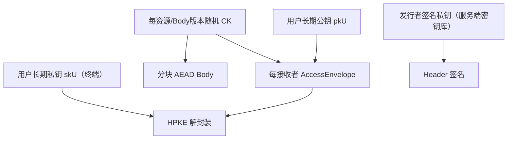

# 密钥层次设计

CK只服务一个资源的一个 Body版本；用户长期私钥、发行者签名密钥、链上交易密钥相互独立。默认不引入 KEK_e；若 R3-B/E7证明需要，则 KEK_e 只包装 CK，按资源+epoch生成，并通过 HPKE面向接收者封装。

`recipientKeyId = SHA-256(canonical public key)`只作标识，不是秘密。私钥不得进入 Header、链或数据库明文字段；KeyStore接口只返回句柄或执行解封装/签名。轮换与销毁策略仍列于 [开放决策](25-OPEN-DECISIONS.md)。
