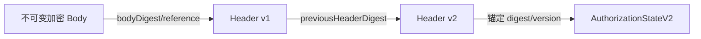

# 版本化 Header Schema V1

每资源一个 Header 版本，包含公共 `core` 与按 `recipientKeyId`排序的 `recipientEnvelopes`：

| 字段 | 类型/角色 |
|---|---|
| schemaVersion, suiteId | 明文、AAD、摘要 |
| chainId, contractAddress | 链状态绑定、AAD、摘要 |
| resourceId, bodyReference, bodyDigest | 资源/Body绑定、AAD、摘要 |
| policyDigest, epoch, stateVersion | 授权状态绑定、AAD、摘要 |
| headerVersion, keyVersion, previousHeaderDigest | 单调版本链、AAD、摘要 |
| recipientMode, recipientKeyId, encapsulation, wrappedKey | envelope；封装值非秘密明文元数据 |
| bodyNonceBase, chunkSize, chunkCount | Body解密参数、AAD、摘要 |
| createdAt, issuerId, metadataDigest | 审计/上下文、摘要 |
| issuerSignature | 对“无签名Header摘要”签名；不参与被签名摘要 |

`aeadNonce`不得作为一个全文件固定 nonce；V1改为 `bodyNonceBase + chunkIndex`派生。未知字段、重复接收者、零摘要、版本非单调、链状态不一致均拒绝。正式 JSON Schema 在 R3-A 冻结后生成；本轮不实现解析器。

