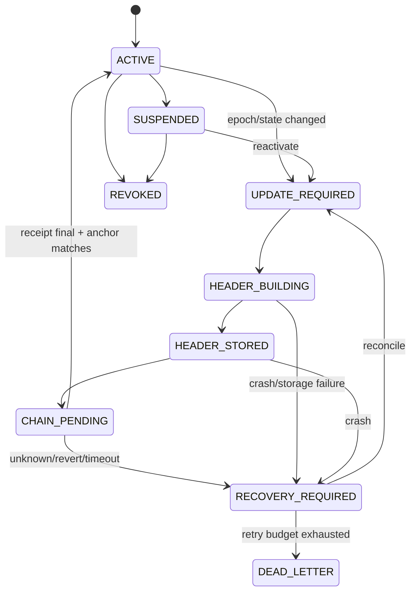

# 状态机

```mermaid
stateDiagram-v2
  [*] --> ACTIVE
  ACTIVE --> UPDATE_REQUIRED: epoch/state changed
  UPDATE_REQUIRED --> HEADER_BUILDING
  HEADER_BUILDING --> HEADER_STORED
  HEADER_STORED --> CHAIN_PENDING
  CHAIN_PENDING --> ACTIVE: receipt final + anchor matches
  CHAIN_PENDING --> RECOVERY_REQUIRED: unknown/revert/timeout
  HEADER_BUILDING --> RECOVERY_REQUIRED: crash/storage failure
  HEADER_STORED --> RECOVERY_REQUIRED: crash
  RECOVERY_REQUIRED --> UPDATE_REQUIRED: reconcile
  RECOVERY_REQUIRED --> DEAD_LETTER: retry budget exhausted
  ACTIVE --> SUSPENDED
  SUSPENDED --> UPDATE_REQUIRED: reactivate
  ACTIVE --> REVOKED
  SUSPENDED --> REVOKED
```

只有 `ACTIVE`且链上锚点、Header摘要、epoch/stateVersion一致时客户端接受。`HEADER_STORED`对象是候选，不是有效版本；旧对象保留到确认与保留期结束。`REVOKED`不可恢复。状态转换使用数据库 CAS 与链上operationId去重，规则见 [幂等数据库](13-IDEMPOTENCY-DATABASE-DESIGN.md)。
