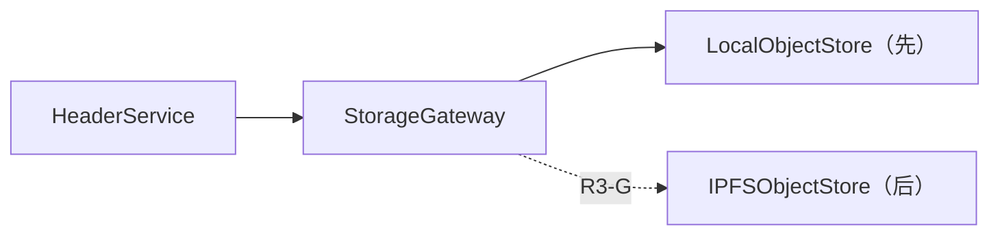

# StorageGateway 与 IPFS 边界

接口：`put(bytes)->ObjectReference`、`get(ref)->bytes`、`exists(ref)`、`pin/ref-unpin`、`verify(ref,digest)`。先实现 LocalObjectStore，闭合密码、Header、任务和恢复语义；R3-G才接 IPFSObjectStore。

IPFS CID提供内容寻址，不自动提供授权、保密、永久可用或副本。Pin只防止特定节点垃圾回收；需要至少两个独立副本、pin状态核验、可用性探测与恢复策略。Kubo RPC具管理权限，不得公网暴露。

`bodyDigest`是协议独立SHA-256；`bodyReference`可为本地URI或CID。CID与digest可以同时验证但不假定相等（CID包含multicodec/multihash与DAG语义）。Header存储也同理。候选对象在链上确认前不可见为active；失败对象进入ORPHAN，超过保留期且无引用后清理。

