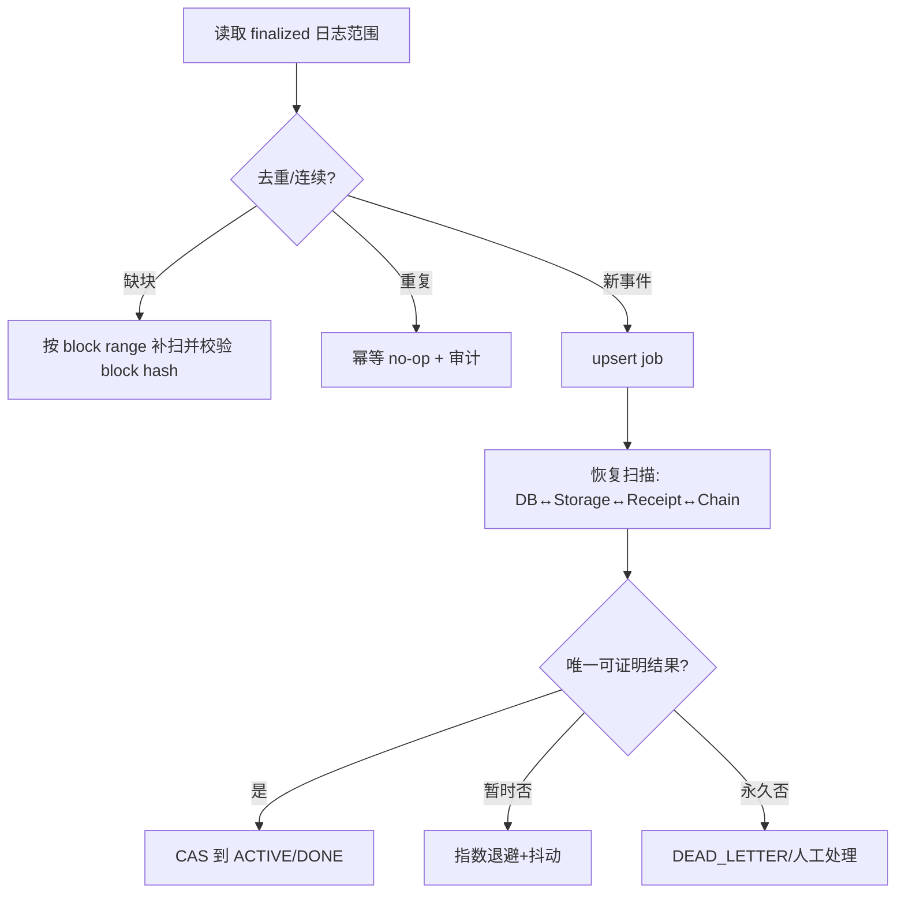

# 故障与恢复模型

交易广播后未知：先按txHash查receipt，再读链上operationId/版本；不得再次盲发。上传后崩溃：digest相同则复用对象。链提交前崩溃：候选保持不可接受。数据库/RPC/存储故障均停止状态推进并保留游标。服务启动先核验 cursor block hash，检测重组后退至安全检查点补扫。

最终一致验收要求链锚点、active Header、存储对象、任务状态四方一致且不变量违反为零。
