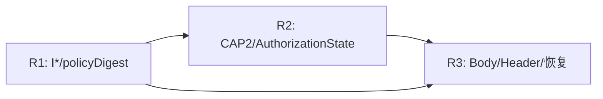

# 实施路线

| 阶段 | 输出/退出门槛 | 硬停止 |
|---|---|---|
| R3-A | 定义、Schema、向量冻结；审稿FATAL=0 | 未决核心语义 |
| R3-B | 官方向量与最小密码验证 | 无成熟HPKE实现/向量不符 |
| R3-C | LocalObjectStore最小端到端 | Body被Header更新改变 |
| R3-D | 状态机、独立DB schema、并发单测 | 无法保证唯一active |
| R3-E | V2合约原型/迁移测试（新链） | 需改冻结合约/CAP2 |
| R3-F | 代理、补扫、receipt恢复 | 游标可越过缺口 |
| R3-G | IPFS接入与pin核验 | 需改正式Kubo |
| R3-H | 故障注入 | 发现不可恢复不变量 |
| R3-I | PILOT_ONLY | 秘密扫描不清零 |
| R3-J | 预注册、证据路径、正式准入 | R2未闭合或审稿未批准 |

每阶段单独提交代码、测试、原始证据哈希和报告；本准备任务仅完成R3-A候选，不自动进入实现。

