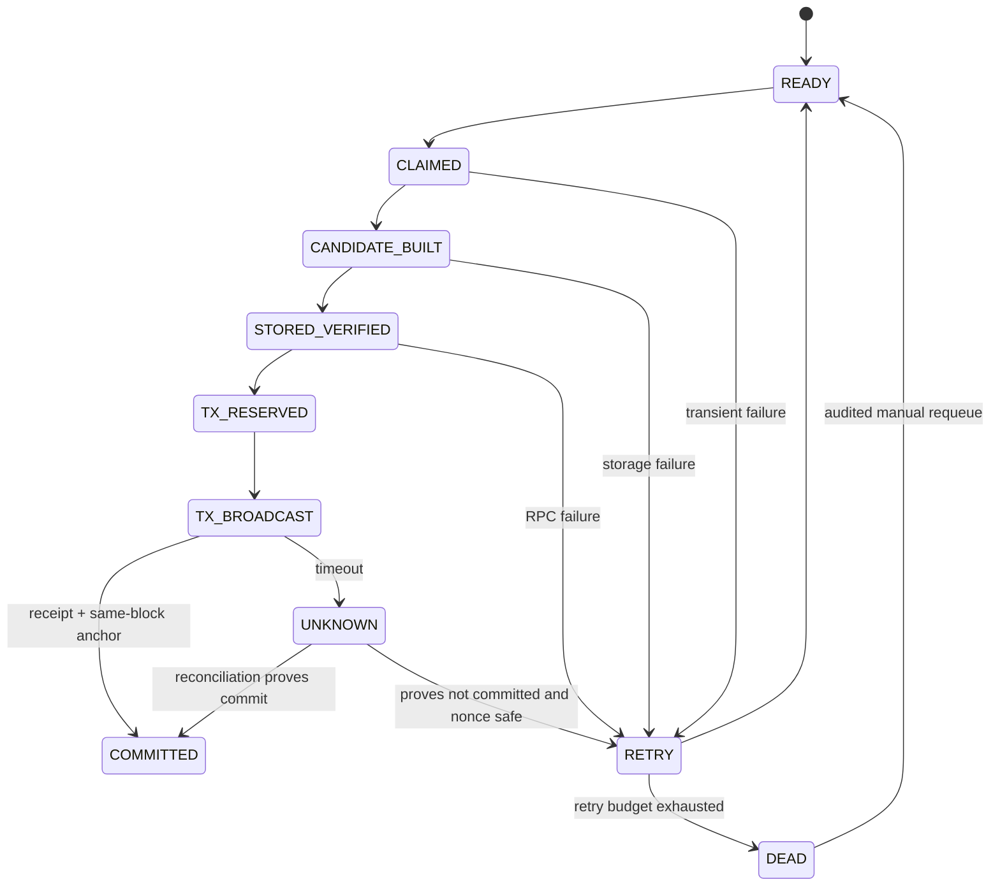

# 状态机V2

## 数据库任务状态

## Header版本状态

`CANDIDATE → STORED → TX_PENDING → ACTIVE`；失败候选变为`ORPHAN_QUARANTINED`。每资源至多一个ACTIVE，只有Registry COMMITTED锚点对应版本可ACTIVE。旧ACTIVE转`SUPERSEDED`但在保留期内只读保存，不可被客户端作为当前版本接受。

## 事件与游标

游标主键含chainId、AuthorizationState、eventSignature；保存safeBlockNumber与safeBlockHash。一个区块范围内所有日志完成或明确幂等no-op后，游标才能CAS推进。发现hash不符时回退到最近检查点，先撤销未最终任务的派生状态，再范围补扫。V13确认深度在未来对账时注入，不在本轮猜测。

## 崩溃恢复

启动时按状态恢复：CLAIMED超租约回READY；候选以digest复用；TX_BROADCAST/UNKNOWN查receipt、Registry operationId和当前版本；任何不能唯一证明的情况保持不可接受并进入RETRY/DEAD。
