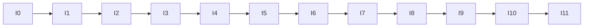

# 正式实施蓝图V1（尚不执行）

| 阶段 | 输入/代码范围 | 测试与证据 | 退出门槛/硬停止 | 建议提交/下一阶段 |
|---|---|---|---|---|
| I0依赖环境冻结 | V13对账、Python/Besu/Web3/PostgreSQL/Kubo版本清单 | lock摘要、许可证、环境报告 | 接口漂移已解释；秘密或需改R2则停 | `chore(r3): freeze implementation baseline`；可进I1 |
| I1标准密码最小验证 | `r3_crypto`仅官方API、BodyFormat向量 | RFC 9180 A.1、NIST/AEAD负向、nonce/格式黄金向量 | 全向量通过；手拼HPKE/后端不支持则停 | `test(r3): validate standard crypto components`；可进I2 |
| I2 LocalObjectStore | StorageGateway、原子写/回读/digest | 小对象单元/故障测试、证据哈希 | 零越权路径；非原子替换则停 | `feat(r3): add local object store`；可进I3 |
| I3 Header与序列化 | dataclass、Schema验证、JCS、签名 | 黄金向量、跨键序/未知字段/篡改 | 同语义字节唯一；宽松解析则停 | `feat(r3): add versioned header v1`；可进I4 |
| I4数据库状态机 | `r3_control`迁移、repository、worker claim | 临时DB小规模并发/CAS/恢复；DDL摘要 | 不触碰R2表；唯一ACTIVE成立 | `feat(r3): add durable header jobs`；可进I5 |
| I5 HeaderRegistry | 新合约、ABI、组合Gateway；仅隔离开发链 | 合约状态/CAS/角色/双合约同块读取 | 不改旧Artifact/CAP2；跨合约校验成立 | `feat(r3): add header registry`；可进I6 |
| I6撤销代理 | 事件补扫、operationId、有限worker | 重复/漏读/乱序/重启单测 | 游标不越缺口；旧Header不回退 | `feat(r3): add revocation agent`；可进I7 |
| I7故障恢复 | receipt/UNKNOWN、对账、死信、孤儿隔离 | E8全崩溃点、审计链 | 不变量违反0；不可证明结果fail-closed | `test(r3): validate recovery invariants`；可进I8 |
| I8 IPFS | IPFSObjectStore、pin/verify/health | 独立非正式Kubo小规模测试 | Local闭环不变；RPC不公网；无可用性夸大 | `feat(r3): add ipfs gateway`；可进I9 |
| I9 PILOT_ONLY | 小规模E6–E9收集器 | 原始/manifest/指标定义审计 | 只验证流程；不可写正式结论 | `experiment(r3): freeze pilot evidence`；可申请I10 |
| I10正式实验准入 | 预注册、样本量、冻结提交/环境 | 独立审稿、秘密扫描、dry-run审计 | FATAL=0、偏差=0、用户批准 | `docs(r3): approve formal experiment admission`；可进I11 |
| I11正式实验 | 全新目录执行E6–E9 | 原始只读、SHA、运行级分析、严格审稿 | 任何协议偏差使结论失效；不覆盖 | `experiment(r3): freeze formal evidence`；结束 |

全程禁止自动跨门。每阶段必须保存输入提交、配置、测试列表、原始证据路径、SHA-256和失败记录；代码成功不等于论文主张成立。

