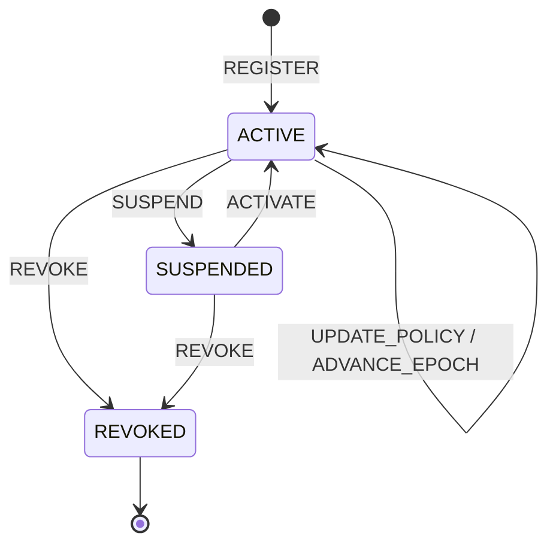

# Epoch State Machine

Epoch是单调授权版本，不是精确墙上时间。所有影响授权有效性的资源转换均
原子增加Epoch与`updated_version`。

| 转换 | 权限 | Epoch变化 | 旧能力 |
|---|---|---:|---|
| REGISTER | DO/资源管理员 | 初始化 | 不适用 |
| UPDATE_POLICY | DO/策略管理员 | +1 | 失效 |
| ADVANCE_EPOCH | DO/授权管理员 | +1 | 失效 |
| SUSPEND | DO/资源管理员 | +1 | 失效且停止签发 |
| ACTIVATE | DO/资源管理员 | +1 | 保持旧能力失效 |
| REVOKE | DO/资源管理员 | +1 | 永久失效 |

非法转换包括重复注册、`REVOKED -> ACTIVE`、`REVOKED`后的策略更新或Epoch
推进，以及相同状态的空转换。能力签发必须读取已经确认的状态快照；状态更新
先完成，后续签发才允许使用新Epoch。
