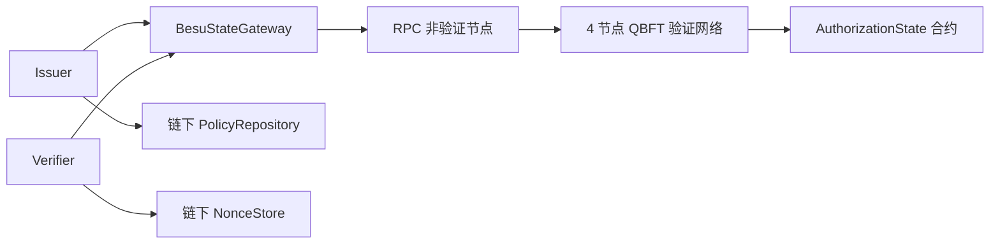

# 研究内容二 Besu 架构设计 V1.1

## 1. 研究目标与边界

在不改变 Baseline-I/Proposed-C 授权判定语义的前提下，以真实 Besu QBFT 网络提供共识排序、状态版本和事件审计。本版本不含 IPFS、数据加密、密文头部更新、多主机部署和正式性能结果。

## 2. 最终架构

联盟链提供共同的授权状态顺序，不保存秘密，也不替代链下策略匹配和令牌签名。

## 3. 链上链下边界

链上保存资源/用户标识哈希、账户地址、`policyDigest`、Epoch、状态、`policyVersion`、`stateVersion`、`userVersion` 和审计事件。链下保存 `I*`、`C(P)`、原始策略、Ed25519 私钥、公钥正文、CAP2、Nonce 消费记录和业务数据。

## 4. 网络与角色

网络固定 4 个验证者和 1 个 RPC 节点，chainId 20260728，QBFT block period 2 秒。ADMIN 管理角色；OWNER 注册资源和更新策略；AUTHORIZER 推进 Epoch；REVOCATION 管理资源/用户状态；AUDITOR 为预留只读治理角色。当前开发部署者集中持有角色，仅用于受控实现。

## 5. 合约状态机

资源注册得到 `(epoch, policyVersion, stateVersion)=(1,1,1)`。策略更新同时递增三者中的 policyVersion、stateVersion、Epoch；单独 Epoch 推进和资源状态迁移递增 Epoch 与 stateVersion。用户注册版本为 1，密钥轮换或状态迁移递增 userVersion。REVOKED 为终态。

## 6. CAP2 链绑定

CAP2 在 CAP1 语义字段外签名绑定 `chainId`、20 字节合约地址、资源 `stateVersion` 和 `userVersion`。策略摘要仍绑定链下规范策略，不绑定 Cover 实现。链 ID/合约地址错误、资源版本过期、用户版本过期分别返回冻结拒绝码。

## 7. Gateway 与确认读取

网关在同一确认区块读取资源和用户，并返回区块号与区块哈希。客户端使用本地私钥签名交易，RPC 只接收原始交易。Issuer 在签名前二次读取；RPC 不可用或两次状态不同均返回 `SYSTEM_STATE_UNAVAILABLE`，不签发令牌。

## 8. 公平性

Baseline-I 与 Proposed-C 共享链、合约、确认块、CAP2 格式、签名、TTL、Nonce 和拒绝顺序，仅时间策略执行接口不同。本阶段没有形成二者正式性能对比数据。

## 9. 测试与故障

合约测试覆盖角色、非法迁移、重复键、Epoch 与版本不变量。真实链检查覆盖正常 CAP2、Epoch 失效、密钥轮换失效和跨链拒绝。单验证者停机期间网络继续出块；RPC 中断期间系统拒绝服务，恢复后继续读链。

## 10. 局限与准入

单机进程不等同于跨组织联盟链；静态许可与集中角色不等同于生产治理；链下 Nonce 尚未支持多 Verifier 共享；Docker 路径因本机镜像拉取损坏未验证。可以进入正式多主机实验“设计”，但不得直接采集或宣称正式性能结果。
