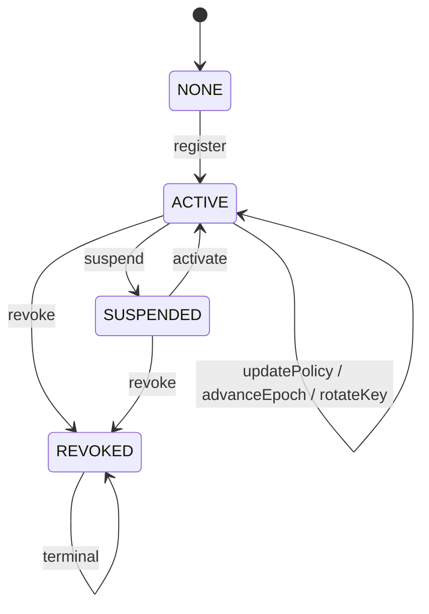
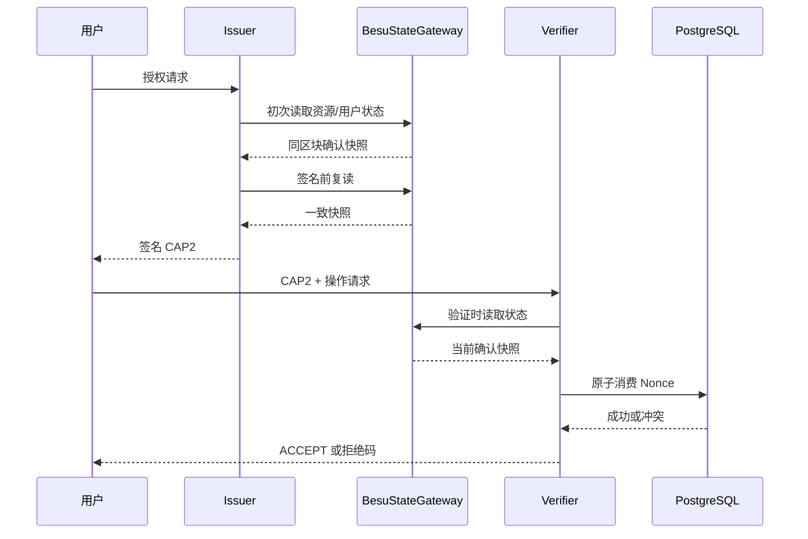
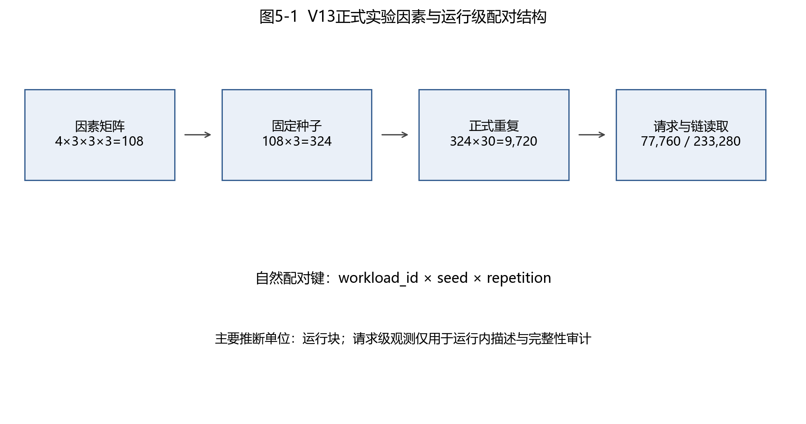
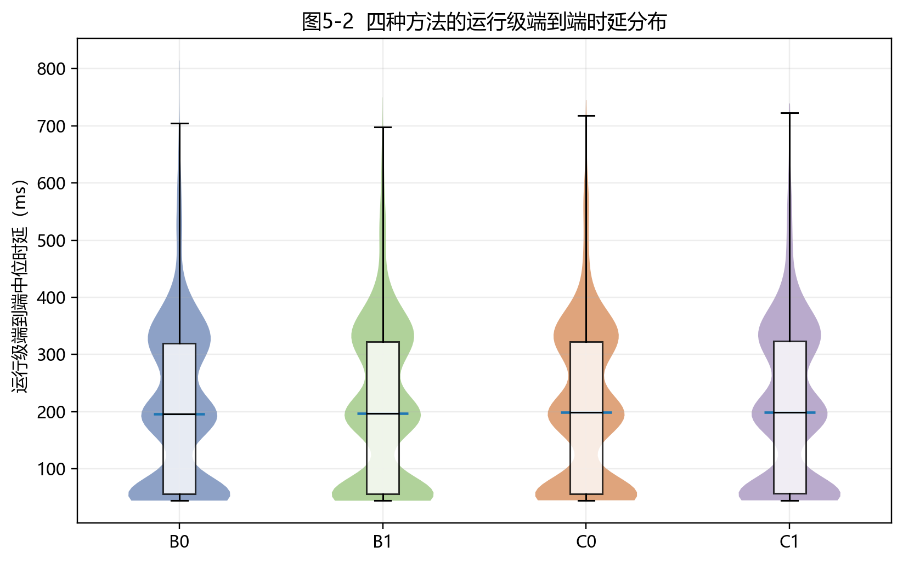
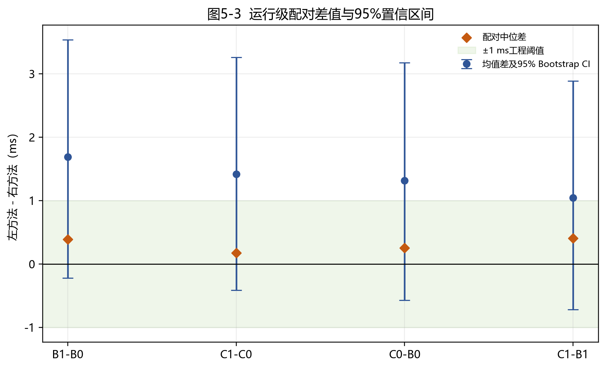
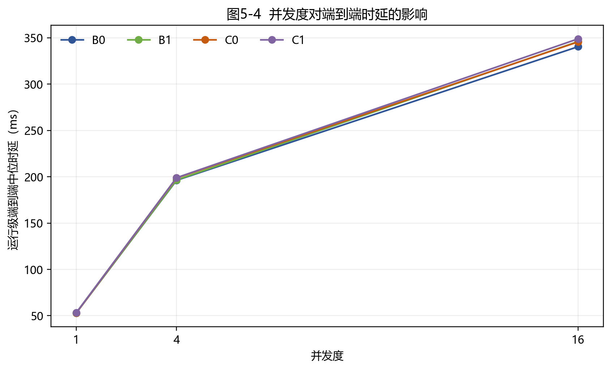
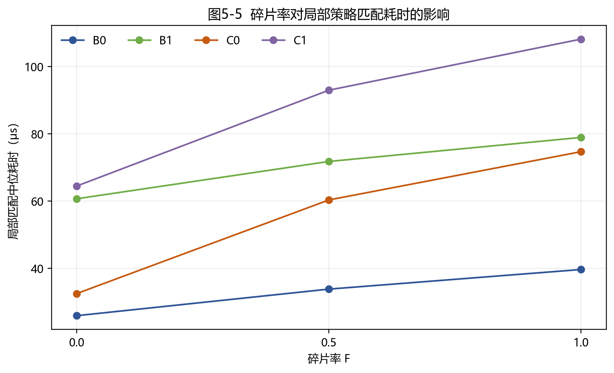
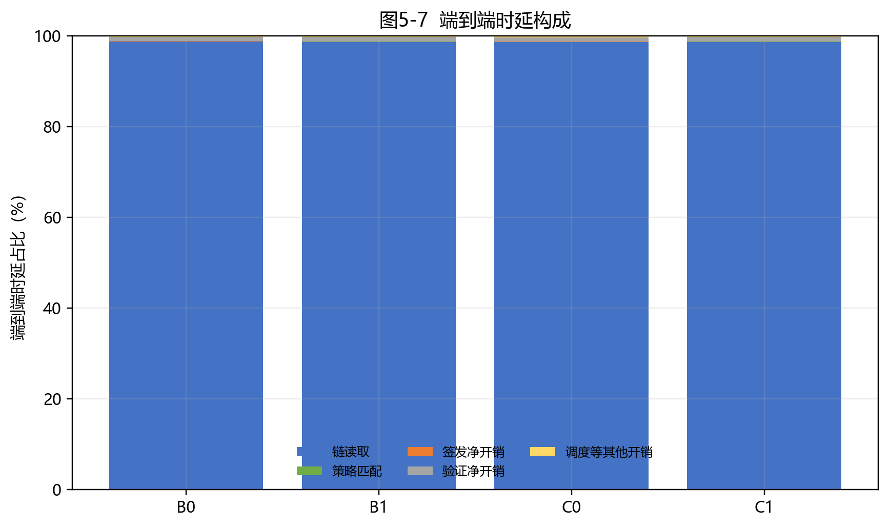
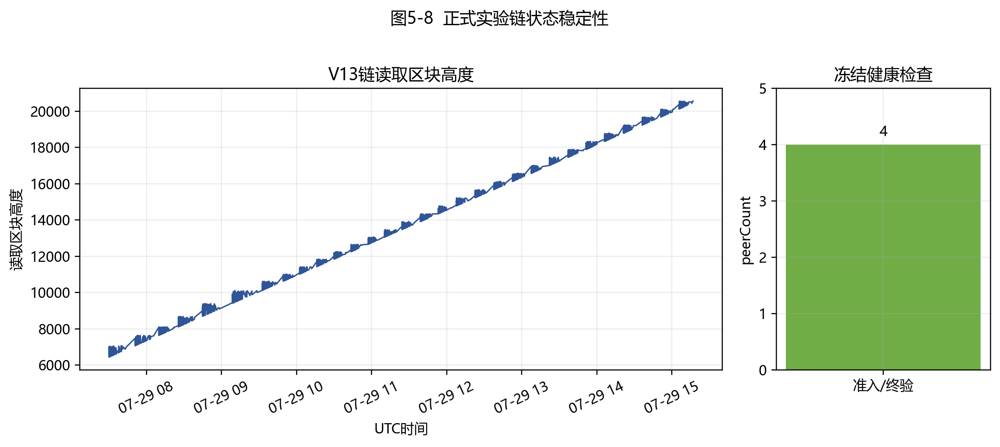
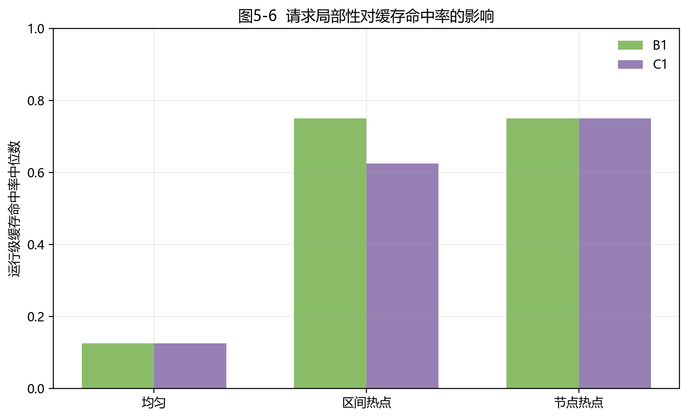

# 第5章 链上状态驱动的可信授权执行机制

## 5.1 研究问题与设计目标

研究内容一将非连续时间约束策略规范化为唯一语义表示 \(I^*\)，并由其确定性计算策略摘要 `policyDigest`；层次覆盖 \(C(P)\) 仅作为可选派生执行结构。本章进一步研究动态授权环境中的状态一致性问题：如何将策略、资源、用户密钥和授权时效锚定到可审计的链上状态，如何使能力仅适用于指定链和合约实例，以及如何在多个验证实例之间一致地拒绝重放。

本章的设计目标包括：（1）在真实五节点 Besu QBFT 许可联盟链上维护单调授权状态；（2）构造与 `chainId`、合约地址、策略摘要和状态版本完整绑定的 CAP2；（3）利用 PostgreSQL 原子共享 Nonce 协调多个 Verifier；（4）在 RPC 或数据库不可用时 Fail-Closed；（5）以公平、预注册的实验识别 \(I^*\)、\(C(P)\) 与缓存机制的真实适用边界。

本章不处理链下数据正文与密文头部、IPFS、门限解封装和前瞻性撤销。这些属于研究内容三。本章也不声称区块链提供绝对可信状态，或测试构成形式化密码学证明。

## 5.2 系统实体、角色与信任边界

系统包含数据所有者、数据用户、链上业务角色、Issuer、两个独立 Verifier、PostgreSQL 共享状态后端，以及由四个 Validator 和一个非验证 RPC 节点组成的 Besu QBFT 网络。链上角色分为 `ADMIN`、`OWNER`、`AUTHORIZER`、`REVOCATION` 和 `AUDITOR`：`ADMIN` 管理初始角色，`OWNER` 登记资源并更新策略，`AUTHORIZER` 推进 Epoch，`REVOCATION` 管理暂停与撤销，`AUDITOR` 只读审计。`BOOTSTRAP_FUNDER` 仅提供实验链初始测试余额，不拥有任何业务角色。

系统区分五类秘密材料：节点身份密钥用于 P2P 身份；交易账户密钥用于链上交易；Issuer 密钥用于 Ed25519 能力签名；用户密钥用于绑定 `userKeyId`；数据库凭据用于共享 Nonce 服务。上述秘密均不进入 Git、报告或服务日志。

信任边界如下：QBFT 在既定 Validator 集合及其容错假设下提供一致账本；合约角色治理者可能误用其合法权限，因此 RBAC 不抵抗已获合法角色的恶意管理员；Issuer 必须正确读取链状态并保护签名密钥；Verifier 必须执行冻结顺序中的全部检查；PostgreSQL 是跨实例一次性消费的共享事实源。系统不假设 RPC 或数据库永久可用，而是在依赖不确定时拒绝授权。

## 5.3 链上授权状态模型

正式合约 `AuthorizationState` 分别维护资源状态和用户状态。资源状态为

\[
R=(owner,policyDigest,epoch,status,policyVersion,stateVersion,updatedAtBlock),
\]

用户状态为

\[
U=(account,userKeyId,status,userVersion,updatedAtBlock).
\]

状态枚举为 `NONE`、`ACTIVE`、`SUSPENDED` 和 `REVOKED`。资源注册后进入 `ACTIVE`；策略更新递增 `policyVersion` 和 `stateVersion`；Epoch 推进递增 `epoch` 和 `stateVersion`；暂停、恢复和撤销推动资源状态及 `stateVersion`。用户注册后进入 `ACTIVE`；密钥轮换递增 `userVersion`；用户状态变化亦递增 `userVersion`。资源或用户一旦进入 `REVOKED`，不得恢复为 `ACTIVE`。



图5-A 资源与用户状态转换示意图。该图依据冻结合约接口绘制；资源更新推动 `stateVersion`，用户更新推动 `userVersion`。

链上状态的作用是提供可审计、可复核的授权锚点，而非消除治理风险。正式合约源码 SHA-256 为 `a6ad3e76eed272036eaa1f9c5c6086c3cf46f198b1adb66045915409c3056c5f`，部署地址为 `0x9ef44cf538d0df457ba77c556d8785e48bfc436d`。

## 5.4 CAP2 能力结构与完整绑定

CAP2 使用 Ed25519 对规范化字节序列签名。其字段依次包括：`magic`、`version`、`flags`、`issuer`、`resourceId`、`policyDigest`、`epoch`、`userKeyId`、`operation`、`notBefore`、`expiresAt`、`nonce`、`issuedAt`、`chainId`、`contractAddress`、`resourceStateVersion`、`userVersion`，以及 \(C(P)\) 模式下可选的 `matchedNode` 与 `coverVersion`。整数采用无符号大端编码，变长字符串带 16 位长度前缀。

\[
B=\operatorname{Encode}_{CAP2}(F_1\Vert F_2\Vert\cdots\Vert F_n),\qquad
\sigma=\operatorname{Ed25519.Sign}(sk_I,B).
\]

其中 `policyDigest` 始终由 \(I^*\) 计算，\(C(P)\) 不参与语义身份定义。`chainId` 与 `contractAddress` 阻止令牌直接迁移到其他链或其他合约实例；`policyDigest`、`epoch` 和 `resourceStateVersion` 绑定资源当前状态；`userVersion` 与 `userKeyId` 绑定当前用户密钥；`operation`、`notBefore` 和 `expiresAt` 限定用途与时间；`nonce` 支持一次性消费。

CAP2 是面向本系统状态的完整绑定能力结构，而不是新的密码学原语。其安全性依赖规范编码、Ed25519 标准假设、状态读取正确性及验证顺序的完整执行。

## 5.5 能力签发与验证流程

**算法5-1 Issuer 签发 CAP2**

```text
输入：resourceId, userId, publicKey, operation, time
1. 在同一确认区块读取资源状态与用户状态；
2. 检查资源和用户均为 ACTIVE；
3. 检查 SHA-256(publicKey) = userKeyId；
4. 检查 I* 的 policyDigest 与链上摘要一致且时间策略允许；
5. 生成 nonce、有效期和 CAP2 待签字段；
6. 签名前再次读取同一资源与用户状态；
7. 若两次快照不一致，则返回 SYSTEM_STATE_UNAVAILABLE；
8. 对规范化 CAP2 字节签名并返回能力。
```

**算法5-2 Verifier 验证 CAP2**

```text
输入：CAP2, 请求上下文
1. 解析规范编码；失败返回 MALFORMED_TOKEN；
2. 验证签名；失败返回 INVALID_SIGNATURE；
3. 读取确认链状态；失败返回 SYSTEM_STATE_UNAVAILABLE；
4. 依次检查资源、用户、policyDigest、epoch、chainId/contractAddress、
   resourceStateVersion、userVersion、userKeyId、operation 和时间窗口；
5. 重新执行 I* 时间策略检查；
6. 原子消费共享 Nonce；冲突返回 NONCE_REPLAY；
7. 仅当全部检查通过且消费成功时返回 ACCEPT。
```

**算法5-3 共享 Nonce 原子消费**

```sql
INSERT INTO consumed_nonce (...)
VALUES (...)
ON CONFLICT DO NOTHING
RETURNING 1;
```

消费唯一键为 `(chain_id, contract_address, resource_id, epoch, nonce)`。返回一行表示本次请求获得唯一消费权；返回零行表示已被消费；数据库异常直接拒绝，不回退到进程内状态。



图5-B CAP2 签发与验证时序。每个成功路径请求包含 Issuer 初读、签名前复读和 Verifier 读取三次真实链状态访问。

## 5.6 共享 Nonce 与多 Verifier 一致性

Verifier-1 与 Verifier-2 不共享进程内内存，而共同使用 PostgreSQL 16.14。数据库唯一约束将重放判断转化为单条事务内的原子竞争；并发 50、100 和 500 个相同能力请求时均仅有一次成功，分别拒绝 49、99 和 499 次重放。数据库中断期间 Verifier Fail-Closed，恢复后既有消费记录仍可阻止重放。

能力 Nonce 与 Ethereum 交易 Nonce 是两套不同机制。前者用于跨 Verifier 的能力一次性消费；后者以 `(chain_id,sender)` 为状态键，通过行锁和 `RESERVED`、`BROADCAST`、`CONFIRMED`、`FAILED` 状态管理链上交易序号。两者均采用数据库事务，但命名空间、目的和状态机不同。

因此，本章可支持的准确表述是：在冻结的 Nonce 命名空间、数据库唯一约束和验证流程假设下，同一能力最多只能被一个并发验证请求成功消费；这不等同于在任意部署和任意攻击模型下“完全杜绝重放”。

## 5.7 合约角色与状态转换

`ADMIN_ROLE` 负责角色治理；`OWNER_ROLE` 登记资源并更新策略；`AUTHORIZER_ROLE` 推进 Epoch；`REVOCATION_ROLE` 暂停、恢复和撤销资源或用户；`AUDITOR_ROLE` 不具有业务写权限。真实链状态机验收覆盖合法角色操作、非授权角色拒绝、版本单调递增、用户密钥轮换、事件与最终状态一致以及撤销终态约束。

角色分离降低单一业务账户承担全部权限的风险，但不能阻止已获得合法管理角色的主体恶意操作。此类主体仍属于治理信任边界，需通过密钥管理、操作审计和组织制度约束。

## 5.8 安全属性与故障闭合分析

本章验证的安全目标如下。

| 目标 | 机制与证据 | 结论边界 |
|---|---|---|
| S1 跨链/合约隔离 | CAP2 绑定 `chainId` 与合约地址；篡改测试拒绝 | 不证明链本身绝对可信 |
| S2 状态版本绑定 | `policyDigest`、`epoch`、`stateVersion` | 依赖链状态读取正确 |
| S3 用户密钥绑定 | `userKeyId` 与 `userVersion` | 不保护已泄露终端私钥 |
| S4 操作与时间绑定 | `operation`、`notBefore`、`expiresAt` | 依赖时钟与配置假设 |
| S5 重放控制 | PostgreSQL 原子共享 Nonce | 限于冻结命名空间和事务语义 |
| S6 多 Verifier 一致性 | 两实例共享数据库事实源 | 数据库不可用时拒绝 |
| S7 Fail-Closed | RPC 故障停止签发，数据库故障拒绝验证 | 可用性让位于安全性 |
| S8 角色控制 | 合约 RBAC 与越权测试 | 不抵抗合法管理员恶意行为 |
| S9 状态可审计 | QBFT 账本、事件和区块证据 | 受 QBFT 容错与治理边界约束 |

攻击回归、语义一致性、并发重放和状态竞争测试均未出现错误接受。这些证据支持冻结实现与故障模型下的系统主张，但不构成形式化安全证明，也不支持抵抗任意 Validator 合谋或追回已被合法用户取得的明文。

## 5.9 系统实现与多主机实验环境

正式实验使用 `FORMAL_AUTHORIZATION_EXPERIMENT_CHAIN`，而非冷保留的 `INFRASTRUCTURE_VALIDATION_CHAIN`。正式链采用 Besu 26.5.0、Java 21、QBFT、四个 Validator 和一个非验证 RPC 节点，`chainId` 与 `network-id` 均为 2026072901。Genesis SHA-256 为 `7d431f01aab7d0c55c58c09346ee1f9a43475322a4aca304cfbb172b9b32add4`。正式合约部署于区块 1483，Artifact SHA-256 为 `b8cd8040e4a7683fb4454ea1cf3c3c4d97647611ad7cb3d616b72a35cf496ad5`。

五台 Ubuntu 24.04 虚拟机运行于 Windows 主机的 VMware 环境：四台承载 Validator，一台 `experiment-client` 承载非验证 RPC、Issuer、Verifier-1、Verifier-2 和 PostgreSQL。正式证据冻结了节点角色、软件版本、链参数和服务健康状态；单台虚拟机的精确 vCPU 与内存配额未形成同等级独立清单，因此本章不据此作硬件效率外推，并将共享物理主机列为有效性限制。

## 5.10 正式实验设计与预注册

第一次正式运行因链读取边界、局部性生成、缓存命中记录、吞吐量与统计单位等协议偏差被标记为 `INVALIDATED_PROTOCOL_DEVIATION`。其原始数据保留用于方法学审计，但不进入本章性能统计。V13 在提交 `8a3d795e22e5d9373c3053245e3b4040cd062dd5` 重新预注册并完整重跑。

V13 比较四种方法：B0 为 Baseline-I 无缓存，B1 为 Baseline-I 区间缓存，C0 为 Proposed-C 无缓存，C1 为 Proposed-C 节点缓存。自变量包括三种碎片率 \(0,0.5,1\)，三种局部性 `UNIFORM`、`INTERVAL_HOTSPOT`、`NODE_HOTSPOT`，以及并发度 \(1,4,16\)。采用三个固定 seed，每个含 seed 配置进行 30 次正式重复。



图5-1 正式实验因素与运行级配对结构。

实验共包含 108 个因素配置、324 个含 seed 配置、9720 个运行块、77760 条请求记录和 233280 条链读取记录。每条请求执行三次真实链读取。四种方法复用相同工作负载；三类局部性生成器产生不同访问分布；缓存命中按单请求直接记录，不在计时外预热；吞吐量按完整运行批次定义。

主要推断单位是 `fragmentation × locality × concurrency × seed × repetition × method` 的运行块。方法比较在相同工作负载、seed 和 repetition 下自然配对，每组比较含 2430 对运行块，并执行 10000 次运行级 Bootstrap。请求级记录只用于运行内描述和完整性审计，不被视为 77760 个独立统计重复。

## 5.11 V13 正式实验结果

表5-1给出运行级总体统计。四种方法的端到端中位时延均约为 196--199 ms，吞吐量中位数约为 17.78--17.93 请求/s。

| 方法 | 运行数 | 中位时延/ms | 均值/ms | 吞吐量中位数/(请求/s) | 缓存命中率中位数 | 链读取占比/% |
|---|---:|---:|---:|---:|---:|---:|
| B0 | 2430 | 196.128 | 209.714 | 17.926 | 0 | 98.796 |
| B1 | 2430 | 196.583 | 211.402 | 17.907 | 0.750 | 98.706 |
| C0 | 2430 | 198.682 | 211.029 | 17.842 | 0 | 98.664 |
| C1 | 2430 | 198.939 | 212.448 | 17.777 | 0.625 | 98.704 |

表5-1 四种方法运行级总体统计。



图5-2 四种方法端到端运行级分布，样本单位为运行块。

表5-2给出四种自然配对比较。点估计均很小，均值差的 95% Bootstrap 置信区间全部跨越 0；在预注册的 1 ms 工程阈值下，改善与退化运行比例相近。

| 比较 | 配对数 | 中位差/ms | 均值差/ms | 均值差95% CI/ms | 稳健效应量 |
|---|---:|---:|---:|---:|---:|
| B1-B0 | 2430 | +0.390 | +1.688 | [-0.220, 3.539] | 0.018 |
| C1-C0 | 2430 | +0.176 | +1.419 | [-0.410, 3.258] | 0.008 |
| C0-B0 | 2430 | +0.257 | +1.315 | [-0.568, 3.177] | 0.012 |
| C1-B1 | 2430 | +0.408 | +1.046 | [-0.717, 2.886] | 0.019 |

表5-2 四种配对比较及运行级 Bootstrap 置信区间。正值表示前者较慢。



图5-3 运行级配对均值差及95% Bootstrap置信区间。

并发度是端到端时延的主要观测影响因素。并发度从 1 增至 4 和 16 时，中位时延由约 52.8 ms 增至约 196--199 ms 和 340--349 ms；吞吐量中位数基本维持在约 17.7--18.0 请求/s，表明新增并发主要转化为排队和等待，而非同比吞吐增长。



图5-4 并发度对端到端运行级中位时延的影响。

碎片率主要影响局部匹配。以无缓存方法为例，B0 的 `match_ns` 中位数由 25.967 μs 增至 39.685 μs，C0 由 32.529 μs 增至 74.699 μs；但这一微秒级变化被约 200 ms 的公共链读取开销掩盖。



图5-5 碎片率对 `match_ns` 运行级中位数的影响。

逐请求链读取占端到端时延的 98.66%--98.80%，局部匹配仅占约 0.017%--0.047%。因此，当前实现的主要性能边界是链状态访问，而不是 \(I^*\) 与 \(C(P)\) 的局部匹配差异。



图5-7 `chain_read`、`match`、`issue` 和 `verify` 的运行级耗时构成。

正式运行期间链高度持续增长；冻结健康快照中的 `peerCount` 为 4。图5-8右图反映准入与结束健康快照，而非逐请求连续 peer 遥测。



图5-8 正式运行期间区块高度及冻结健康快照。

## 5.12 缓存、局部性与 C(P) 消融分析

热点负载确实提高缓存命中率：B1 在两类热点下中位命中率为 0.75，而均匀访问为 0.125；C1 在区间热点和节点热点下分别为 0.625 和 0.75，均匀访问为 0.125。然而，命中率提高没有稳定转化为端到端收益。



图5-6 请求局部性对缓存命中率的影响。

B1-B0 与 C1-C0 的配对中位差分别为 +0.390 ms 和 +0.176 ms，置信区间跨 0，且改善运行比例分别约为 43.70% 和 44.32%，退化比例分别约为 47.33% 和 46.71%。因此，缓存没有表现出稳定且具有工程意义的端到端收益。

C0-B0 与 C1-B1 同样没有稳定方向。\(C(P)\) 在语义测试中保持 \(I^*\) 的决策结果，但没有表现出 Baseline-I 难以复制的协议能力或性能价值。本章据此冻结 `C(P)_DEMOTED_CONFIRMED_BY_VALID_RERUN`：\(C(P)\) 是可选派生 IR、消融和证伪对象，不构成研究内容二的核心性能贡献。

这一负面结果不是实验失败。它通过公平基线和真实系统开销揭示了方法边界，使研究贡献收敛到 \(I^*\) 唯一语义、真实链状态锚定、CAP2 完整绑定、共享 Nonce、多 Verifier 一致性、Fail-Closed 和可复现边界实验。

## 5.13 讨论、局限与适用边界

第一，每请求三次链读取提供了签发前后状态一致性与验证时当前状态确认，但导致 98.66%--98.80% 的端到端时间用于链读取。未来可研究带区块证明或版本约束的安全状态缓存、批量读取和多资源聚合，但这些机制尚未实现。

第二，实验仅覆盖五节点许可链和冻结工作负载，且虚拟机共享物理主机，不能外推到任意规模、公链环境或独立物理集群。第三，缓存结论受冻结容量、LRU 策略、局部性生成器和请求规模约束。第四，系统依赖 Ed25519、QBFT、数据库事务和操作系统密钥保护等假设，未提供端到端形式化证明。第五，RBAC 不防止合法管理员恶意行为，系统也不能追回已被用户获得的能力、明文或密钥。第六，CPU 字段记录的是累计进程时间而非利用率，因此本章不据其比较方法 CPU 效率。

正式性能结论只适用于 V13 冻结代码、配置、链状态和环境。进一步优化应优先减少可验证链读取成本，而不是放大微秒级局部匹配差异。

## 5.14 本章小结

本章在真实五节点 Besu QBFT 许可联盟链上实现并验证了由链上授权状态锚定、与 `chainId`、合约实例、资源状态、策略摘要和用户密钥版本完整绑定的授权执行机制。PostgreSQL 原子共享 Nonce、多 Verifier 一致性控制和依赖故障下的 Fail-Closed 行为，为重放拒绝、状态竞争控制和跨实例隔离提供了可审计证据。

V13 有效重跑表明，逐请求链读取主导端到端时延，并发度是主要观测影响因素；热点提高缓存命中率但未产生稳定工程收益，\(C(P)\) 亦未表现出 Baseline-I 不可复制的优势。研究内容二因而完成了“谁在当前链上状态下能够获得并使用授权能力”的闭环。研究内容三将在此冻结接口之上研究授权后链下加密材料的安全释放、版本化 Header、前瞻性撤销和链上链下恢复闭环，本章不预先声称这些机制已经实现。
