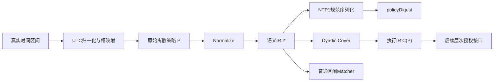

# 第四章图表索引

| 编号 | 题名 | 来源 | 核验状态 |
|---|---|---|---|
| 图4-1 | 确定性时间策略编译流程 | `figures/图4-1确定性时间策略编译流程.mmd`及生成脚本 | SVG/PDF/PNG均已生成并视觉核验 |
| 图4-2 | 不同碎片率下三种策略表示的规模比较 | `figures/figure_4_2_representation_size.pdf` | 已由脚本生成 |
| 图4-3 | 策略编译耗时随时间域规模变化 | `figures/figure_4_3_compile_time.pdf` | 已由脚本生成 |
| 图4-4 | 三种策略表示的成员匹配延迟 | `figures/figure_4_4_match_latency.pdf` | 已由脚本生成 |
| 图4-5 | 从连续到碎片化策略的表示适用边界 | `figures/figure_4_5_applicability_boundary.pdf` | 已由脚本生成 |
| 表4-1 | 符号及含义 | 本章形式化定义 | 已核验 |
| 表4-2 | 三种表示的理论与实现特征 | `tables/table_4_2_theory_and_empirical.*` | 已核验 |
| 表4-3 | E2正确性验证汇总 | `tables/table_4_3_e2_correctness.*` | 已核验 |
| 表4-4 | E1-C核心边界结果 | `tables/table_4_4_core_results.*`及表示比例CSV | 已核验 |
| 表4-5 | 二次幂与非二次幂全域补充实验 | supplement原始CSV及统计汇总 | 已核验 |

## 图4-1排版内容

图4-1不使用或改写任何实验数据点。正式文件：

- `figures/图4-1确定性时间策略编译流程.svg`
- `figures/图4-1确定性时间策略编译流程.pdf`
- `figures/图4-1确定性时间策略编译流程.png`
- 可编辑源：`.mmd`
- 可重复生成脚本：`experiments/figure_4_1.py`
