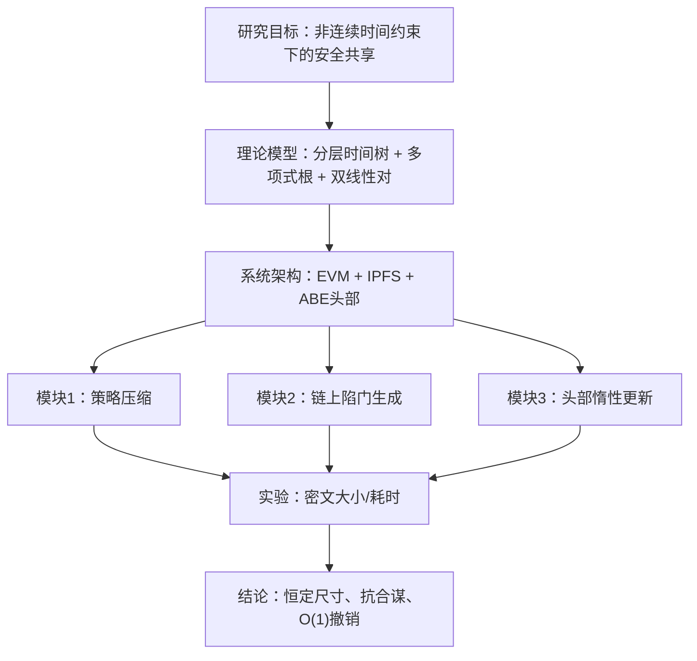
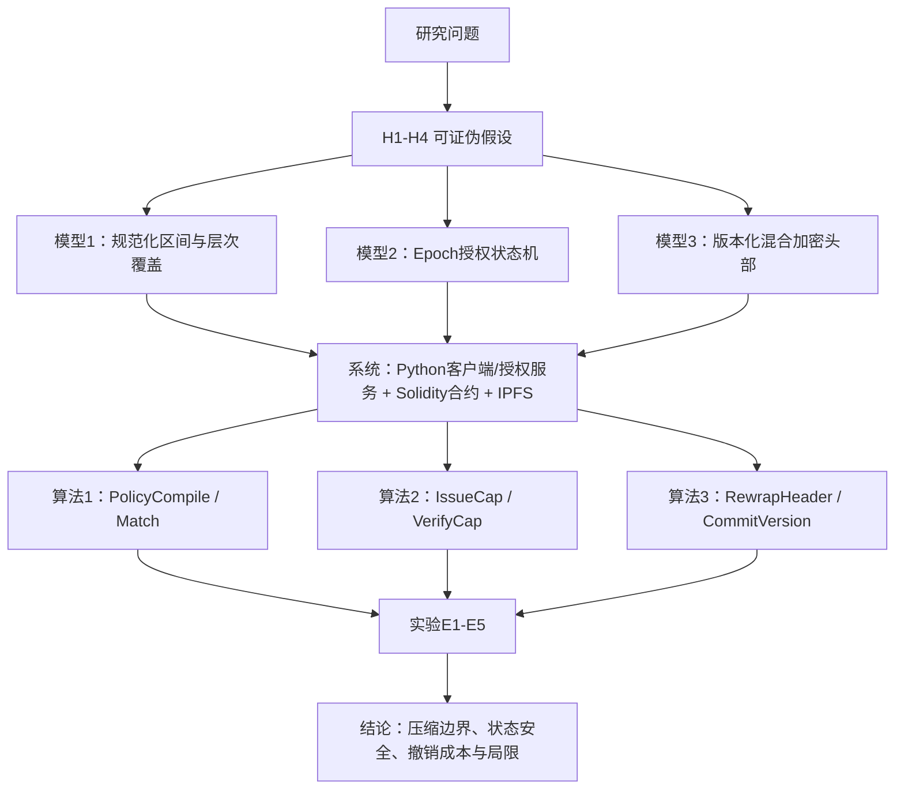
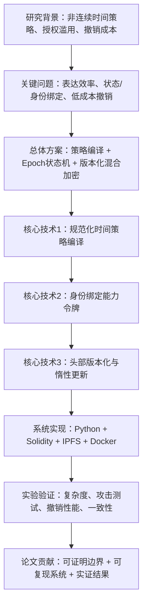

# 《面向非连续时间约束的区块链数据共享关键技术研究及实现》开题报告系统级审查与重构报告

> 审查对象：`开题报告表-王威-1 (2).docx`  
> 审查日期：2026-07-27  
> 审查结论：**原方案不宜按现有密码学构造继续实现，建议“重大修改后继续”。题目与三个核心研究问题可以保留。**

## 审查边界与原则

本报告完整审阅了开题报告中的研究目标、四项研究内容、理论依据、技术路线、实施方案、可行性、风险应对、创新点及35条参考文献。审查不以包装创新为目标，而以“能否形成可实现、可验证、可复现、可答辩的专业硕士论文”为判断标准。

必须明确：当前最大问题不是代码尚未完成，而是**原方案的三个核心结论尚未由完整算法、复杂度边界和威胁模型支撑**。在此基础上直接做实验，只会测量一个尚未被严格定义的系统。

# 第一部分 当前方案严格审查

## 1.1 研究问题与技术方案匹配性

| 研究问题 | 当前解决方案 | 是否匹配 | 存在问题 |
|---|---|---:|---|
| 非连续、分钟级时间策略导致策略与密文膨胀 | 分层时间树聚合；将允许时间节点映射为多项式根；用 `g^{P(α)}` 表示策略 | 部分匹配 | 分层覆盖适合压缩“区间并集”，但不保证任意碎片集合均为 `O(log N)`；群元素虽可恒定，公共参数、系数计算和验证成本仍随多项式次数增长 |
| 陷门囤积、重放、跨用户共享与合谋 | 将区块哈希、时间、GID和秘密 `sk` 嵌入陷门；合约生成陷门 | 目标相关，但构造不成立 | 未定义完整 `Setup/KeyGen/Encrypt/TrapdoorGen/Decrypt`；哈希绑定不等于抗合谋证明；公开EVM不能安全保存主秘密或其可恢复碎片 |
| 撤销需要重加密大文件或更新全员密钥 | KEM/DEM分离数据体和头部；撤销时更新头部及链上索引 | 基本匹配 | 只能保证“单文件更新成本与文件体积无关”，不能保证系统总成本恒为 `O(1)`；已获得明文或旧数据密钥的用户无法被追溯撤销 |
| 证明方案安全并验证性能优势 | DBDH/DLIN下IND-CPA归约；与Waters11及区块链ABE对比 | 不匹配 | 新构造未完整定义，无法进入归约证明；DBDH/DLIN、随机预言机/标准模型选择不一致；基线操作与本方案操作未对齐 |

结论：研究问题本身合理，但当前技术路线只对第三个问题形成了部分工程闭环。前两个问题存在“研究问题正确、解决机制尚未成立”的情况。

## 1.2 当前系统逻辑链审查

逐层检查结果：

| 层级 | 输入 | 预期输出 | 审查结果 |
|---|---|---|---|
| 研究目标 | 非连续时间策略、用户身份、撤销事件、文件 | 可执行的时间受限共享机制 | 明确 |
| 理论模型 | 时间集合、主秘密、链状态、GID | 正确且安全的密码算法 | 缺少完整算法定义、正确性等式与安全游戏 |
| 系统架构 | 密文体、头部、合约状态、陷门请求 | 可部署协议 | 合约秘密管理不可行；链上链下状态提交顺序未定义 |
| 模块依赖 | 压缩头部→双绑定→撤销更新 | 递进闭环 | 模块2依赖未成立的新密码原语，导致模块3安全性也悬空 |
| 实验验证 | 策略规模、用户、文件、撤销事件 | 可重复统计结果 | 目前只有指标名称，没有自变量、基线、重复次数、失败判据 |

主要断点有四个：

1. **从代数性质跳到密码方案。** `P(t)=0` 或 `(x-t)|P(x)` 只是代数事实，不自动得到可正确解密、可抗选择明文攻击的ABE方案。
2. **从链状态跳到可信时间。** 区块哈希可作为版本标识或不可预测性有限的状态摘要，但不是精确墙上时钟，更不能作为合约秘密。
3. **从更新头部跳到即时撤销。** 更新头部只能限制未来版本访问，不能收回用户已缓存的密钥或明文。
4. **从单次操作常数成本跳到系统总成本 `O(1)`。** 若一次撤销影响 `F_r` 个文件，则至少要处理 `F_r` 个头部或延迟到后续访问，总代价仍与受影响对象数相关。

## 1.3 技术选型合理性审查

| 模块 | 当前技术 | 存在问题 | 推荐方案 | 理由 |
|---|---|---|---|---|
| 非连续时间表达 | 年月日时分多叉树 | 日历分支不均匀；任意孤立时间点无法对数压缩 | 离散Epoch域上的规范化区间并集 + 二叉规范覆盖 | 定义简单、边界可证明、Python易实现 |
| 策略压缩 | 根多项式与 `g^{P(α)}` | 隐藏公共参数与计算开销；正确性和安全性未完成 | 将规范覆盖节点编码为策略清单/哈希承诺；多项式仅作可选对照实验 | 不自行发明新密码原语，贡献落在可验证编译算法 |
| 身份绑定 | `H(GID)`嵌入配对指数 | 仅有公式草图，不能证明不可转移 | 用户公钥指纹绑定 + 面向该公钥的HPKE封装 + 签名能力令牌 | 使用标准、成熟、可测试的KEM/KDF/AEAD组合 |
| 状态绑定 | 实时区块哈希 | 不是精确时间；状态频繁变化；历史可用性受平台限制 | 合约维护单调 `epoch/version`，时间仅用于窗口判断 | Epoch直接表达撤销状态，语义稳定且易审计 |
| 链上陷门生成 | 合约保存MSK碎片并执行椭圆曲线运算 | 合约状态与执行公开，秘密会暴露；门限方案工作量陡增 | 合约只保存策略摘要、Epoch、撤销状态和头部摘要；密钥服务链下运行 | 符合“链上状态机、链下密码计算”边界 |
| 数据加密 | 未指定模式的AES | 只有保密性，无篡改检测和Nonce规范 | AES-256-GCM或ChaCha20-Poly1305 | 提供AEAD，能够同时验证机密性与完整性 |
| 密钥封装 | 自研ABE头部 | 构造未完成，Python生态和EVM映射风险高 | RFC 9180 HPKE（X25519 + HKDF-SHA256 + AEAD） | 标准明确、测试向量完整、适合Python原型 |
| 链下存储 | IPFS CID | CID只表明内容寻址，不自动保证持久可用 | IPFS + 本地/远程Pin + 可用性检测 | 避免把完整性误写成可用性 |
| 撤销更新 | 事件监听后重封装头部 | 事件丢失、重复、乱序及提交窗口未处理 | 幂等更新状态机：上传新头部→校验→链上提交→旧Epoch拒绝 | 可以定义一致性不变量并做故障注入实验 |
| 原型栈 | Java/Python + JPBC/Charm + Solidity | 技术栈过多，Charm在Windows部署成本高 | Python 3.12、`cryptography`、Web3.py、Solidity、Anvil/Ganache、Kubo/IPFS、Docker | 与个人基础和六个月周期匹配 |

以太坊的BN254预编译合约只提供指定曲线上的加法、标量乘法和配对检查，并不意味着任意ABE构造可直接链上实现；EIP-197的初衷也是提供特定配对检查能力，而不是秘密陷门服务。见 [EIP-197](https://eips.ethereum.org/EIPS/eip-197)。

## 1.4 创新性审查

### 可保留并收敛的贡献

1. **方法/算法贡献：** 非连续时间策略的规范化、区间合并与层次化编译；给出输出敏感的复杂度边界。
2. **系统架构贡献：** 以链上单调Epoch为唯一授权状态锚点，将策略、用户公钥、文件头部版本和撤销事件连接为状态机。
3. **工程贡献：** 数据体不变、头部版本化重封装、事件驱动惰性更新与故障恢复的可复现实验平台。

### 不能作为独立创新的内容

- KEM/DEM、IPFS、智能合约、AES、哈希上链均是成熟技术，简单组合不是算法创新。
- “加入GID哈希”“加入区块哈希”本身属于参数拼接，不能替代安全定义。
- “使用FFT”“调用预编译合约”是实现优化，不是论文核心创新。
- 仅展示系统能运行、Gas更低或文件加密更快，不能证明抗重放与抗合谋。

### 专家最可能提出的质疑

1. `g^{P(α)}` 如何由加密者计算？公共参数是否必须包含至 `α^k` 的幂？若是，复杂度转移到了哪里？
2. 任意非连续时间集合为何能从 `O(N)` 降到 `O(log N)`？交错孤立点的最坏情况是什么？
3. `Token`公式中的 `sk`由谁持有？智能合约数据公开，主秘密如何保密？
4. 为什么区块哈希代表当前可信时间？分叉、确认延迟、区块时间偏差如何处理？
5. 哈希中加入GID为何能防止合法用户把陷门、私钥甚至明文直接交给他人？
6. 被撤销用户已经取得 `K_sym` 后，更新头部如何让旧密钥失效？
7. `O(1)`是相对于文件大小、用户数、策略节点数还是受影响文件数？
8. 参考文献正文编号为何与文后条目不对应？例如正文将Sahai-Waters ABE写为 `[12]`，但条目 `[12]` 是Boneh-Franklin IBE。

# 第二部分 关键漏洞总结

## 2.1 致命级漏洞

1. **密码学构造未闭合。** 缺少正式算法、参数域、正确性证明和安全游戏，现阶段不能声称IND-CPA。
2. **链上秘密假设错误。** EVM是公开确定性执行环境，不能直接持有主秘密并返回秘密相关陷门。
3. **复杂度结论错误。** 任意碎片时间集合不存在无条件 `O(log N)` 表示；FFT也不能把一般多项式构造降为对数时间。

## 2.2 重大级漏洞

1. 撤销语义未区分未来访问、历史密文、已泄露明文和密钥泄露。
2. 抗重放、抗转移、抗合谋混为一谈；三个安全属性需要不同攻击者能力与判据。
3. 头部、IPFS、合约索引更新不具备原子性，可能出现“链上新状态+链下旧头部”窗口。
4. 参考文献至少存在大范围编号错配，直接影响学术诚信和现状分析可信度。

## 2.3 一般级漏洞

- “区块链解决拜占庭时间同步”“杜绝密钥滥用”“数学上无懈可击”等表述过度。
- 未说明AEAD的Nonce、Tag、AAD和密钥轮换。
- 未定义公开数据集在研究中的作用；文件类型不是密码性能的理论自变量，文件大小才是主要自变量。
- “本地已有服务器、已深入掌握理论、已有代码能力”等条件与当前真实进展不一致，中期报告中必须如实修正。

# 第三部分 重构总体方案

## 3.1 保持不变的题目与核心问题

题目保持为：

> **面向非连续时间约束的区块链数据共享关键技术研究及实现**

核心问题保持为：

1. 如何降低非连续、细粒度时间策略的表达和计算开销？
2. 如何阻止过期授权重放，并使授权结果与具体用户身份及当前系统状态绑定？
3. 如何避免撤销时重加密大文件和更新全员长期私钥？

改变的是解题机制和论断边界，不是研究主题。

## 3.2 核心思想与科学假设

**核心思想：** 将“时间策略压缩”“实时授权”“数据加密”和“撤销状态”拆成边界清晰的四层：策略编译器负责把时间规则变成紧凑且可验证的规范表示；区块链只负责维护单调Epoch和审计状态；链下授权服务根据链上状态签发短期、身份绑定的能力令牌；标准混合加密负责数据机密性，撤销只改变密钥头部版本。

| 假设 | 可证伪表述 |
|---|---|
| H1 策略编译有效 | 对由 `k` 个区间构成的非连续策略，规范层次覆盖相较分钟枚举显著减少策略字节和授权判断时间；收益随区间连续性增加，最坏情况不承诺恒定大小 |
| H2 状态与身份绑定有效 | 旧Epoch、错误用户公钥、过期时间、重复Nonce或被篡改令牌均被拒绝，且合法请求可通过 |
| H3 头部撤销降低成本 | 单文件撤销更新时间与数据体大小近似无关，明显低于全文件重加密；总成本随受影响文件数增长 |
| H4 状态机具有工程鲁棒性 | 面对重复事件、事件延迟、旧头部、乱序提交，系统维持“仅当前Epoch头部可接受”的不变量 |

## 3.3 理论模型

1. **时间域：** 将研究周期离散为Epoch集合 `T={0,...,U-1}`，输入策略是若干闭区间的并集。
2. **规范化：** 排序、合并相交或相邻区间，得到互不相交集合 `I*`。
3. **层次覆盖：** 每个规范区间分解为二叉时间树中的最小规范节点集合 `C(P)`。单区间节点数为 `O(log U)`，`k`个区间为输出敏感的 `O(k log U)` 上界；任意孤立点最坏情况仍为 `Ω(k)`。
4. **链上状态机：** 每个资源维护 `(policyDigest, epoch, headerDigest, status)`；撤销是 `epoch := epoch + 1`。
5. **能力令牌：** 授权服务签名 `Cap=(fileId, policyDigest, epoch, userKeyId, nbf, exp, nonce)`。
6. **混合加密：** 数据体由AEAD加密；数据密钥通过用户公钥执行HPKE封装。RFC 9180明确给出KEM、KDF和AEAD组合及其安全要求，适合作为实现基础：[RFC 9180](https://www.rfc-editor.org/info/rfc9180/)。
7. **安全边界：** 系统保证未取得当前数据密钥的撤销用户不能访问新版本；不声称收回已经获得的明文，也不声称阻止用户主动共享私钥或明文。

## 3.4 系统闭环

# 第四部分 三个研究内容重新设计

## 4.1 研究内容一：非连续时间策略的规范化编译与可验证表示

- **研究目标：** 在不枚举每一分钟的前提下，对非连续时间策略进行紧凑、确定且可复现的表示。
- **核心问题：** 如何在表达能力、策略尺寸、编译时间和判断时间之间取得可量化平衡？
- **理论基础：** 区间并集规范化、二叉层次覆盖、规范序列化与密码哈希。
- **技术路线：** `Parse → Normalize → Merge → CanonicalCover → Serialize → Digest`。
- **实现方案：** Python实现策略DSL、日期到Epoch映射、规范覆盖、匹配器和性质测试。
- **实验验证：** 与分钟枚举、区间列表两种基线比较策略字节、节点数、编译耗时、匹配耗时；改变时间跨度 `U`、区间数 `k`、碎片率和粒度。
- **理论产出：** 给出正确性命题“编译前后允许时间集合等价”，以及 `O(k log U)` 的上界和最坏情况说明。

为什么必须先做：后续能力令牌必须绑定一个唯一的 `policyDigest`；若策略表示不规范，同一语义可能产生不同哈希，链上审计与撤销均无法可靠执行。

## 4.2 研究内容二：链上Epoch驱动的身份绑定授权协议

- **研究目标：** 让每次授权同时绑定当前链上状态、目标资源、策略版本和用户公钥。
- **核心问题：** 如何让旧授权、跨用户授权和被篡改授权可被确定拒绝，同时避免在合约中保存秘密？
- **理论基础：** 数字签名、Nonce、有效期、接收者公钥绑定、单调版本状态机。
- **技术路线：** 合约读取当前Epoch → 服务校验策略与撤销状态 → 签发短期能力令牌 → 客户端/网关验证签名、Epoch、用户公钥、时间与Nonce。
- **实现方案：** Solidity合约保存公开状态；Python授权服务使用Ed25519签名；用户以X25519公钥标识接收者；重放缓存按 `(issuer, nonce, epoch)` 管理。
- **实验验证：** 构造合法、过期、旧Epoch、用户替换、文件替换、策略替换、签名篡改、Nonce重放等测试矩阵；报告拒绝率、误拒率和验证延迟。
- **安全产出：** 给出协议状态机、不变量和基于标准签名/HPKE安全性的组合论证，不声称提出新ABE。

为什么建立在内容一上：令牌中的策略摘要由内容一产生；内容二把静态策略语义变成可审计的动态授权决策。

## 4.3 研究内容三：版本化密文头部与可恢复的惰性撤销机制

- **研究目标：** 撤销时不重加密大数据体、不更新合法用户长期私钥，并明确一致性与成本边界。
- **核心问题：** 如何保证链上Epoch、链下头部和数据体引用一致，并在事件失败时恢复？
- **理论基础：** KEM/DEM、AEAD、内容寻址、版本状态机、幂等事件处理。
- **技术路线：** AES-GCM加密数据体并固定Body CID → HPKE封装DEK形成Header → 合约提交Header摘要和Epoch → 撤销时递增Epoch并重封装Header → 客户端只接受当前Epoch。
- **实现方案：** Header包含 `fileId/bodyCid/policyDigest/epoch/recipientKeyId/encapsulatedKey/aeadNonce/tag`；先上传并校验新头部，再链上提交；代理任务带幂等键并支持重试。
- **实验验证：** 对不同文件大小/类型、用户数、受影响文件数测试全量重加密、立即头部更新、惰性头部更新；注入事件重复、延迟、丢失和旧头部。
- **工程产出：** 可复现实验平台、完整日志、数据表、绘图脚本和Docker配置。

为什么建立在内容二上：撤销的本质是Epoch状态迁移；没有内容二的唯一状态锚点，内容三无法判断哪个头部是当前有效版本。

# 第五部分 技术路线设计

## 5.1 总体技术路线图

## 5.2 模块输入输出关系

| 模块 | 输入 | 输出 | 与其他模块关系 |
|---|---|---|---|
| 策略解析器 | 人类可读时间规则、粒度、时区 | Epoch区间集合 | 为规范化模块提供统一时间域 |
| 策略编译器 | 区间集合 | 覆盖节点、规范字节串、策略摘要 | 摘要进入合约、令牌和头部 |
| 状态合约 | 资源、策略摘要、管理操作 | 当前Epoch、撤销状态、头部摘要、事件 | 是授权与撤销的唯一公开状态源 |
| 授权服务 | 当前Epoch、用户公钥、策略、时间 | 签名能力令牌 | 不保存于链上；令牌绑定模块1和合约状态 |
| 数据加密器 | 明文文件、DEK、AAD | AEAD数据体、CID/摘要 | 数据体在多次撤销间保持不变 |
| 头部封装器 | DEK、用户公钥、策略摘要、Epoch | 版本化Header | 撤销时仅重封装此对象 |
| 客户端验证器 | 令牌、Header、合约状态、私钥 | 明文或明确拒绝原因 | 同时验证三层状态一致性 |
| 事件代理 | 撤销事件、旧元数据 | 新Header和提交交易 | 支持幂等重试与故障恢复 |

## 5.3 建议技术栈

- Python 3.12：策略编译、密码模块、实验驱动和数据分析。
- `cryptography`：Ed25519、X25519、HKDF、AES-GCM；HPKE可使用具备RFC 9180测试向量的库或按RFC封装现成原语。
- Solidity + Anvil/Ganache：资源、Epoch、撤销和头部摘要状态机。
- Web3.py：链上链下交互。
- Kubo/IPFS：本地内容寻址与Pin；CID不表示存储位置，持久性需显式Pin，见 [IPFS Persistence](https://docs.ipfs.tech/concepts/persistence/)。
- pytest + Hypothesis：单元、性质和攻击测试。
- pandas/seaborn：实验统计和制图。
- Docker Compose：固定版本并一键复现实验环境。

# 第六部分 实验体系设计

## 6.1 贡献—实验闭环

| 理论/工程贡献 | 实验设计 | 评价指标 | 证明目标 |
|---|---|---|---|
| 规范时间策略编译 | 改变 `U、k、粒度、碎片率`，对比分钟枚举、区间列表、层次覆盖 | 节点数、字节数、压缩比、编译/匹配时间、峰值内存 | 验证H1及适用边界，而非宣称任意恒定尺寸 |
| 编译语义正确性 | 随机生成策略，逐Epoch比较原策略和编译策略判定 | 语义不一致数、边界错误数 | 支撑等价性命题 |
| Epoch与身份绑定 | 正常请求和八类恶意变体 | 攻击接受率、合法拒绝率、验证时延 | 验证H2中的重放、替换和篡改拒绝 |
| 头部撤销 | 文件大小从KB至GB；比较全量重加密、立即头部更新、惰性更新 | 撤销时延、读写字节、CPU、Header大小 | 验证单文件成本与数据体大小解耦 |
| 撤销规模边界 | 改变受影响文件数、用户数 | 总耗时、单头部耗时、吞吐、p95 | 证明总成本为 `O(F_r)`，防止错误O(1)结论 |
| 链上经济性 | 注册、更新策略、撤销、提交头部 | Gas、确认时延、交易数、状态字节 | 说明链上公开状态成本 |
| 一致性状态机 | 注入重复、延迟、丢失、乱序、旧头部 | 不变量违反数、恢复时间、重试次数 | 验证H4和工程可恢复性 |
| 数据加密性能 | 公开数据集按文件类型分层、按大小分桶 | 吞吐、延迟、内存 | 展示工程性能；不把类型差异包装为密码创新 |

## 6.2 数据与基线

1. **时间策略数据：** 以可控随机生成器为主，因为研究自变量是时间跨度、区间数和碎片率；固定随机种子并发布生成配置。
2. **文件数据：** 采用公开、许可清晰的数据集子集，如GovDocs1或公开文本/图像/压缩文件；实验按文件大小分桶，文件类型仅作分层报告。
3. **策略基线：** 分钟枚举、合并区间列表、规范层次覆盖。
4. **撤销基线：** 全文件重加密、立即头部重封装、惰性头部重封装。
5. **链上基线：** 只记录中心数据库状态与写入合约状态，用于量化审计能力引入的额外成本，不宣称两者安全目标完全相同。

## 6.3 实验规范

- 每组性能实验至少预热5次、正式重复30次。
- 同时报告中位数、均值、标准差、p95和95% Bootstrap置信区间。
- 固定CPU、内存、Python、依赖、链配置、区块时间、IPFS版本及随机种子。
- 原始CSV、绘图脚本、配置和日志均纳入仓库；禁止手工修改结果。
- 安全实验必须给出“期望拒绝原因”，不能只展示解密失败截图。
- AES应使用认证加密模式；NIST SP 800-38D将GCM定义为AEAD，见 [NIST SP 800-38D](https://csrc.nist.gov/pubs/sp/800/38/d/final)。

# 第七部分 论文最终贡献总结

建议把最终贡献写成以下三条：

1. **提出一种面向非连续时间约束的规范化策略编译方法。** 该方法通过区间归一化与层次覆盖减少细粒度时间枚举开销，给出语义等价性和输出敏感复杂度边界，并通过不同碎片度策略验证其适用范围。
2. **设计一种链上Epoch状态驱动、面向用户公钥绑定的授权协议。** 合约仅维护公开状态，链下服务签发短期能力令牌，令牌与策略摘要、资源、Epoch、用户公钥及Nonce绑定，从而可检测过期重放、跨用户替换与参数篡改。
3. **实现一种版本化密文头部的低开销撤销系统。** 采用标准混合加密分离静态数据体与动态密钥头部，通过幂等事件状态机更新头部，实现单文件撤销成本与数据体大小解耦，并通过故障注入验证链上链下的一致性。

不能写入最终贡献的表述：

- “任意复杂策略恒定密文、解密恒为对数级”；
- “彻底杜绝合谋和密钥借用”；
- “撤销总复杂度严格O(1)”；
- “区块链提供精确可信时间”；
- “提出全新ABE并已在DBDH下证明”，除非未来真的完成完整构造并经密码学专家复核。

## 7.1 当前方案评价

| 维度 | 评价 | 风险 |
|---|---|---|
| 创新性 | 概念看似较强，但证据不足 | 高 |
| 理论合理性 | 关键公式和复杂度边界未闭合 | 极高 |
| 工程可实现性 | 合约秘密和自研ABE阻塞实现 | 极高 |
| 实验完整性 | 尚无变量、基线、统计和故障实验 | 高 |
| 引用可靠性 | 正文与参考文献编号大范围错配 | 极高 |

**是否建议继续：** 不建议按原方案继续；建议保留题目和问题，立即切换到重构方案。

## 7.2 重构后方案评价

| 维度 | 评价 |
|---|---|
| 创新性 | 中等，属于“算法边界清晰 + 协议状态机 + 工程验证”的专业硕士贡献 |
| 技术合理性 | 较高，核心密码能力来自公开标准，新增部分可被单测和形式化不变量验证 |
| 工程可实现性 | 高，Python/Solidity/Docker可在本机完成 |
| 实验完整性 | 较高，每一贡献都有对应基线、指标和证伪条件 |
| 答辩风险 | 中等，主要取决于是否如实收缩宣称、获得真实结果并修复引用 |

“通过概率”无法作为统计概率负责地估计。按评审风险分级，重构后若完成全部核心实验、引用核验、论文自洽和导师认可，可评为**中高把握**；若仍沿用原密码学强结论，则为**高风险**。

## 7.3 学术诚信与安全边界

- 不得编造实验结果、已完成代码或“已系统掌握”的进展。
- 中期报告可将当前成果表述为“完成问题重构、模型定义、原型骨架与初步验证”，但每项必须有仓库、日志或表格证据。
- 文献必须逐条验证题名、作者、年份、出处和DOI；正文引用编号必须重新生成。
- AI可用于检索、代码和文字辅助，但公式、安全论断、数据和引用必须由本人复核，并按学校要求披露。

# 第八部分 后续研究计划

## 8.1 中期答辩前的紧急计划

| 时间 | 必须完成 | 可展示证据 |
|---|---|---|
| 第1-2天 | 冻结重构方案、系统实体、威胁模型、安全边界 | 方案文档、威胁模型表、技术路线图 |
| 第3-4天 | 实现时间策略解析、合并、层次覆盖与测试 | Python代码、pytest报告、压缩率初步表 |
| 第5-6天 | 实现Epoch合约最小版本和Web3.py调用 | 合约、部署日志、交易与Gas截图 |
| 第7-8天 | 实现AES-GCM数据体与版本化Header原型 | 加解密演示、不同文件大小初步结果 |
| 第9-10天 | 填写中期考评表、完成30页报告和答辩PPT | 中期报告、PPT、演示脚本、风险清单 |

中期阶段不要伪装成已经取得完整论文结果。合理表述应是：**原方案审查发现关键理论风险，已经完成研究体系重构，并取得策略编译器、合约状态机和混合加密原型的阶段性成果。**

## 8.2 六个月执行路线

### 阶段1：第1个月，方案冻结与研究内容一

- 完成文献与引用审计，修复全部错配。
- 定义时间域、策略DSL、算法伪代码、正确性命题和复杂度边界。
- 完成策略编译器、性质测试及E1实验。
- 里程碑：内容一可独立形成论文“方法与实验”两节。

### 阶段2：第2个月，研究内容二

- 完成威胁模型和状态机。
- 实现合约、授权服务、签名令牌及重放缓存。
- 完成攻击测试矩阵和E2/E4实验。
- 里程碑：所有非法变体均有确定拒绝原因；合约不包含任何秘密。

### 阶段3：第3个月，研究内容三

- 实现AES-GCM、HPKE头部、IPFS Pin和事件代理。
- 建立上传、提交、撤销、重试与恢复协议。
- 完成单文件和多文件撤销测试。
- 里程碑：端到端演示可重复运行，撤销语义和局限清楚。

### 阶段4：第4个月，完整实验与消融

- 完成E1-E5、公开数据集实验和故障注入。
- 增加消融：无层次覆盖、无Epoch校验、无Nonce缓存、立即/惰性更新。
- 输出统计表、置信区间、图和复现实验说明。
- 里程碑：每项结论能指向一张表或一幅图，不出现无证据强结论。

### 阶段5：第5个月，小论文投稿

- 小论文聚焦“非连续时间策略编译 + Epoch撤销状态机 + 实验”，不要试图覆盖所有密码学命题。
- 完成初稿、内部审稿、引用审计、实验审计和投稿格式适配。
- 软件学报不宜作为“快速投稿”的默认目标；应根据真实创新和实验质量选择更匹配的中文核心/CCF相关期刊或会议，并核验当年投稿范围和周期。
- 里程碑：完成一次正式投稿并保存投稿回执。

### 阶段6：第6个月，学位论文整合

- 形成“绪论—相关工作—模型与问题—策略编译—授权协议—撤销系统—实验—总结”完整结构。
- 将小论文内容扩展为学位论文核心章节，补充工程实现、故障实验和局限讨论。
- 开展至少两轮盲审式自查：技术审查、引用审查、结果可复现审查。
- 里程碑：完整学位论文初稿、可一键运行仓库、答辩演示与问题清单。

## 最终评审意见

原开题报告选题具有现实意义，三个研究问题可以支撑专业硕士论文，但当前方案把“策略表示压缩、密码安全、链状态和撤销效率”过早合并为一个未经定义的新ABE原语，导致理论、系统和实验同时失去落点。建议评审结论为：

> **重大修改后继续。保留题目与核心问题，取消未经证明的恒定尺寸新ABE和链上秘密陷门构造，改用可证明边界的时间策略编译、链上Epoch状态机、标准混合加密及版本化头部撤销。**

按此方案执行，论文的创新强度不会夸张，但逻辑闭合、实现风险可控、实验可复现，符合以解决实际工程问题为导向的专业硕士学位论文要求。

---

## 主要核验依据

1. Brent Waters, *Ciphertext-Policy Attribute-Based Encryption: An Expressive, Efficient, and Provably Secure Realization*. 该经典构造中密文大小、加密和解密时间随访问公式复杂度线性变化：[IACR ePrint 2008/290](https://eprint.iacr.org/2008/290.pdf)。
2. John Bethencourt, Amit Sahai, Brent Waters, *Ciphertext-Policy Attribute-Based Encryption*：[UCLA作者公开PDF](https://www.cs.ucla.edu/~sahai/work/web/2007%20Publications/SSP2007.pdf)。
3. Ethereum Improvement Proposal 197，BN254配对检查预编译合约：[EIP-197](https://eips.ethereum.org/EIPS/eip-197)。
4. Solidity官方文档提醒不应把 `block.timestamp` 或 `blockhash` 当作随机源：[Solidity Global Variables](https://docs.soliditylang.org/en/latest/units-and-global-variables.html)。
5. RFC 9180，Hybrid Public Key Encryption：[RFC 9180](https://www.rfc-editor.org/info/rfc9180/)。
6. NIST SP 800-38D，GCM与GMAC：[NIST SP 800-38D](https://csrc.nist.gov/pubs/sp/800/38/d/final)。
7. IPFS官方文档，内容持久化与Pin：[IPFS Persistence](https://docs.ipfs.tech/concepts/persistence/)；CID是内容地址而非存储位置：[IPFS Content Addressing](https://docs.ipfs.tech/concepts/content-addressing/)。

> 方法说明：本审查采用学术论文评审、方法学审查、反方质询和工程可行性四种视角进行结构化复核；所有视角均由同一模型家族完成，不能替代导师或密码学专家的独立审查。
