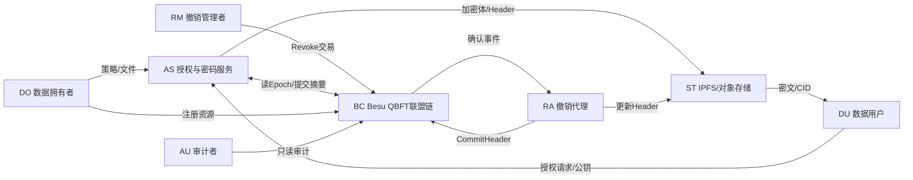
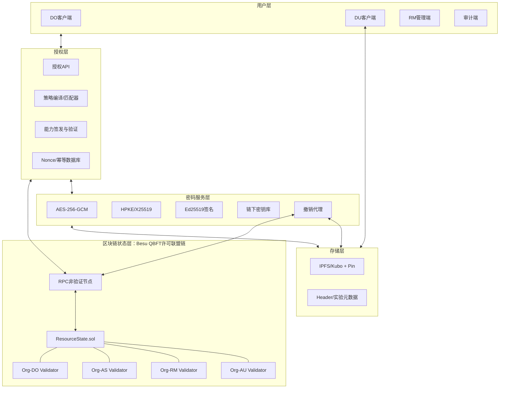

# 《论文实施蓝图 V1.0》

> 论文题目：面向非连续时间约束的区块链数据共享关键技术研究及实现  
> 版本：V1.0  
> 日期：2026-07-27  
> 状态：研究设计冻结，后续变更必须记录原因、影响和版本  
> 联盟链冻结选型：Hyperledger Besu、QBFT、Solidity、Web3.py

## 蓝图摘要

本研究不重新发明密码算法。论文围绕三个递进贡献展开：

1. 非连续时间策略的规范化编译与层次覆盖；
2. 真实联盟链上由Epoch驱动、与用户公钥绑定的授权状态管理；
3. 基于标准密码组件的版本化密文头部和前瞻性撤销系统。

最终区块链实验使用**真实多节点许可联盟链**，而不是Ganache、Anvil或单节点私链。冻结的最终环境为4个Besu QBFT验证节点、4个逻辑组织、1个非验证RPC节点，启用节点许可与账户许可。开发期可在本机Docker中运行等拓扑网络，最终论文数据必须来自多主机或至少多虚拟机部署，并保存创世文件、节点公钥、许可清单、日志、区块、交易回执及实验脚本。

# 第一部分 最终研究方案冻结

## 1.1 最终论文研究定位

| 项目 | 冻结内容 |
|---|---|
| 论文题目 | **面向非连续时间约束的区块链数据共享关键技术研究及实现** |
| 核心研究问题R1 | 如何在不枚举全部细粒度时间点的情况下，确定性地表示和判断非连续时间策略，并给出真实复杂度边界？ |
| 核心研究问题R2 | 如何利用许可联盟链维护可审计、单调递增的授权Epoch，使授权结果绑定资源、策略、状态和用户公钥？ |
| 核心研究问题R3 | 如何在不更新合法用户长期私钥的情况下，通过小型密文头部更新降低撤销成本，并处理链上链下版本一致性？ |
| 研究对象 | 区块链与链下存储协同环境中的非连续时间约束数据共享系统 |
| 主要输入 | 时间策略、文件、用户公钥、授权请求、撤销事件 |
| 主要输出 | 规范策略、策略摘要、授权能力令牌、加密数据体、版本化头部、链上状态和审计记录 |
| 研究范式 | 设计科学与实验系统研究：形式化模型→算法→原型→真实联盟链实验→证据 |

## 1.2 解决与不解决的问题

### 本论文解决

1. 由多个时间区间构成的非连续策略的规范化、压缩表示和快速匹配。
2. 同义策略生成相同规范表示和摘要，支撑跨节点一致校验。
3. 授权令牌与 `resourceId、policyDigest、epoch、userKeyId、有效期、nonce` 的完整绑定。
4. 旧Epoch、过期令牌、跨用户替换、参数篡改和已记录Nonce重放的检测。
5. 许可联盟链对授权状态、撤销顺序和头部版本的多组织共识与审计。
6. 文件体与密钥控制信息分离，使单个头部更新成本不随文件体积增长。
7. 事件重复、进程重启、事件漏读和链下更新失败下的幂等恢复。

### 本论文不解决

1. 不提出新的ABE、KEM、数字签名或对称加密算法。
2. 不阻止已授权用户主动共享私钥、解密后的明文或已经获得的数据密钥。
3. 不收回已经泄露或缓存的明文，也不对历史已下载数据提供“远程销毁”。
4. 不把联盟链区块时间当作精确可信墙上时钟；业务时间由授权服务读取可信系统时间，链只记录Epoch和交易顺序。
5. 不抵抗超过QBFT容错阈值的验证节点合谋，不处理整个联盟链被控制。
6. 不解决终端恶意软件、侧信道、操作系统内存窃取和硬件密钥保护。
7. 不证明IPFS数据永久可用；可用性通过Pin和监测实现，而非由CID自动保证。

## 1.3 创新边界与论文声明

### 可以作为论文贡献

- **C1 方法贡献：** 非连续时间策略的规范化编译算法、语义等价性和输出敏感复杂度分析。
- **C2 协议贡献：** 真实许可联盟链上的Epoch授权状态机及资源—策略—状态—用户四重绑定机制。
- **C3 系统贡献：** 版本化密文头部、幂等撤销代理、链上链下提交协议与可复现实验平台。

### 必须避免的强声明

| 禁止表述 | 可用表述 |
|---|---|
| 任意时间集合均压缩为 `O(log N)` | 单区间规范覆盖为 `O(log U)`；`k`个规范区间为输出敏感的 `O(k log U)` 上界，孤立点最坏为 `Ω(k)` |
| 完全防止密钥泄露 | 在标准算法未被攻破且根密钥未泄露的假设下保护密钥材料 |
| 彻底杜绝合谋 | 检测令牌跨用户替换；不抵抗用户共享私钥、数据密钥或明文 |
| 区块链提供绝对可信时间 | 联盟链提供经共识确认的Epoch顺序和可审计状态 |
| 撤销复杂度严格为 `O(1)` | 单头部更新与文件大小无关；总成本随受影响头部数线性增长 |
| 撤销后用户再也无法解密 | 阻止未缓存当前数据密钥的撤销用户获得后续授权；不收回既得明文或密钥 |
| 方案达到IND-CPA/IND-CCA | 标准组件分别继承其公开安全性质；组合系统给出属性级安全论证和实验验证，不声称新原语安全归约 |

# 第二部分 理论模型定义

## 2.1 记号与系统状态

- 离散时间域：`T={0,...,U-1}`，`U`为研究窗口内的最小时间槽总数。
- 原始策略：`P={ [l_i,r_i] | 1≤i≤m }`。
- 规范区间集合：`I*=Normalize(P)`，区间互不相交且不相邻，数量为 `k≤m`。
- 层次覆盖：`C(P)=Cover(I*, U)`，节点数量为 `c=|C(P)|`。
- 策略摘要：`pd=SHA-256(CanonicalSerialize(C(P)))`。
- 用户标识：`uid`；用户加密公钥指纹：`ukid=SHA-256(pk_DU)`。
- 资源链上状态：

```text
RS[rid] = {
  owner,
  policyDigest,
  epoch,
  headerDigest,
  status,
  updatedAtBlock
}
```

- 能力令牌：

```text
Cap = Sign_skAS(
  version || rid || pd || epoch || ukid ||
  notBefore || expiresAt || nonce || operation
)
```

- 安全接受条件：

```text
Accept iff
  SignatureValid(Cap)
  ∧ Cap.rid = request.rid
  ∧ Cap.pd = RS[rid].policyDigest
  ∧ Cap.epoch = RS[rid].epoch
  ∧ Cap.ukid = H(request.pkDU)
  ∧ notBefore ≤ now < expiresAt
  ∧ nonce未被消费
  ∧ RS[rid].status = ACTIVE
  ∧ 当前时间满足编译策略
```

## 2.2 系统实体

| 实体 | 拥有什么 | 信任什么 | 可执行操作 |
|---|---|---|---|
| 数据拥有者DO | 明文、资源管理账户、内容密钥CK、策略定义 | 标准密码算法、联盟链确认状态 | 编译策略、加密文件、注册资源、批准策略更新 |
| 数据用户DU | 长期HPKE密钥对、联盟链账户、能力令牌 | 自身终端、AS签名公钥、确认后的链状态 | 注册、申请授权、验证令牌、下载并解密 |
| 授权服务AS | 签名私钥、策略匹配器、Nonce数据库、头部密钥服务 | 联盟链多数诚实、DO策略、系统时钟 | 读取状态、判断策略、签发令牌、封装访问密钥 |
| 联盟链BC | 多组织验证节点、账本、状态合约、许可清单 | QBFT容错假设 | 共识排序、状态转换、事件发布、审计查询 |
| 存储系统ST | 加密数据体、版本化头部、CID、Pin状态 | 不被信任其保密性；仅依赖密码完整性 | 存取对象、返回CID、Pin、可用性检测 |
| 撤销管理者RM | 撤销权限账户、撤销理由 | 合约权限控制 | 发起撤销、推进Epoch、查询执行状态 |
| 撤销代理RA | 事件游标、任务队列、幂等键、头部更新权限 | 确认后的链事件、AS/DO密钥服务 | 补扫事件、更新头部、提交摘要、失败重试 |
| 审计者AU | 只读联盟链节点或RPC权限 | 区块和交易签名 | 核验策略变更、撤销顺序、实验交易和日志 |

## 2.3 实体关系图



## 2.4 真实联盟链模型

冻结部署拓扑：

| 逻辑组织 | 节点 | 角色 |
|---|---|---|
| Org-DO | Validator-1 | 数据提供方验证节点 |
| Org-AS | Validator-2 | 授权服务方验证节点 |
| Org-RM | Validator-3 | 管理/监管方验证节点 |
| Org-AU | Validator-4 | 审计方验证节点 |
| Client Zone | RPC-1 | 非验证RPC、Web3.py入口 |

要求：

- 4个QBFT验证节点分别拥有独立密钥、数据目录、P2P地址和组织归属。
- 节点许可阻止未授权节点入网；账户许可限制部署、注册、撤销和头部提交账户。
- 最终实验部署于4台VM或4台主机；本机Docker等拓扑仅用于开发。
- 4验证节点配置下，以 `n≥3f+1` 为模型，可容忍至多1个拜占庭验证节点；论文只验证节点宕机/隔离下的可用性，不声称通过应用实验重新证明QBFT安全。
- Besu提供EVM与JSON-RPC，可继续使用Solidity和Web3.py。Besu官方文档说明其支持公共及私有网络、CLI和JSON-RPC：[Besu Documentation](https://docs.besu-eth.org/)。

## 2.5 威胁模型

| 攻击者 | 能力 | 目标 | 系统防线 | 明确边界 |
|---|---|---|---|---|
| 非授权用户A1 | 读取公开链状态和可获取的链下密文，发起请求 | 获取CK或明文 | 策略判断、签名能力、HPKE接收者绑定 | 不考虑其攻破标准密码 |
| 过期用户A2 | 持有旧令牌、旧Epoch头部和合法长期私钥 | 在过期后继续访问 | 时间有效期、当前Epoch核验、Nonce | 若已缓存CK/明文则无法收回 |
| 恶意授权用户A3 | 转交令牌或自己的公钥资料 | 帮助另一用户访问 | `ukid`绑定和HPKE封装到指定公钥 | 无法阻止共享私钥、CK或明文 |
| 重放攻击者A4 | 监听并重复提交合法令牌/请求 | 重复使用授权 | Nonce消费、Epoch、有效期 | 多AS实例必须共享一致Nonce存储 |
| 链下篡改者A5 | 替换/删除Body或Header，返回旧CID | 破坏完整性或诱导降级 | AEAD Tag、CID、headerDigest、Epoch | 删除造成可用性问题，不由密码学消除 |
| 交易攻击者A6 | 构造未授权交易、抢先或重放交易 | 篡改资源状态 | 账户许可、合约RBAC、交易Nonce、QBFT确认 | 合法管理员恶意操作仍会被执行但可审计 |
| 单节点恶意者A7 | 控制至多1个验证节点，延迟或拒绝消息 | 分叉或阻断状态更新 | 4节点QBFT模型 | 不抵抗2个及以上验证节点合谋 |
| 恶意存储方A8 | 观察密文元数据、拒绝服务 | 推断或阻断访问 | 内容加密、最小化元数据、多点Pin | 不保证流量模式隐私和持续可用性 |

攻击者不能：

- 以非忽略概率攻破SHA-256、Ed25519、X25519/HPKE或AES-256-GCM；
- 获取AS签名根私钥、DO内容密钥库或用户长期私钥，除非该安全目标明确讨论密钥泄露；
- 控制超过联盟链容错阈值的验证节点；
- 任意控制所有联盟成员、所有IPFS副本和全部客户端；
- 绕过操作系统获得可信进程内存。

## 2.6 安全目标

| 安全目标 | 攻击场景 | 攻击方式 | 系统响应 | 验证方法 |
|---|---|---|---|---|
| G1 数据机密性 | A1读取链与存储 | 直接解密Body/Header | 无合法私钥和授权材料则失败 | 标准组件依据 + 负向解密测试 |
| G2 数据完整性 | A5修改Body/Header | 位翻转、CID替换、字段替换 | AEAD、摘要或Epoch验证失败 | 篡改矩阵实验 |
| G3 授权完整性 | A1/A3伪造或替换令牌字段 | 修改rid、pd、ukid、operation | 签名或绑定校验失败 | 单字段变异测试 |
| G4 状态一致性 | 客户端使用旧状态 | 旧Epoch令牌配新头部或反之 | 拒绝不一致组合 | 状态组合测试 + 不变量检查 |
| G5 重放抵抗 | A4重复提交令牌 | 同Nonce重复访问 | 第二次及以后拒绝 | 并发/串行重放实验 |
| G6 撤销有效性 | A2在撤销后申请访问 | 使用旧令牌或请求新令牌 | 旧Epoch拒绝，新申请因撤销状态拒绝 | 撤销前后状态实验 |
| G7 可审计性 | 争议授权或撤销 | 删除本地日志 | 链上交易、事件、区块保留顺序证据 | 多节点账本一致性核验 |
| G8 幂等恢复 | RA重复/漏读事件 | 重复任务、进程崩溃、游标回退 | 同一幂等键最多提交一个有效版本 | 故障注入测试 |

其中G1依赖标准密码组件；G2-G8依赖系统组合逻辑。论文必须区分“由标准安全性质支持”与“由本系统实验验证”，不能把测试通过写成密码学证明。

# 第三部分 三个核心算法设计

## 3.1 Algorithm 1：非连续时间策略编译

### 输入输出

- 输入：原始区间集合 `P`、研究时间域 `[0,U)`、最小时间粒度 `Δ`。
- 输出：规范区间集合 `I*`、最小二叉规范覆盖 `C`、规范字节串 `B`、摘要 `pd`。
- 前置条件：所有时间先转换到同一时区和半开区间 `[l,r)`；`0≤l<r≤U`。

### 伪代码

```text
Algorithm PolicyCompile(P, U, Δ)
Input : raw intervals P, domain size U, granularity Δ
Output: normalized intervals I*, canonical cover C, digest pd

1  Q ← empty list
2  for each interval [start, end) in P:
3      l ← FloorToSlot(start, Δ)
4      r ← CeilToSlot(end, Δ)
5      require 0 ≤ l < r ≤ U
6      append [l, r) to Q
7  sort Q by (l ascending, r ascending)
8  I* ← MergeOverlappingOrAdjacent(Q)
9  C ← empty list
10 for each [l, r) in I*:
11     while l < r:
12         a ← LargestAlignedPowerOfTwoBlockStartingAt(l)
13         b ← LargestPowerOfTwoNotExceeding(r-l)
14         size ← minValidAlignedBlock(a, b)
15         append Node(l, size) to C
16         l ← l + size
17 B ← CanonicalSerialize(version, U, Δ, C)
18 pd ← SHA256(B)
19 return I*, C, B, pd
```

实现时第12-14行可使用标准二叉线段树查询分解，避免 `l=0` 的最低位特殊问题。

### 复杂度

- 归一化与排序：`O(m log m)`。
- 合并：`O(m)`。
- 若合并后有`k`个区间，规范覆盖生成时间为 `O(c)`，且一般上界为 `c=O(k log U)`。
- 序列化和摘要：`O(c)`。
- 总时间：`O(m log m + c)`；空间：`O(k+c)`。
- 单个区间需要至多对数数量规范节点；但`k`个彼此隔离的最小时间槽至少需要`Ω(k)`个信息单元，因此不声称任意集合为`O(log U)`。

### 正确性证明思路

证明三个引理：

1. **规范化保持语义：** 排序与合并只把相交/相邻区间替换为其并集，因此 `Union(P)=Union(I*)`。
2. **覆盖完备且不越界：** 每次选择的节点区间包含于剩余 `[l,r)`，循环结束时节点并集恰为原区间。
3. **覆盖互斥与确定性：** `l`严格递增，节点不重叠；最大对齐块选择规则唯一，故同一规范策略生成同一`C、B、pd`。

由三个引理得到 `Decode(C)=Union(P)` 以及规范摘要确定性。

### 实验验证

- 随机生成不同`U、m、k、碎片率`的策略。
- 将原区间判定与覆盖节点判定逐槽或随机采样比较。
- 与时间点枚举、仅合并区间两种基线比较字节数、节点数、编译和匹配时间。
- 专门加入最坏样例：奇偶交错的孤立时间槽，展示压缩退化边界。

## 3.2 Algorithm 2：基于Epoch状态的授权算法族

### Setup

```text
Setup(λ)
1  生成AS签名密钥 (skAS, pkAS)
2  定义Hash=SHA-256、Sign=Ed25519、HPKE套件、AEAD=AES-256-GCM
3  部署Besu QBFT联盟链和ResourceState合约
4  设置DO、AS、RM、RA、AU角色账户及许可
5  初始化Nonce数据库和确认深度策略
6  输出公共参数 pp；秘密仅保存在链下密钥库
```

- 复杂度：密码初始化`O(1)`；联盟链部署成本与节点数有关，不计入每次授权复杂度。

### Register

```text
Register(uid, pkDU, accountDU)
1  验证注册身份和公钥所有权
2  ukid ← SHA256(pkDU)
3  合约写入 User[uid]=(ukid, accountDU, ACTIVE)
4  返回交易回执和注册版本
```

- 复杂度：链下`O(1)`；1次联盟链交易。

### PolicyCompile

- 调用Algorithm 1，输出`C、pd`。
- DO调用`registerResource(rid,pd,headerDigest)`，初始`epoch=0`。
- 复杂度：`O(m log m+c)`及1次联盟链交易。

### IssueCapability

```text
IssueCapability(uid, rid, operation, now)
1  state ← ConfirmedRead(RS[rid])
2  user  ← ConfirmedRead(User[uid])
3  require state.status=ACTIVE and user.status=ACTIVE
4  policy ← LoadByDigest(state.policyDigest)
5  require Match(policy, now)=true
6  nonce ← SecureRandom(128 bits)
7  exp ← min(now + TTL, currentAllowedWindowEnd)
8  payload ← CanonicalEncode(
       rid, state.policyDigest, state.epoch,
       user.ukid, now, exp, nonce, operation)
9  σ ← Sign(skAS, payload)
10 return Cap=(payload, σ)
```

- 复杂度：策略匹配取决于索引结构，目标为`O(log c)`或`O(log k)`；签名`O(1)`；2次只读链查询。

### VerifyCapability

```text
VerifyCapability(Cap, pkDU, request, now)
1  require Verify(pkAS, Cap.payload, Cap.σ)
2  state ← ConfirmedRead(RS[Cap.rid])
3  require request fields = Cap bound fields
4  require SHA256(pkDU)=Cap.ukid
5  require Cap.policyDigest=state.policyDigest
6  require Cap.epoch=state.epoch and state.status=ACTIVE
7  require Cap.notBefore ≤ now < Cap.expiresAt
8  atomically require-and-record NonceUnused(Cap.nonce, Cap.epoch)
9  return ACCEPT; otherwise return typed rejection code
```

- 复杂度：签名验证、摘要和Nonce操作为期望`O(1)`；1次链只读。多实例Nonce数据库要求原子唯一约束。

### Revoke

```text
Revoke(rid, subject, reasonHash)
1  require caller has RM role
2  state ← RS[rid]
3  state.epoch ← state.epoch + 1
4  mark subject revoked for rid (or mark resource suspended)
5  state.headerStatus ← PENDING
6  emit RevocationRequested(rid, newEpoch, subject, reasonHash)
7  return transaction receipt
```

- 复杂度：单资源链上状态更新`O(1)`；若一次操作涉及`R`个资源则为`O(R)`。
- 生效点：交易达到论文预设的QBFT确认条件后，AS停止签发旧Epoch能力。

## 3.3 Algorithm 3：版本化密文头部更新

### 密钥层次与撤销语义

- `CK`：随机内容密钥，AES-GCM加密大文件Body。
- `KEK_e`：资源在Epoch `e`的头部包装密钥。
- `W_e=Wrap(KEK_e, CK)`：小型包装内容。
- 对通过授权的用户，AS以用户`pkDU`执行HPKE，发送`KEK_e`或一次性访问材料。

重要限制：若用户已经得到`CK、KEK_e`和旧头部，则更新头部不能让其“忘记”旧密钥。本文的撤销目标是**阻止未缓存数据密钥的撤销用户获得新的授权材料，并保护后续资源版本**。这是不重加密大文件条件下可诚实达到的安全边界。

### Encrypt

```text
Encrypt(file, rid, policy, recipients)
1  (C, pd) ← PolicyCompile(policy)
2  CK ← Random(256 bits); nonceB ← Random(96 bits)
3  Body ← AES-GCM.Encrypt(CK, nonceB, file, AAD=rid||pd)
4  bodyCID ← ST.PutAndPin(Body)
5  epoch ← 0; KEK_0 ← Random(256 bits)
6  W_0 ← AES-KeyWrap(KEK_0, CK)
7  Header_0 ← Encode(rid, bodyCID, pd, epoch, W_0, metadata)
8  headerCID ← ST.PutAndPin(Header_0)
9  hd ← SHA256(Header_0)
10 BC.RegisterResource(rid, pd, epoch, hd, headerCID)
11 SecureStore(CK, KEK_0)
12 return bodyCID, headerCID, receipt
```

- 大文件加密时间`O(|file|)`；头部与文件大小无关。
- 可使用AES-GCM直接保护Body；GCM是认证加密模式，依据 [NIST SP 800-38D](https://csrc.nist.gov/pubs/sp/800/38/d/final)。

### Update

```text
Update(rid, newEpoch, eventId)
1  idempotencyKey ← H(chainId||contract||eventId||rid||newEpoch)
2  if JobCompleted(idempotencyKey): return stored result
3  require ConfirmedChainEpoch(rid)=newEpoch
4  CK ← SecureLoadContentKey(rid)
5  KEK_new ← Random(256 bits)
6  W_new ← AES-KeyWrap(KEK_new, CK)
7  Header_new ← Encode(rid, unchangedBodyCID, currentPd,
                       newEpoch, W_new, previousHeaderDigest)
8  newCID ← ST.PutAndPin(Header_new)
9  verify ST.Get(newCID)=Header_new
10 tx ← BC.CommitHeader(rid,newEpoch,H(Header_new),newCID)
11 wait for QBFT confirmation
12 SecureStore(KEK_new); MarkCompleted(idempotencyKey,tx)
13 return newCID, tx
```

- **保持不变：** `Body、bodyCID、CK`及用户长期密钥。
- **发生更新：** `epoch、KEK_e、W_e、Header、headerCID/headerDigest`和链上索引。
- 更新时间`O(|Header|)`，与Body大小无关；批量更新`F_r`个资源的总成本为`O(F_r)`。

### Decrypt

```text
Decrypt(rid, Cap, skDU)
1  require VerifyCapability(Cap, pkDU)=ACCEPT
2  state ← ConfirmedRead(RS[rid])
3  Header ← ST.Get(state.headerCID)
4  require H(Header)=state.headerDigest
5  require Header.epoch=state.epoch and Header.pd=state.pd
6  accessMaterial ← AS.ReleaseByHPKE(Cap, pkDU)
7  KEK_e ← HPKE.Open(skDU, accessMaterial)
8  CK ← AES-KeyUnwrap(KEK_e, Header.W_e)
9  Body ← ST.Get(Header.bodyCID)
10 file ← AES-GCM.Decrypt(CK, Body, AAD=rid||pd)
11 return file
```

- 复杂度：Body解密`O(|file|)`；其余为常数次标准密码操作和链/存储读取。
- RFC 9180给出由KEM、KDF和AEAD组合的HPKE框架及安全要求：[RFC 9180](https://www.rfc-editor.org/info/rfc9180/)。

# 第四部分 系统架构设计

## 4.1 论文系统架构图



## 4.2 模块接口

| 模块 | 输入 | 输出 | 主要接口 |
|---|---|---|---|
| PolicyCompiler | 时间规则、时区、粒度 | `C、B、pd` | `compile()`、`match()` |
| AuthorizationAPI | uid、rid、operation | Cap或拒绝码 | `POST /capabilities` |
| CapabilityVerifier | Cap、pkDU、请求上下文 | 接受/拒绝原因 | `verify()` |
| ResourceState合约 | 角色交易、摘要、Epoch | 状态、事件、回执 | `registerResource`、`revoke`、`commitHeader`、`getState` |
| BlockchainGateway | ABI、交易、查询 | 已确认状态和事件 | Web3.py JSON-RPC |
| CryptoService | file、CK、KEK、用户公钥 | Body、Header、HPKE封装 | `encrypt_body`、`wrap_header`、`release_key` |
| StorageGateway | bytes、CID | 对象、Pin状态 | `put`、`get`、`pin`、`verify` |
| RevocationAgent | 已确认事件、游标 | 新头部、提交交易 | `scan_logs`、`process_job`、`recover` |

Web3.py官方支持合约交易、回执与事件日志。事件监听不能只依赖易丢失的临时Filter；撤销代理应持久化最后确认区块并用`get_logs(from_block,to_block)`补扫，Web3.py文档也提醒Filter可能不可靠：[Web3.py Events and Logs](https://web3py.readthedocs.io/en/v7.14.1/filters.html)。

## 4.3 完整业务流程

1. **上传：** DO编译策略→生成CK/KEK→AES-GCM加密文件→Body/Header写入IPFS并Pin→合约登记摘要与Epoch 0。
2. **授权：** DU注册公钥→AS读取确认后的链状态→匹配当前时间→签发短期Cap。
3. **访问：** DU验证Cap和链状态→读取当前Header/Body→AS将访问材料HPKE封装给DU→DU解密。
4. **撤销：** RM提交`revoke`→QBFT确认后Epoch递增并产生事件→AS立即拒绝旧Epoch。
5. **更新：** RA按确认区块补扫事件→生成新KEK并重包CK→上传Header→提交新摘要→记录幂等结果。
6. **再次访问：** 合法DU申请新Epoch Cap并获得新访问材料；旧Cap、旧Header组合或被撤销用户的新申请被拒绝。

# 第五部分 论文目录设计

| 章 | 建议标题 | 研究目标与主要内容 | 对应算法 | 对应实验 |
|---|---|---|---|---|
| 第1章 | 问题提出与研究边界 | 场景、三项问题、贡献、限制、路线 | 无 | 无 |
| 第2章 | 相关研究与技术依据 | 时间策略表示、能力授权、联盟链状态、混合加密、撤销语义 | 无 | 基线选择依据 |
| 第3章 | 系统模型、威胁模型与研究方法 | 实体、假设、安全目标、联盟链模型、评价方法 | 全局定义 | 实验设计总则 |
| 第4章 | 非连续时间策略的规范化编译方法 | 形式化时间域、规范化、层次覆盖、正确性和复杂度 | Algorithm 1 | E1、E2 |
| 第5章 | 真实联盟链上的Epoch授权协议 | Besu QBFT状态机、能力令牌、注册、授权、验证、撤销 | Algorithm 2 | E3、E4、E5 |
| 第6章 | 版本化密文头部与撤销系统 | KEM/DEM边界、Encrypt/Update/Decrypt、幂等恢复、一致性 | Algorithm 3 | E6、E7、E8 |
| 第7章 | 原型实现与综合实验评估 | 多主机联盟链、IPFS、实现细节、统计结果、消融、故障实验 | 全部 | E1-E9 |
| 第8章 | 结论、局限与后续工作 | 回答R1-R3，说明既得密钥、联盟链阈值及外部效度限制 | 无 | 结果归纳 |

章节组织仍保留绪论和基础，但第4-6章严格按三个研究贡献展开，第7章只报告真实实现与证据。

# 第六部分 软件实现路线

## 6.1 第一阶段：最小可运行原型MVP

MVP仅验证策略编译、内存Epoch授权、Ed25519能力令牌和AES-GCM，不加入区块链、IPFS和HPKE。

```text
thesis-system/
├── pyproject.toml
├── README.md
├── src/
│   ├── time_policy/
│   │   ├── parser.py
│   │   ├── normalize.py
│   │   ├── cover.py
│   │   ├── serialize.py
│   │   └── matcher.py
│   ├── authorization/
│   │   ├── models.py
│   │   ├── state_store.py
│   │   ├── capability.py
│   │   └── verifier.py
│   └── crypto/
│       ├── aead.py
│       └── keys.py
├── tests/
│   ├── unit/
│   ├── property/
│   ├── security_cases/
│   └── integration/
└── experiments/
    ├── policy/
    ├── authorization/
    └── results/
```

开发顺序：

1. 定义半开区间、UTC和规范序列化格式。
2. 实现`normalize`与单元测试。
3. 实现`cover/matcher`与Hypothesis性质测试。
4. 实现内存资源状态和Epoch。
5. 实现Ed25519 Cap签发/验证、Nonce唯一约束和拒绝码。
6. 实现AES-GCM文件加解密。
7. 完成“上传→授权→访问→撤销→旧授权失败”的内存端到端测试。

MVP通过门槛：

- 随机策略语义等价测试无失败；
- 八类令牌变异全部按预期拒绝；
- 文件任意位篡改导致AEAD验证失败；
- 撤销后旧Epoch令牌必然失败；
- 不包含任何伪区块链模拟结果作为论文证据。

## 6.2 第二阶段：完整系统

```text
thesis-system/
├── contracts/
│   ├── ResourceState.sol
│   ├── AccessRoles.sol
│   ├── test/
│   └── deploy/
├── blockchain/
│   ├── besu/
│   │   ├── genesis/
│   │   ├── permissions/
│   │   ├── org-do/
│   │   ├── org-as/
│   │   ├── org-rm/
│   │   ├── org-au/
│   │   └── rpc/
│   └── gateway/
│       ├── client.py
│       ├── transactions.py
│       ├── events.py
│       └── confirmations.py
├── services/
│   ├── authorization_api/
│   ├── crypto_service/
│   ├── storage_gateway/
│   └── revocation_agent/
├── infra/
│   ├── docker-compose.dev.yml
│   ├── multi-host/
│   ├── monitoring/
│   └── ipfs/
├── experiments/
│   ├── workloads/
│   ├── consortium/
│   ├── revocation/
│   ├── fault_injection/
│   ├── analysis/
│   └── raw/
└── docs/
    ├── threat-model.md
    ├── protocol.md
    └── reproducibility.md
```

完整系统顺序：

1. 在Anvil上完成Solidity单元测试，但不采集论文实验数据。
2. 本机Docker启动4验证节点Besu QBFT开发网络，验证权限、共识、部署和Web3.py。
3. 接入IPFS/Kubo与Pin，完成Header/Body寻址。
4. 接入HPKE和链下密钥库。
5. 实现基于区块范围补扫的事件代理、游标和幂等任务表。
6. 部署4VM/4主机最终网络，重复端到端测试。
7. 冻结软件版本、镜像摘要、创世文件和实验配置后采集正式数据。

# 第七部分 实验设计

## 7.1 论文主张映射

- 主张C1：策略编译在结构化非连续区间上显著减少枚举规模，且边界诚实。
- 主张C2：Epoch协议能检测旧状态、重放、跨用户和字段篡改，并在真实联盟链上提供可审计顺序。
- 主张C3：头部更新成本与文件大小解耦，系统能从事件和链下故障中恢复。
- 反主张：收益不是由隐藏公共参数或虚假`O(1)`产生；撤销不等于收回既得明文。

## 7.2 核心实验矩阵

| 实验 | 验证问题/贡献 | 自变量 | 指标 | 基线 |
|---|---|---|---|---|
| E1 策略压缩 | C1是否降低策略表示规模 | `U、k、粒度、区间长度、碎片率` | 节点数、字节、压缩比 | 时间点枚举、合并区间列表 |
| E2 策略正确性与边界 | 编译前后是否等价，何时退化 | 随机策略、边界策略、孤立点比例 | 不一致数、编译/匹配延迟、最坏压缩比 | 原区间判定 |
| E3 授权攻击矩阵 | C2是否拒绝非法能力 | 攻击类型、并发度、TTL | 攻击接受率、合法拒绝率、拒绝码、延迟 | 无Epoch、无Nonce、无ukid三个消融 |
| E4 联盟链写入性能 | 真实联盟链状态成本 | 发送速率、并发客户端、交易类型 | TPS、提交/确认延迟、p95、Gas、失败率 | 单节点开发链仅作性能参照，不作安全等价基线 |
| E5 联盟链容错与审计 | 状态是否多节点一致且可审计 | 停止1个验证节点、网络延迟、RPC切换 | 可用性、区块停顿、恢复时间、账本摘要一致率 | 正常4节点QBFT |
| E6 文件加密 | 标准数据保护开销 | 文件大小、类型 | 吞吐、延迟、峰值内存 | AES-GCM本地基线 |
| E7 撤销效率 | C3是否与文件大小解耦 | 文件大小、受影响资源数、用户数 | 总时延、头部时延、读写字节、链确认时间 | 全文件重加密、立即头部更新、惰性头部更新 |
| E8 一致性与故障恢复 | C3能否维持当前Epoch不变量 | 事件重复、漏读、代理崩溃、IPFS失败、乱序 | 重复提交数、不变量违反数、恢复时间、重试次数 | 无幂等/无补扫消融 |
| E9 端到端访问 | 综合系统是否可用 | 负载、节点位置、缓存状态 | 授权到明文总时延、成功率、阶段耗时占比 | 不上链状态存储作为成本参照 |

## 7.3 真实联盟链实验规范

正式结果环境：

- 4个Besu QBFT验证节点，4个组织，独立VM/主机和独立密钥；
- 1个RPC非验证节点；必要时增加备用RPC；
- Solidity合约部署在该链，Web3.py提交真实签名交易；
- 启用许可配置；记录对未许可节点和账户的拒绝测试；
- 记录创世区块、chainId、Besu镜像精确版本、节点enode、机器配置、网络RTT和区块参数；
- 每个交易保存`txHash、blockNumber、gasUsed、status、timestamps`；
- 通过各节点查询相同高度的区块哈希/状态摘要，验证账本一致；
- E4-E5-E7-E9的正式数据不得来自Ganache、Anvil或单节点Besu。

开发和最终实验必须分开标记：

| 环境 | 用途 | 可否进入论文主结果 |
|---|---|---:|
| Python内存状态 | MVP与单元测试 | 否 |
| Anvil/Ganache | 合约单元测试 | 否 |
| 单机4容器Besu QBFT | 集成调试、预实验 | 仅可作为预实验/消融，不能称真实跨组织部署 |
| 4VM/4主机Besu QBFT | 正式联盟链实验 | 是 |

## 7.4 数据、统计和停止条件

- 策略实验：至少3个固定随机种子；每个配置生成足够策略样本并保留生成器配置。
- 性能实验：预热5次，正式重复至少30次；报告中位数、均值、标准差、p95和95% Bootstrap置信区间。
- 文件实验：公开数据集按大小分桶，文件类型只作分层因素；核心自变量是字节数。
- 正式实验期间监控CPU、内存、磁盘I/O、网络和各节点日志。
- 若E2出现任何语义不一致，停止后续实验并修复算法。
- 若撤销后旧Epoch仍被接受，停止论文写作并修复状态机。
- 若多节点账本不一致，正式结果作废并重新部署。

# 第八部分 六个月执行计划

| 月份 | 研究任务 | 代码任务 | 论文任务 | 阶段成果 |
|---|---|---|---|---|
| 第1个月 | 冻结定义、算法1、正确性和复杂度 | 完成`time_policy`、性质测试、E1/E2脚本 | 完成第3章模型和第4章初稿 | Algorithm 1、真实初步数据、图表1-3 |
| 第2个月 | 完成Algorithm 2和状态不变量 | MVP授权、Cap、Nonce、AES-GCM；Solidity单测 | 完成第5章协议初稿 | 内存端到端MVP、攻击矩阵结果 |
| 第3个月 | 明确Algorithm 3撤销边界 | Besu 4节点开发网、Web3.py、IPFS、HPKE、RA | 完成第6章设计初稿 | 单机等拓扑完整系统、预实验 |
| 第4个月 | 真实联盟链与故障研究 | 部署4VM/4主机QBFT网络，完成E3-E9 | 完成第7章方法和结果骨架 | 正式原始数据、日志、交易回执、图表 |
| 第5个月 | 结果分析与小论文主张收敛 | 补消融、修缺陷、冻结复现镜像 | 完成小论文并投稿；完善第4-7章 | 投稿稿件、投稿回执、复现包V1 |
| 第6个月 | 全文一致性和答辩验证 | 一键部署、清理敏感密钥、演示脚本 | 完成全文、引用审计、两轮模拟外审 | 学位论文初稿/定稿、答辩PPT、演示 |

每月退出门槛：

1. 第1月：随机和边界策略语义测试全部通过。
2. 第2月：攻击矩阵零错误接受，拒绝原因可追踪。
3. 第3月：本机4节点QBFT完成上传—撤销—更新—再访问。
4. 第4月：正式多主机网络完成全套数据采集，可由脚本复现。
5. 第5月：每条小论文结论都对应表格/图和原始数据。
6. 第6月：论文、代码、图表、引用和答辩口径完全一致。

# 第九部分 风险控制

| 风险 | 出现原因 | 提前解决方案 |
|---|---|---|
| R1 策略编译创新不足 | 只是实现普通区间合并，缺少形式化边界和强基线 | 把确定性序列化、层次覆盖、等价证明、碎片退化边界和系统绑定作为完整方法；优先完成E1/E2 |
| R2 撤销安全被专家否定 | 不重加密Body却声称收回已泄露密钥 | 从定义开始限定为前瞻性授权撤销；单列既得密钥限制；对后续内容版本使用新CK |
| R3 “真实联盟链”名不副实 | 最终仍用单机容器或Ganache，组织只是标签 | 第3月前落实4VM/主机；保存独立节点证据、许可配置、共识日志和网络指标；正式数据只从该环境产生 |
| R4 AS成为单点信任与单点故障 | AS持有签名/包装密钥并决定授权 | 明确AS为受信授权执行点；根密钥链下保护；部署双实例但共享原子Nonce库；论文不宣称完全去中心化 |
| R5 工程范围过大导致无结果 | 同时学习密码、Besu、Solidity、IPFS和论文写作 | 按MVP→单机联盟链→多主机实验三级门推进；任何可选隐私、ZKP、TEE、跨链、ABE全部排除 |

补充风险：

- 事件Filter丢失：使用持久化区块游标和`get_logs`补扫，不把临时Filter作为唯一来源。
- IPFS对象不可用：至少双节点Pin并记录可用性；CID完整性与持久性分开评价。
- 时间边界错误：统一UTC、半开区间和版本化序列化；夏令时仅在输入层处理。
- 数据不可复现：冻结Docker镜像摘要、依赖锁、随机种子、创世配置和原始CSV。
- 引用再次错配：使用文献管理器生成编号，提交前运行逐条DOI/题名审计。

## 最终冻结决定

本论文的主线正式冻结为：

```text
非连续时间策略编译
        ↓
策略摘要与语义确定性
        ↓
Besu QBFT许可联盟链Epoch状态
        ↓
身份公钥绑定能力授权
        ↓
标准混合加密与版本化头部
        ↓
前瞻性撤销、幂等恢复和真实多节点实验
```

下一研究动作只进入**研究内容一：形式化定义、算法实现与E1/E2实验**。在其正确性测试和边界实验通过前，不扩写论文结果章节，也不提前堆叠IPFS、联盟链或复杂密码组件。

## 主要技术依据

1. Hyperledger Besu官方文档：Besu是支持公共和私有网络、EVM及JSON-RPC的Ethereum客户端：[Besu Documentation](https://docs.besu-eth.org/)。
2. Hyperledger Besu官方Docker镜像：[hyperledger/besu](https://hub.docker.com/r/hyperledger/besu)。
3. Web3.py合约事件和日志接口及Filter可靠性提醒：[Web3.py 7.14.1 Events and Logs](https://web3py.readthedocs.io/en/v7.14.1/filters.html)。
4. RFC 9180，Hybrid Public Key Encryption：[RFC 9180](https://www.rfc-editor.org/info/rfc9180/)。
5. NIST SP 800-38D，GCM认证加密：[NIST SP 800-38D](https://csrc.nist.gov/pubs/sp/800/38/d/final)。
6. IPFS持久性与Pin：[IPFS Persistence](https://docs.ipfs.tech/concepts/persistence/)。

